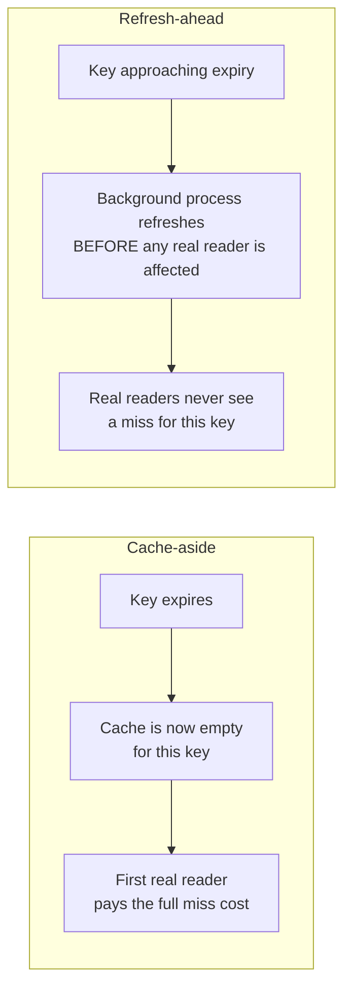

# Refresh-Ahead — Junior

<!-- level-focus -->
At junior level, focus on this question:

> Why does refresh-ahead avoid the miss that plain cache-aside always pays
> when a TTL expires?

---

## Cache-aside's blind spot

In cache-aside (`../cache-aside/README.md`), a key expiring means the
**next reader** pays the full miss cost: read from the database, then
repopulate the cache. For a hot key requested thousands of times per second,
this means one unlucky request (whichever happens to arrive right after
expiry) eats a slow database round trip, and briefly, requests arriving in
that same narrow window might all race to refetch (a preview of
[Cache Stampede](../cache-stampede-and-hot-keys/README.md)).



## The mechanism

```python
def get_with_refresh_ahead(key):
    entry = cache.get_with_metadata(key)   # includes TTL remaining
    if entry.ttl_remaining < entry.original_ttl * 0.2:  # <20% of TTL left
        schedule_background_refresh(key)    # kick off async refresh now
    return entry.value   # still serve the current (soon-to-expire) value
```

A background job monitors approaching-expiry keys and refetches them from
the database **before** they actually expire — real reader requests
continue being served the (still valid) cached value the whole time, and by
the time the key would have expired, it's already been silently replaced
with a fresh value.

> 🎓 **Takeaway:** refresh-ahead shifts the cost of "keeping the cache
> current" from the unlucky reader who happens to arrive right after expiry,
> to a background process that does the same work proactively, invisibly to
> any real request.

## Test yourself

1. Under plain cache-aside, which specific request pays the cost of a cache
   miss — is it predictable in advance?
2. Why does refresh-ahead need to track "TTL remaining," not just "is this
   key expired yet"?
3. What would happen if the background refresh itself is slow and doesn't
   finish before the original TTL actually expires?

Continue to [`middle.md`](middle.md).
