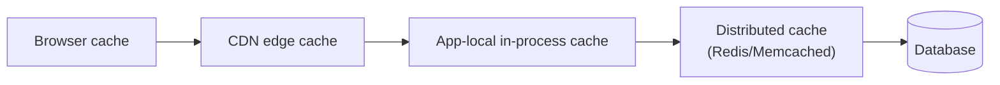

# Types of Caching (by Location)

> The same cache-aside/write-through logic can live in wildly different
> places — inside a single process, in a shared cluster, in front of a CDN,
> or inside the browser. Where you put the cache determines who benefits,
> how fresh it can be, and what happens when a node restarts.

## Choose a level

| Level | Guide | You are done when |
|---|---|---|
| Junior | [In-process vs. distributed](junior.md) | You can explain why a distributed cache is needed once you run more than one app instance. |
| Middle | [CDN and browser layers](middle.md) | You can place CDN and browser caching correctly relative to your application's own cache. |
| Senior | [Multi-layer coherence](senior.md) | You can explain why invalidating one layer doesn't automatically invalidate the others. |
| Professional | [Choosing locations for a data platform](professional.md) | You can design where each caching layer belongs across an ingestion-to-serving pipeline. |

## Practice rule

For any cached value, ask: "how many different physical locations might a
copy of this exist in right now?" (browser, CDN, app process, distributed
cache, database). Each is a place staleness can hide independently —
`senior.md`'s entire subject.

## Related

- [Cache-Aside](../cache-aside/README.md)
- [Cache Invalidation](../cache-invalidation/README.md)
