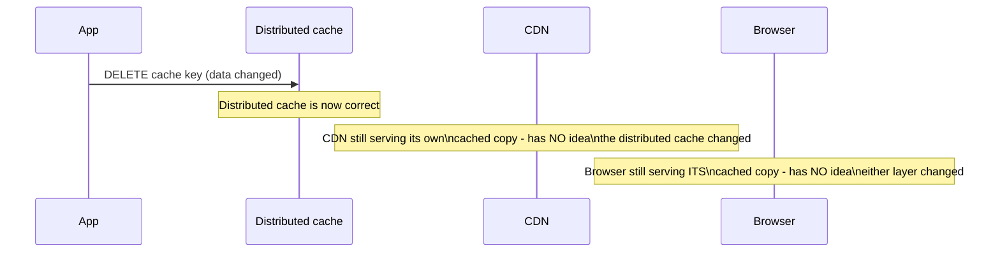
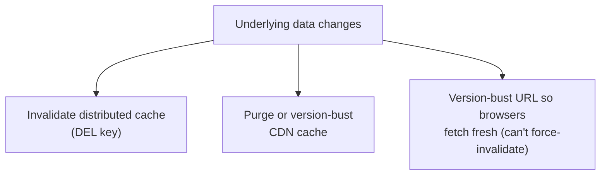

# Types of Caching — Senior

<!-- level-focus -->
At senior level, focus on this question:

> Why doesn't invalidating your distributed cache also invalidate the CDN or
> browser copies of the same data — and what does a correct invalidation
> chain look like?

Prerequisite: [`middle.md`](middle.md).

---

## Invalidation doesn't propagate upward automatically

Each layer in `middle.md`'s chain is an **independent cache** with its own
storage and its own invalidation mechanism. Deleting a key from your
distributed cache does nothing to a CDN edge node's copy of the same
response, and does nothing to a user's browser cache either — each layer
must be invalidated **separately**, through its own specific mechanism, or
allowed to expire on its own TTL.

## Correct invalidation per layer

| Layer | Invalidation mechanism |
|---|---|
| **Distributed cache** | `DEL key` / explicit application-level invalidation, as covered in [Cache Invalidation](../cache-invalidation/README.md). |
| **CDN edge cache** | An explicit purge API call to the CDN provider (Cloudflare's `/purge_cache`, CloudFront's invalidation API) — or cache-busting via a versioned URL (`/api/report?v=42`) so the "old" URL is simply never requested again. |
| **Browser cache** | Cannot be actively invalidated at all — you can only avoid caching it in the first place (`Cache-Control: no-store`) or use a versioned/fingerprinted URL so a "new" resource has a new URL the browser has never cached. |

## Versioned URLs: the universal cross-layer solution

Rather than trying to actively invalidate every layer (which the browser
layer doesn't even support), the most robust pattern is to make the **URL
itself** change whenever the content changes — a content hash or version
number embedded in the path (`/assets/app.a1b2c3.js`,
`/api/report/v17`). Every layer's cache is keyed by URL, so a new URL is
automatically a guaranteed miss everywhere, with zero explicit invalidation
calls needed anywhere in the chain.

> 🎯 **Senior takeaway:** treat "invalidate the cache" as a claim that must
> be scoped to a specific layer — there is no single action that clears a
> browser's cache, a CDN's cache, and a distributed cache all at once except
> designing your URLs so that changed content is simply never the same URL as
> before.

## Test yourself

1. Why does deleting a key from Redis have zero effect on a CDN edge node
   serving a cached copy of the same data?
2. Why can't you actively force a user's browser to drop a cached response,
   the way you can call a CDN's purge API?
3. Design a versioned-URL scheme for a dashboard's underlying data API so
   that a data refresh never requires explicit multi-layer invalidation.

Continue to [`professional.md`](professional.md) to design caching layer
placement across a full data platform.
