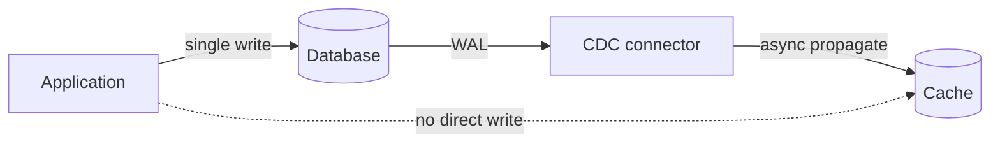

# Write-Through — Professional

<!-- level-focus -->
At professional level, focus on this question:

> How do real systems implement the "write to two places atomically" problem
> without a distributed transaction, and what formal guarantee do they
> actually achieve?

Prerequisite: [`senior.md`](senior.md).

---

## There is no free lunch: write-through is the two-generals problem in miniature

Writing to a cache and a database "together" is structurally the same
unsolvable-in-general problem as the classical **Two Generals Problem**:
two independent systems cannot be guaranteed to agree on a joint action
using only unreliable communication between them, without either an
external coordinator (two-phase commit) or accepting a weaker guarantee.
Write-through, as commonly implemented, deliberately accepts the weaker
guarantee (`senior.md`'s DB-first ordering) rather than paying 2PC's cost —
this is a conscious trade of formal correctness for operational simplicity,
and understanding it as such (rather than as "the cache and DB are kept in
sync") is the professional-level framing.

## Change Data Capture as the industrially-hardened alternative

Rather than the application performing a synchronous dual-write, the
production-grade pattern at scale is: **write only to the database, and let
a CDC pipeline (reading the database's write-ahead log) asynchronously
propagate the change to the cache.** This sidesteps the dual-write ordering
problem (`senior.md`) entirely, because there's only ever one write path —
by construction, the cache can never get ahead of a committed database
state, because it's derived *from* the WAL, which by definition only
contains committed changes.



The trade: this reintroduces a **lag window** (CDC propagation latency,
typically tens to low-hundreds of milliseconds) between commit and cache
update — worse worst-case freshness than synchronous write-through, but with
categorically simpler failure semantics (there is no "cache write failed but
DB write succeeded" state to reason about, because the application never
performs a cache write directly at all). This is the well-known **"outbox
pattern" / CDC-based cache invalidation** architecture used at large scale
specifically because it eliminates an entire class of dual-write bugs by
construction, not by careful ordering discipline.

## The formal guarantee write-through with DB-first ordering actually provides

DB-first write-through, done correctly, provides **read-your-writes
consistency for the writer**, conditional on the cache write eventually
succeeding — but it does **not** provide linearizability across all
observers: a concurrent reader hitting the cache in the narrow window
between the DB commit and the cache-set completing can still observe the old
value, then (after the cache-set lands) the new one — this is a genuine,
if narrow, staleness window, not a violation of write-through's contract,
because write-through as conventionally defined only promises "the cache
converges to correct quickly and deterministically," not "instantaneously
and atomically with the database write for all observers."

## Production checklist (staff-level)

1. **Prefer CDC-based (WAL-derived) cache population over application-level
   synchronous dual-writes for any system where dual-write failure modes
   have caused (or could cause) production incidents** — it's a structural
   fix, not a discipline-dependent one.
2. **Explicitly document which consistency guarantee your write-through
   implementation actually provides** (read-your-writes for the writer? for
   all readers? within what latency bound?) rather than the vague claim
   "the cache is always correct" — this becomes load-bearing the first time
   an incident review needs to establish what should have been true.
3. **Instrument and alert on cache-write failure rate as a distinct SLI**
   from database write failure rate — under DB-first ordering, this
   specific failure class degrades gracefully but silently unless measured.
4. **For systems considering 2PC-style guarantees between cache and
   database, weigh the operational cost explicitly against the CDC-based
   alternative** — full distributed-transaction correctness between a cache
   and a database is rarely justified given how effectively the CDC pattern
   sidesteps the underlying problem for a fraction of the complexity.
5. **In a design review, ask "what does a reader see in the microseconds
   between DB commit and cache update completing"** — if this narrow window
   matters for the specific use case (financial display, safety-critical
   state), write-through as commonly implemented is insufficient regardless
   of ordering discipline, and a different consistency model is needed.

## Cheat Sheet

```text
+------------------------------------------------------------------+
|               WRITE-THROUGH — INTERNALS & SCALE                     |
+------------------------------------------------------------------+
| Dual-write (app writes to cache AND db) is structurally the           |
| Two Generals Problem - no guaranteed joint agreement without a         |
| coordinator (2PC) or a weaker accepted guarantee (DB-first ordering)   |
+------------------------------------------------------------------+
| CDC-based cache population (WAL -> pipeline -> cache) eliminates       |
| dual-write bugs BY CONSTRUCTION: only one write path exists, cache      |
| can never race ahead of a committed state. Trade: adds a real lag      |
| window (ms-scale), but categorically simpler failure semantics         |
+------------------------------------------------------------------+
| DB-first write-through provides READ-YOUR-WRITES for the writer,       |
| NOT linearizability for all concurrent readers - a narrow staleness    |
| window for OTHER readers is expected, not a bug, under this contract  |
+------------------------------------------------------------------+
```

## Test yourself

1. Explain why write-through's DB-first ordering rule is a practical
   compromise, not a solution, to the same class of problem the Two
   Generals Problem formalizes.
2. Why does a CDC-based cache-population architecture eliminate an entire
   class of bugs "by construction" rather than by careful engineering
   discipline?
3. A concurrent reader observes a stale value in the microseconds between
   a writer's DB commit and the cache update completing under DB-first
   write-through. Is this a bug? What guarantee was and wasn't violated?

## Further Reading

- Lamport, Shostak, Pease — the Two Generals / Byzantine Generals framing
  is adjacent; more directly: Gray & Lamport — "Consensus on Transaction
  Commit" for why atomic cross-system writes require coordination.
- Debezium documentation and the "Outbox Pattern" (Chris Richardson,
  microservices.io) — the production CDC-based cache/event propagation
  architecture.
- See also: [Cache Invalidation — professional](../cache-invalidation/professional.md),
  [Write-Behind — professional](../write-behind/professional.md).
