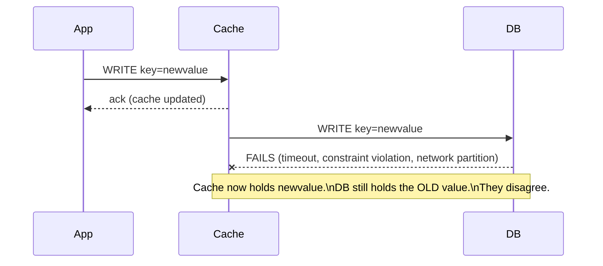
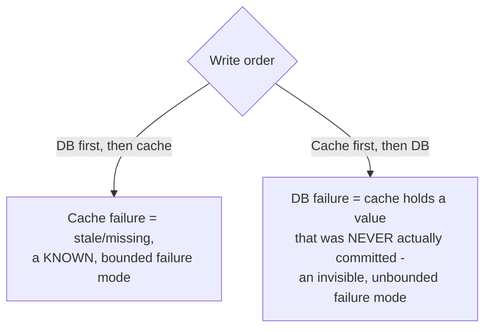

# Write-Through — Senior

<!-- level-focus -->
At senior level, focus on this question:

> What happens when the cache write succeeds but the database write fails —
> or vice versa — and how do you design around that partial-failure window?

Prerequisite: [`middle.md`](middle.md).

---

## Two systems, one logical write, no shared transaction



A cache and a database are two independent systems — there is no single
transaction spanning both (this is the same distributed-transaction problem
from
[Transactions & ACID — senior](../../../transaction/transactions-and-acid/senior.md),
just with a cache instead of a second database). If the database write fails
after the cache write succeeded, reads now serve a value the database never
actually committed — arguably **worse** than plain cache-aside, because
write-through's whole selling point was "the cache is never wrong."

## Designing the write order and failure handling

**Order matters.** Write to the **database first**, then the cache — never
the reverse:

```python
def update_user_email(user_id, new_email):
    db.execute("UPDATE users SET email=%s WHERE id=%s", new_email, user_id)
    # only update the cache AFTER the DB write is confirmed durable
    cache.set(f"user:{user_id}", {"email": new_email})
```

If the cache write now fails after a successful database write, the cache is
simply **stale or missing** — a familiar, bounded failure mode already
handled by falling back to cache-aside-style behavior (miss → read from DB)
for that key, rather than a **wrong** value being served with full
confidence.



**Retry and reconciliation.** For the cache-write-fails-after-DB-succeeds
case, retry the cache write with backoff; if it keeps failing, either delete
the (now-stale) cache key so the next read falls through to the database
(degrading gracefully to cache-aside behavior), or accept a bounded TTL as a
backstop exactly as recommended in
[Cache-Aside — senior](../cache-aside/senior.md).

> 🎯 **Senior takeaway:** write-through's consistency guarantee is only as
> strong as its write ordering. Writing to the database first turns any
> cache-side failure into a familiar, self-correcting problem (miss → refetch
> or short-lived staleness). Writing to the cache first turns any
> database-side failure into a silent, confidently-wrong cache entry with no
> built-in correction mechanism.

## Test yourself

1. Why is "cache write succeeds, DB write fails" strictly worse than a plain
   cache miss, in terms of what a reader experiences?
2. Walk through why writing to the database first converts every cache-side
   failure into a bounded, self-correcting one.
3. Design the retry/fallback logic for a cache write that keeps failing after
   a successful, already-committed database write.

Continue to [`professional.md`](professional.md) to compare write-through
against write-behind for pipeline sinks under load.
