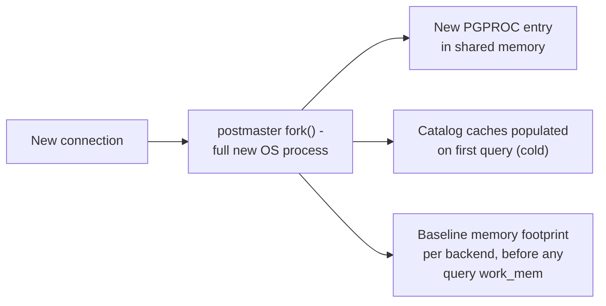

# Connection Pooling — Professional

<!-- level-focus -->
At professional level, focus on this question:

> What is actually happening at the OS and network layer during connection
> setup, and how do the internals of PgBouncer/ProxySQL let them multiplex
> connections so aggressively?

Prerequisite: [`senior.md`](senior.md).

---

## What a "connection" costs at the OS level, precisely

Beyond the TCP/TLS/auth handshake from `junior.md`, opening a Postgres
connection means the postmaster **forks a new OS process** (not a thread) —
each backend gets its own memory space, its own `PGPROC` entry in shared
memory, its own set of catalog caches populated on first use. This is why
Postgres connection counts have historically had a much lower practical
ceiling than thread-based engines: **each connection's baseline memory
footprint is measured in low single-digit megabytes just for backend
process overhead**, before any query-specific work memory is allocated, and
context-switching between hundreds of OS processes carries real scheduler
overhead that a thread-based model avoids. MySQL, using a thread-per-connection
model, has a lower per-connection memory floor but faces its own ceiling from
thread-context-switch overhead and per-thread stack memory at very high
connection counts.



## How PgBouncer's transaction pooling mode actually multiplexes

PgBouncer sits as a proxy holding a small, fixed pool of **real** backend
connections to Postgres. In **transaction pooling mode**, it assigns a real
backend connection to a client only for the duration of one transaction
(`BEGIN`...`COMMIT`/`ROLLBACK`), then immediately returns that backend to the
pool for the next waiting client — implemented as a simple state machine per
client socket tracking whether it currently "owns" a backend. This works
because **most client connections spend the overwhelming majority of their
lifetime idle** between transactions (waiting on network, application logic,
user think-time) — PgBouncer exploits that idle time by never holding a real
backend connection open during it.

**Why session-level features break under this model**: `SET` (session
variables), `LISTEN/NOTIFY`, prepared statements via the simple protocol, and
temporary tables are all tied to a specific **backend process's** session
state. Since transaction pooling mode can hand a client a *different* backend
process for its next transaction, any session state set on the previous
backend is simply gone — this isn't a bug, it's the direct structural
consequence of what makes the multiplexing ratio (thousands of clients onto
tens of backends) possible at all.

```mermaid
sequenceDiagram
    participant C1 as Client 1
    participant C2 as Client 2
    participant PGB as PgBouncer
    participant B1 as Backend 1
    C1->>PGB: BEGIN; ... ; COMMIT
    PGB->>B1: assigned for this txn
    Note over PGB: Backend 1 returned to pool\nimmediately after COMMIT
    C2->>PGB: BEGIN; ... ; COMMIT
    PGB->>B1: SAME backend, DIFFERENT client
    Note over C1: If C1 had run SET search_path=...,\nit's gone - C2 gets B1's state, not C1's
```

## The real ceiling: it's not just connections, it's shared_buffers contention

At extreme connection multiplexing scale (10,000+ logical clients onto a few
hundred real backends), the bottleneck typically shifts away from
connection-setup cost entirely and toward **contention on Postgres's shared
memory structures** — the buffer manager's clock-sweep eviction algorithm,
the WAL insertion lock, and the lock manager's own hash table (see the
Locking & Concurrency Control professional page) all become the actual
limiting resources, because now hundreds of *fully active* backends are
genuinely competing for the same shared memory internals simultaneously,
which is a fundamentally different bottleneck than the connection-count
problem pooling was originally built to solve.

## Production checklist (staff-level)

1. **Size the real backend pool (behind PgBouncer/ProxySQL) against
   `shared_buffers` and lock-manager contention headroom, not just against
   `max_connections`** — at high multiplexing ratios, internal engine
   contention becomes the binding constraint before connection count does.
2. **Audit application code for session-state dependencies
   (`SET`, temp tables, advisory locks, prepared statements) before adopting
   transaction pooling mode** — these are silent correctness bugs, not
   performance issues, and they surface intermittently based on which
   backend a client happens to get.
3. **Distinguish "connection setup is slow" (fixable by pooling) from
   "the database engine itself is contended at high concurrency" (not
   fixable by pooling alone) via wait-event and lock-manager profiling**
   before assuming more pooling infrastructure will help.
4. **For process-per-connection engines (Postgres), monitor per-backend
   memory (not just aggregate) under real workloads** — `work_mem` multiplied
   across many concurrently active backends running memory-intensive sorts/
   hashes can exhaust host memory well before `max_connections` is reached.
5. **In an incident review for a connection-pool-related outage, check
   whether the actual failure was connection exhaustion or downstream
   engine-internal contention that pooling infrastructure merely
   surfaced** — the fix differs completely (pool sizing vs. query/schema
   optimization).

## Cheat Sheet

```text
+------------------------------------------------------------------+
|             CONNECTION POOLING — INTERNALS & SCALE                  |
+------------------------------------------------------------------+
| Postgres: process-per-connection (fork()), PGPROC entry, cold          |
|   catalog caches -> higher per-connection memory/CPU floor             |
| MySQL: thread-per-connection -> lower memory floor, different          |
|   context-switch ceiling at extreme connection counts                  |
+------------------------------------------------------------------+
| PgBouncer transaction pooling: real backend assigned ONLY per          |
| transaction, exploiting client idle time between transactions -        |
| session state (SET, temp tables, LISTEN/NOTIFY) is tied to the         |
| BACKEND PROCESS, not the client -> breaks under this model by design  |
+------------------------------------------------------------------+
| At extreme multiplexing ratios, the real ceiling shifts from           |
| connection count to shared-memory internals: buffer manager clock-     |
| sweep, WAL insertion lock, lock-manager hash table contention          |
+------------------------------------------------------------------+
```

## Test yourself

1. Why does PgBouncer's transaction pooling mode achieve such high
   multiplexing ratios, and precisely why does it break `SET search_path`
   persisting across a client's queries?
2. A team scales PgBouncer's backend pool size expecting linear throughput
   improvement, but sees diminishing and then negative returns past a
   certain pool size. What internal Postgres resource would you suspect,
   and how would you confirm it?
3. Why does Postgres's process-per-connection model create a different
   memory-scaling profile than MySQL's thread-per-connection model at very
   high connection counts?

## Further Reading

- PgBouncer documentation — "Pooling modes" (the precise state-machine
  behavior of transaction/session/statement pooling).
- PostgreSQL source/documentation — "Process and Memory Architecture" (per-
  backend process model, `PGPROC`, shared memory structures).
- Bruce Momjian — presentations on Postgres connection scaling and
  shared_buffers/lock manager internals.
- See also: [Locking & Concurrency Control — professional](../../transaction/locking-and-concurrency-control/professional.md),
  [MVCC — professional](../../transaction/mvcc/professional.md).
