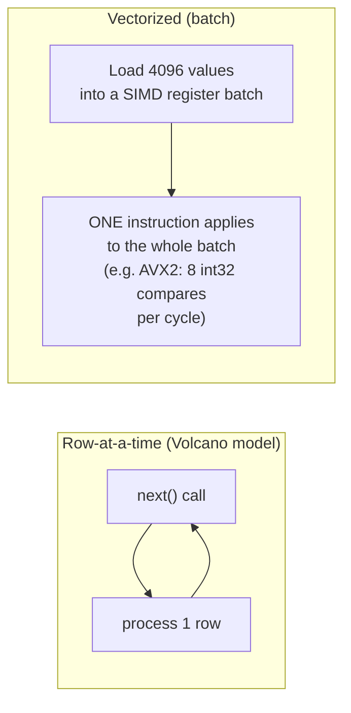
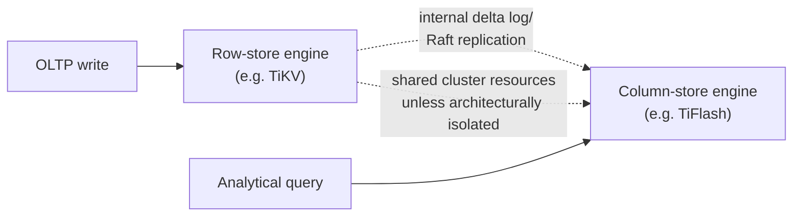

# OLTP vs OLAP — Professional

<!-- level-focus -->
At professional level, focus on this question:

> What do vectorized execution and SIMD actually do to make column stores
> fast, and what happens to an HTAP system's internals when both workloads
> hit the same data simultaneously?

Prerequisite: [`senior.md`](senior.md).

---

## Vectorized execution: the real mechanism behind column-store speed

The row-vs-column storage layout (`middle.md`) explains the I/O savings, but
the larger modern speedup comes from **vectorized execution**: instead of a
classical "Volcano-style" iterator model calling `next()` once per row
(massive per-row function-call and branch-misprediction overhead), a
vectorized engine processes **batches** of a few thousand values per column
at once, using SIMD (Single Instruction, Multiple Data) CPU instructions to
apply one operation (compare, add, filter) across an entire batch in a
handful of instructions.



This is why a column store isn't just "less I/O" — a modern engine
(ClickHouse, DuckDB, Snowflake's internals, Vertica) is also doing
**dramatically fewer CPU instructions per row** for scans, filters, and
aggregations, compounding the I/O advantage from `middle.md`. The
professional-level implication: an OLTP row-store engine (Postgres's default
executor) run on the exact same hardware for a large aggregation query is
slower not only because of extra I/O, but because its per-row iterator
model leaves most of the CPU's SIMD width unused.

## Compression as a co-design with vectorization

Column stores keep data compressed (dictionary encoding, run-length
encoding, delta encoding) not just for storage savings but because a
vectorized engine can often **operate directly on compressed data** —
comparing a filter predicate against dictionary-encoded integer codes is
cheaper than decompressing every value first. This is why compression ratio
and query speed are coupled in a column store in a way they simply aren't in
a row store: better compression here isn't a storage-cost optimization
alone, it's a query-speed optimization too.

## HTAP internals: what "maintain both representations" actually costs

Systems like SingleStore and TiDB implement HTAP by maintaining a row-store
representation (for fast point writes/lookups) and asynchronously
propagating changes into a column-store representation (for scans), often
via an internal **change-data-capture-like delta log** between the two
storage engines inside the same product. The professional-level cost
this creates:

- **The internal sync is itself a consistency and resource-contention
  problem**, structurally identical to the OLTP→OLAP replication lag
  problem from `senior.md`, just moved inside one product's boundary instead
  of across two separate systems — an HTAP system doesn't eliminate this
  cost, it internalizes it.
- **Analytical queries reading the column-store side under heavy concurrent
  OLTP write load contend for the same underlying compute/memory resources**
  that the OLTP path needs, unless the system architecturally isolates them
  (e.g. TiFlash as a genuinely separate storage/compute tier in TiDB,
  reading from the same Raft log as TiKV but on independent hardware) — a
  poorly-isolated HTAP deployment can reproduce the exact "analytics query
  starves OLTP traffic" failure mode from `senior.md`, inside a single
  product that was marketed specifically to prevent it.



## Scale failure modes, concretely

| Symptom | Root cause | Diagnostic |
|---|---|---|
| A row-store engine's aggregation query is 50-100x slower than a column store on identical hardware for the same logical query | Volcano-iterator per-row overhead + no SIMD utilization, on top of the I/O difference | Compare CPU instructions-per-row via `perf` profiling, not just I/O metrics |
| An HTAP system's analytical queries show latency spikes correlated with OLTP write bursts | Insufficient physical/resource isolation between the row-store and column-store engines internally | Resource-level (CPU/memory/IO) attribution per engine component, not just per-query metrics |
| A column store's query speed degrades after a schema change adds a high-cardinality column | Compression ratio drop increases both storage AND the amount of data the vectorized engine must decompress/process per batch | Compare compression ratio and bytes-scanned before/after the schema change, not just query latency |

## Production checklist (staff-level)

1. **When benchmarking row-store vs. column-store engines, profile CPU
   instructions per row, not just wall-clock time** — this reveals whether
   the win is from I/O reduction, vectorization, or both, which matters for
   predicting behavior on different hardware.
2. **For any HTAP deployment, verify the actual resource isolation
   architecture between the transactional and analytical engines** before
   trusting it to prevent cross-workload contention — ask specifically how
   compute/memory/IO are partitioned, not just whether the product is
   labeled "HTAP."
3. **Treat compression ratio as a query-performance metric to monitor**, not
   just a storage-cost metric, for any column-store-backed system — a
   degrading ratio predicts rising query latency before it's visible in
   latency dashboards.
4. **In a hardware/engine selection design review, ask for SIMD/vectorization
   support explicitly**, not just "is it columnar" — some columnar formats
   are column-oriented on disk but still execute row-at-a-time, missing the
   larger modern speedup.
5. **For HTAP systems with an internal replication/delta mechanism between
   engines, monitor that internal lag as its own SLI**, separate from
   end-to-end query latency — it's the direct analog of cross-system
   replication lag and deserves the same operational rigor.

## Cheat Sheet

```text
+------------------------------------------------------------------+
|              OLTP vs OLAP — INTERNALS & SCALE                       |
+------------------------------------------------------------------+
| Column-store speed = I/O reduction (fewer bytes read) PLUS            |
| VECTORIZED execution (SIMD batch processing) - not I/O alone           |
| Volcano row-at-a-time iterator model wastes most of a CPU's SIMD      |
| width regardless of storage layout                                    |
+------------------------------------------------------------------+
| Compression is CO-DESIGNED with vectorization: engines operate         |
| directly on compressed/encoded data - compression ratio is a          |
| QUERY-SPEED metric, not just a storage-cost metric                     |
+------------------------------------------------------------------+
| HTAP internals: row-store + column-store engines linked by an          |
| internal delta log/replication - this INTERNALIZES the OLTP/OLAP      |
| lag and contention problem, doesn't eliminate it. Verify actual        |
| resource isolation (e.g. TiFlash's separate hardware) before trusting |
| an HTAP label to prevent cross-workload interference                  |
+------------------------------------------------------------------+
```

## Test yourself

1. Two systems both store data column-oriented on disk, but one is 20x
   faster on aggregation queries. What architectural difference would you
   investigate first?
2. Why is compression ratio a leading indicator of query performance
   specifically for vectorized column stores, in a way it isn't for a
   row-store engine?
3. An HTAP system's marketing claims full workload isolation, but analytical
   query p99 latency correlates with OLTP write bursts in production. What
   would you check in the vendor's architecture documentation before
   escalating this as a bug?

## Further Reading

- Boncz, Zukowski, Nes — "MonetDB/X100: Hyper-Pipelining Query Execution"
  (the original vectorized execution paper).
- Abadi, Boncz, Harizopoulos — "Column-Oriented Database Systems" (VLDB
  tutorial, compression/vectorization co-design).
- PingCAP engineering blog — TiFlash architecture (a documented, real HTAP
  isolation design).
- See also: [Query Optimization — professional](../../performance/query-optimization/professional.md).
