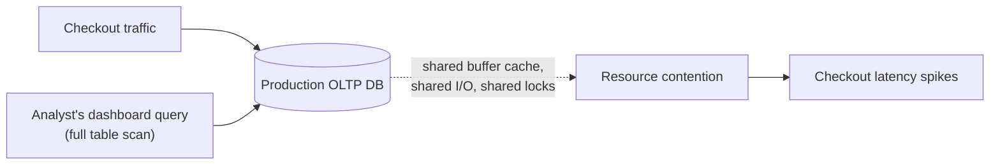
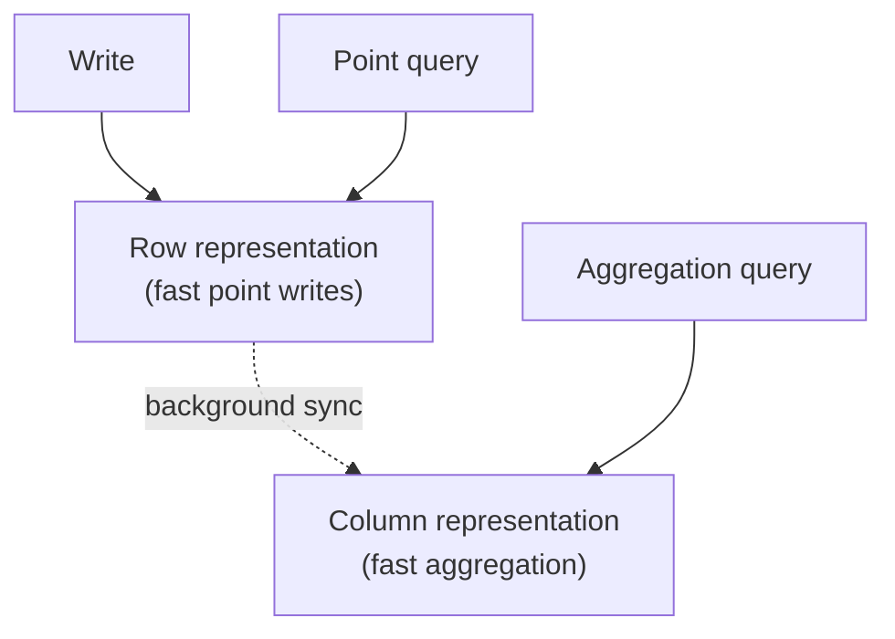

# OLTP vs OLAP — Senior

<!-- level-focus -->
At senior level, focus on this question:

> Why does "just run analytics on the production database" work fine in a
> demo and fail in production, and what is HTAP actually offering?

Prerequisite: [`middle.md`](middle.md).

---

## Why the naive approach degrades

An analytical query issued against the OLTP database competes for the exact
same finite resources — buffer cache pages, disk I/O bandwidth, CPU, and
(per [Locking & Concurrency Control — professional](../../transaction/locking-and-concurrency-control/professional.md))
potentially locks — as live application traffic. A query scanning millions of
rows can evict hot application data from the buffer cache, causing every
subsequent application query to hit disk instead of memory. This is exactly
the "pipeline writer vs. app writer" problem from that page, generalized to
readers: **read contention from analytics is just as real a production risk
as write contention from a batch job.**

This is why the standard architecture separates the two: OLTP database as
system of record, replicated or ETL'd into a dedicated OLAP system (warehouse
or column store) that analysts and dashboards query instead — see
[Replication](../../scaling/replication/README.md) and
[Kimball Dimensional Modeling](../../data-modeling/kimball-modeling/README.md).

## HTAP: Hybrid Transactional/Analytical Processing

Newer systems (SingleStore, TiDB, CockroachDB with columnar extensions,
Snowflake's Unistore, Postgres with columnar extensions like Citus/Hydra)
attempt to serve both workloads from one system, usually by maintaining
**both a row-store and a column-store representation** of the same data
internally, and routing queries to whichever representation fits.

| Trade-off | What you gain | What you give up |
|---|---|---|
| HTAP system | No separate ETL pipeline; analytics see near-real-time data with far less latency than a batch ETL window. | Higher operational complexity than either specialized system alone; often more expensive per unit of either workload than a purpose-built OLTP or OLAP system; the "sync" between representations is itself a consistency/lag question. |
| Separate OLTP + OLAP (traditional) | Each system is simpler, cheaper, and more mature at its one job; well-understood operational patterns. | ETL/replication lag between the two; more moving parts (a pipeline) to build and monitor. |

> 🎯 **Senior takeaway:** HTAP doesn't eliminate the row-store/column-store
> trade-off from `middle.md` — it hides it behind one system's marketing,
> maintaining both representations internally. It's a genuine option for
> teams that need low-latency analytics on fresh data and can afford the
> operational complexity; it is not a free lunch that makes the separate-
> systems architecture obsolete for most teams.

## Test yourself

1. Explain, in terms of the buffer cache, why one heavy analytical query
   against the OLTP database can make unrelated application queries slower.
2. What operational question would you ask before recommending an HTAP
   system over the traditional OLTP + ETL + OLAP architecture for a given
   team?
3. Why is "near-real-time" a more honest description of HTAP's analytical
   freshness than "real-time," given it still maintains two representations
   internally?

Continue to [`professional.md`](professional.md) to design the boundary
between OLTP and OLAP systems as a pipeline.
