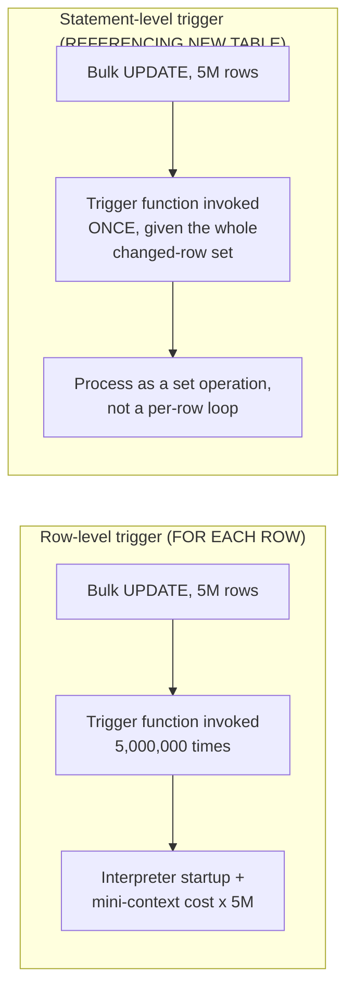

# Stored Procedures & Triggers — Professional

<!-- level-focus -->
At professional level, focus on this question:

> How does a trigger actually execute inside a transaction's control flow at
> the engine level, and what are the real internal failure modes at scale
> (recursion limits, statement-level vs. row-level firing, replication
> interaction)?

Prerequisite: [`senior.md`](senior.md).

---

## Row-level vs. statement-level firing: a real performance cliff

Postgres and most engines let a trigger fire either **once per affected
row** (`FOR EACH ROW`) or **once per statement** (`FOR EACH STATEMENT`,
regardless of how many rows the statement touches). A row-level `AFTER`
trigger on a bulk `UPDATE` affecting 5 million rows executes its trigger
function **5 million times**, each invocation paying full PL/pgSQL
interpreter startup and its own mini-transaction-context bookkeeping —
this is a well-documented, severe performance cliff: a bulk operation that
should complete in seconds can take hours purely from row-level trigger
overhead, with no change to the actual data volume being modified. The
professional-level fix is not "optimize the trigger body" but recognizing
that **row-level AFTER triggers and bulk DML are fundamentally in tension**,
and redesigning either the trigger (to statement-level with access to the
full changed-row set via `REFERENCING NEW TABLE AS ...` in Postgres 10+,
processing the whole batch in one invocation) or the write pattern (batching
smaller than the trigger's practical row-level ceiling).



## Recursive/reentrant trigger limits: a real engine-enforced ceiling

Because a trigger can itself perform DML that fires other triggers (the
cascading-chain risk from `senior.md`), engines must bound recursion to
prevent infinite loops from crashing the server. Postgres enforces
`max_stack_depth` indirectly (a runaway trigger recursion eventually blows
the C-level call stack of the backend process, which Postgres detects and
aborts with a stack-depth-exceeded error); SQL Server exposes an explicit,
configurable `nested triggers` setting with a hard limit of 32 levels. A
staff-level diagnostic skill: when a write mysteriously fails with a
stack-depth or recursion-limit error under specific data conditions (not
consistently), the actual bug is almost always a trigger whose write
pattern occasionally satisfies its own re-trigger condition — a bug that
often only manifests for a specific subset of input data, making it
notoriously hard to reproduce from a bug report alone.

## Trigger interaction with logical replication and CDC at the WAL level

Postgres's logical replication (and by extension Debezium-style CDC)
captures changes **after** trigger execution, at the level of the actual
row versions committed to the WAL — meaning a `BEFORE INSERT` trigger that
modifies `NEW` before the row is written is completely invisible as a
separate event; only the final, trigger-modified row appears in the
replication/CDC stream. Conversely, **`AFTER` triggers that themselves
perform DML on other tables generate their own separate WAL entries**,
which is the actual physical mechanism underlying the "trigger effects
appear as ordinary CDC events" behavior. A subtlety many teams miss:
Postgres logical replication does **not**, by default, replicate the
firing of `AFTER` triggers on the *replica/subscriber* side unless
explicitly configured (`ALTER TABLE ... ENABLE REPLICA TRIGGER`) —
meaning a trigger-maintained audit table can silently diverge between
primary and any read replica or logical-replication target unless this is
deliberately configured, a frequently-undiscovered production gap.

## Production checklist (staff-level)

1. **Never deploy a row-level `AFTER`/`BEFORE` trigger on a table subject to
   bulk DML without load-testing the trigger under realistic bulk volume
   first** — the row-level firing cost cliff is severe and non-obvious from
   a small-scale functional test.
2. **Prefer statement-level triggers with transition tables
   (`REFERENCING NEW TABLE AS ...`) for any trigger logic that can be
   expressed as a set operation** over the changed rows, rather than
   per-row procedural logic, whenever your engine supports it.
3. **Explicitly configure replica-side trigger firing behavior**
   (`ENABLE REPLICA TRIGGER` in Postgres, or the equivalent) if trigger-
   maintained derived state must stay consistent across logical replication
   targets — verify this in a design review, don't assume it's automatic.
4. **When diagnosing an intermittent recursion/stack-depth error, look for
   a data-dependent trigger self-trigger condition** — these bugs are
   condition-specific, not universal, and reproduce only under particular
   input shapes.
5. **Version-control and CI-test trigger logic with the same rigor as
   application code**, including explicit bulk-volume performance
   regression tests — a trigger's cost profile under bulk operations is a
   production-readiness gate, not an afterthought to check after an
   incident.

## Cheat Sheet

```text
+------------------------------------------------------------------+
|      STORED PROCEDURES & TRIGGERS — INTERNALS & SCALE                |
+------------------------------------------------------------------+
| Row-level (FOR EACH ROW) trigger on bulk DML = trigger function        |
| invoked ONCE PER ROW - severe, well-known performance cliff on         |
| large batches. Fix: statement-level trigger + transition tables        |
| (REFERENCING NEW TABLE), processing the whole changed set at once      |
+------------------------------------------------------------------+
| Recursive/reentrant triggers hit a REAL engine-enforced limit           |
| (stack depth in Postgres, "nested triggers" cap of 32 in SQL Server) - |
| intermittent recursion errors are usually a data-dependent             |
| self-trigger condition, not a universal bug                            |
+------------------------------------------------------------------+
| Logical replication/CDC captures POST-trigger row state (BEFORE        |
| trigger changes are invisible as separate events; AFTER trigger DML     |
| generates its own WAL entries). Replica-side trigger firing is OFF     |
| by default in Postgres logical replication - must explicitly enable    |
| ENABLE REPLICA TRIGGER or derived state silently diverges              |
+------------------------------------------------------------------+
```

## Test yourself

1. A bulk `UPDATE` on 3 million rows takes 4 hours due to a row-level
   `AFTER` trigger. Redesign it using a statement-level trigger with
   transition tables, and explain the performance mechanism that fixes it.
2. Why does a recursive trigger bug often only manifest for specific input
   data rather than consistently, making it hard to reproduce from a bug
   report?
3. A trigger-maintained audit table on the primary has drifted from its
   logical-replication target. What configuration would you check first,
   and why does Postgres default to this behavior?

## Further Reading

- PostgreSQL documentation — "Trigger Behavior Summary," "Transition
  Tables," and "Logical Replication: Restrictions."
- Microsoft SQL Server documentation — "Nested Triggers" and recursive
  trigger configuration.
- Debezium documentation — "How trigger-generated changes appear in
  change streams" (WAL-level capture behavior).
- See also: [Transactions & ACID — professional](../../transaction/transactions-and-acid/professional.md).
