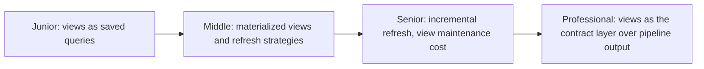
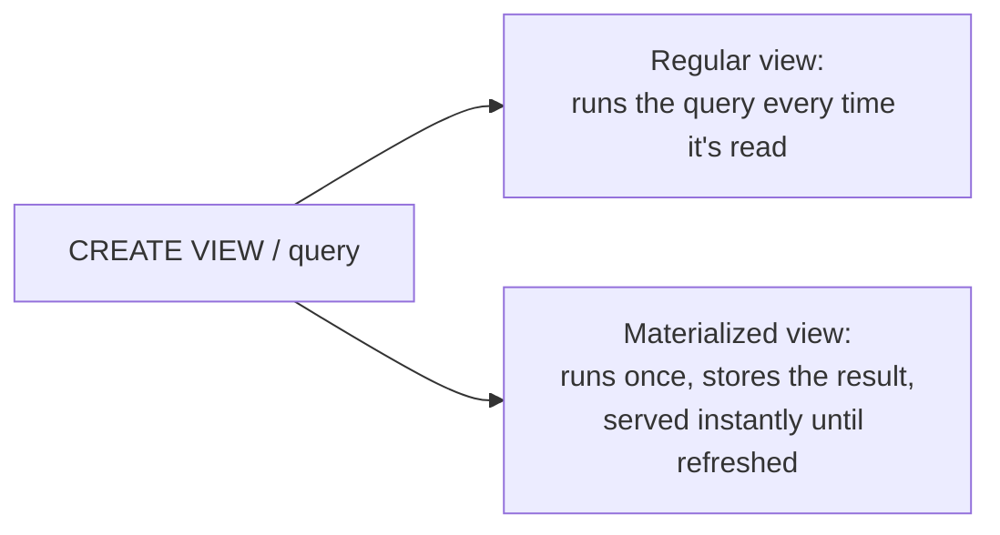

# Views

> A view is a saved query that looks like a table. A materialized view is a
> saved query that *is* a table, refreshed on a schedule you control. The
> choice between them is a freshness-vs-compute trade-off data engineers make
> constantly when exposing derived data.

## Choose a level

| Level | Guide | You are done when |
|---|---|---|
| Junior | [Views as saved queries](junior.md) | You can explain why a view doesn't store data and what that means for freshness vs. compute cost. |
| Middle | [Materialized views and refresh](middle.md) | You can choose between `REFRESH` strategies and explain the staleness they introduce. |
| Senior | [Incremental refresh](senior.md) | You can explain why incremental refresh is harder than full refresh and when it's worth the complexity. |
| Professional | [Views as a pipeline contract](professional.md) | You can design a view layer that decouples downstream consumers from upstream schema changes. |

## Practice rule

Before creating a materialized view, ask: "how stale can this be before
someone downstream makes a wrong decision from it?" That answer determines
your refresh interval — not "as fresh as possible," which usually costs far
more compute than the use case actually needs.

## Related

- [Query Optimization](../../performance/query-optimization/README.md)
- [Relational Model](../../data-modeling/relational-model/README.md)
- [Caching: Refresh-Ahead](../caching/refresh-ahead/README.md)
