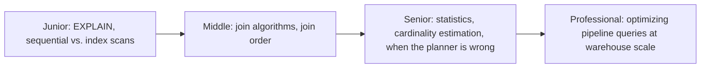
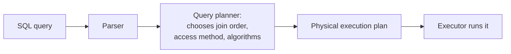

# Query Optimization

> A query planner turns your SQL into a physical execution plan — and reading
> that plan is the single highest-leverage skill for making a slow pipeline
> query fast. Guessing at optimizations without reading the plan is how
> engineers add indexes that never get used.

## Choose a level

| Level | Guide | You are done when |
|---|---|---|
| Junior | [Reading EXPLAIN](junior.md) | You can read an `EXPLAIN` plan and identify a sequential scan versus an index scan. |
| Middle | [Join algorithms and order](middle.md) | You can explain nested loop, hash, and merge joins, and why join order matters. |
| Senior | [Statistics and cardinality](senior.md) | You can diagnose a bad plan caused by stale statistics or a misestimated cardinality. |
| Professional | [Optimizing pipeline queries at scale](professional.md) | You can optimize a warehouse query touching billions of rows using partitioning, clustering, and materialization. |

## Practice rule

Before adding an index or rewriting a query "to make it faster," run
`EXPLAIN ANALYZE` first and identify exactly which operation in the plan is
consuming the most time or rows. Optimizing a query without reading its plan
first is optimizing blind.

## Related

- [B+Tree](../indexing/b+tree/README.md)
- [OLTP vs OLAP](../../operation/21-oltp-vs-olap/README.md)
- [Views](../../operation/05-views/README.md)
