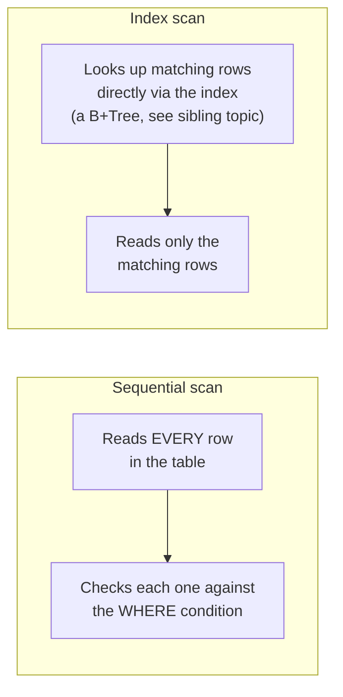

# Query Optimization — Junior

<!-- level-focus -->
At junior level, focus on this question:

> How do you read an `EXPLAIN` plan to tell whether a query is scanning the
> whole table or using an index?

---

## Sequential scan vs. index scan

```sql
EXPLAIN SELECT * FROM orders WHERE customer_id = 42;
```

```text
Seq Scan on orders  (cost=0.00..18334.00 rows=1 width=97)
  Filter: (customer_id = 42)
```

```text
Index Scan using idx_orders_customer_id on orders  (cost=0.43..8.45 rows=1 width=97)
  Index Cond: (customer_id = 42)
```



A **sequential scan** reads every row in the table and checks each against
the filter — cost scales with table size regardless of how selective the
filter is. An **index scan** uses an index (see
[B+Tree](../14-indexing%20%26%20filtering/b+tree/README.md)) to jump directly
to matching rows — cost scales with the number of *matching* rows, not the
table's total size.

## Why the planner sometimes chooses a sequential scan anyway

A sequential scan isn't always the "wrong" choice — if a query matches a
**large fraction** of the table (say, more than ~10-20%, a rule of thumb that
varies by workload), reading the whole table sequentially can actually be
faster than jumping around via an index, because sequential disk reads are
cheaper per-row than the random-access pattern an index scan implies. The
planner makes this cost-based decision using table statistics — the subject
of `senior.md`.

> 🎓 **Takeaway:** `EXPLAIN` (or `EXPLAIN ANALYZE` to also see actual runtime
> numbers, not just estimates) tells you exactly what the database plans to
> do — reading it is the prerequisite skill for every optimization decision
> that follows. Never guess at why a query is slow; ask the planner.

## Test yourself

1. Why does a sequential scan's cost stay roughly the same regardless of how
   selective the `WHERE` clause is, while an index scan's cost doesn't?
2. What does `EXPLAIN ANALYZE` show you that plain `EXPLAIN` doesn't?
3. Would you expect an index scan or a sequential scan for
   `SELECT * FROM orders WHERE status != 'cancelled'` on a table where 95% of
   rows aren't cancelled? Why?

Continue to [`middle.md`](middle.md).
