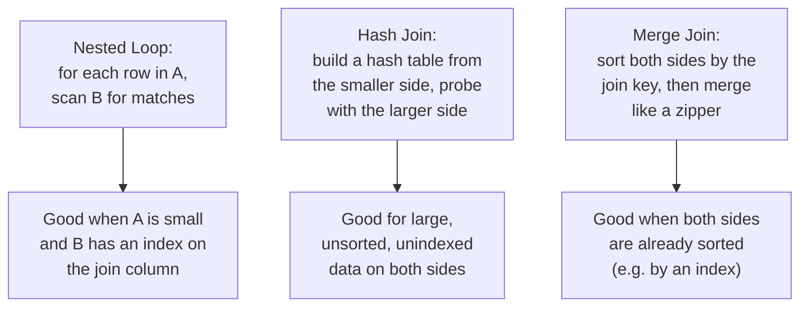
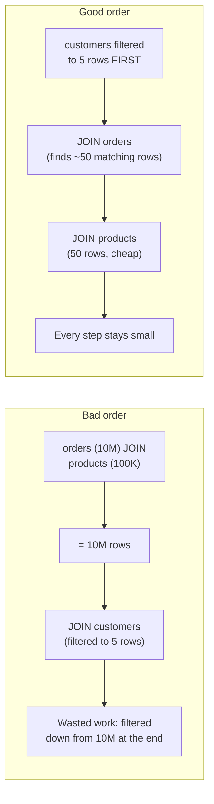

# Query Optimization — Middle

<!-- level-focus -->
At middle level, focus on this question:

> What are the three main join algorithms, and why does the order tables are
> joined in matter for performance?

Prerequisite: [`junior.md`](junior.md).

---

## Three join algorithms



| Algorithm | Cost shape | Best when |
|---|---|---|
| **Nested loop** | O(rows in A × cost to find matches in B) | A is small; B has an index on the join column so "find matches" is cheap per row. |
| **Hash join** | O(rows in A + rows in B) | Neither side is sorted or indexed on the join key; one side fits comfortably in memory for the hash table. |
| **Merge join** | O(rows in A + rows in B), given sorted input | Both sides are already sorted (e.g. reading from an index in key order) — avoids a separate sort step. |

```sql
EXPLAIN SELECT * FROM orders o JOIN customers c ON o.customer_id = c.customer_id;
```

```text
Hash Join  (cost=1.09..450.23 rows=1000 width=120)
  Hash Cond: (o.customer_id = c.customer_id)
  ->  Seq Scan on orders o
  ->  Hash
        ->  Seq Scan on customers c
```

## Why join order matters

For 3+ table joins, the planner must decide **which two tables to join
first**, then join that result with the next table, and so on. The
intermediate result size at each step compounds — joining the two most
selective (smallest-result) tables first keeps every subsequent join's input
small, while joining two large tables first can produce a huge intermediate
result that every later join then has to work through.



Modern query planners generally figure this out automatically using
statistics (how many rows each filter/join is expected to produce) — but
this optimization can fail when those statistics are wrong, which is exactly
`senior.md`'s subject.

## Test yourself

1. Why is a nested loop join a poor choice when neither table has an index
   on the join column and both tables are large?
2. Why does a merge join avoid a separate sort step only when its inputs are
   already sorted — what would happen if you forced a merge join on unsorted
   data?
3. For a 4-table join where one table has a highly selective `WHERE` filter
   reducing it to 10 rows, why would you want that table joined first?

Continue to [`senior.md`](senior.md).
