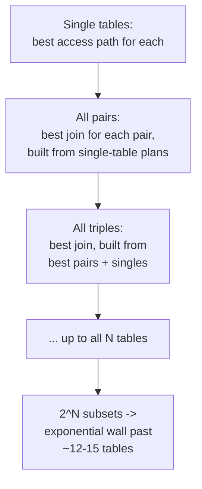
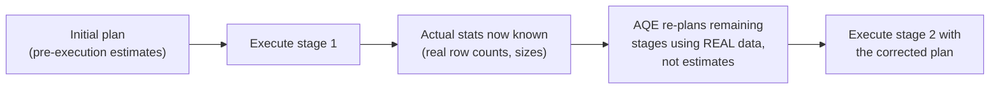

# Query Optimization — Professional

<!-- level-focus -->
At professional level, focus on this question:

> How does a cost-based optimizer actually search the plan space (dynamic
> programming vs. genetic algorithms), and what happens when that search
> itself becomes the bottleneck?

Prerequisite: [`senior.md`](senior.md).

---

## Plan-space search: dynamic programming and its exponential wall

For an N-way join, the number of possible join orders grows factorially
(roughly `(2N-2)!/(N-1)!` for left-deep trees alone). Classical query
optimizers (following the original System R optimizer design) use
**dynamic programming**: build up the cheapest plan for joining every
subset of tables incrementally — first every single table, then every pair,
then every triple built from cheaper pairs, and so on — memoizing the best
plan found for each subset so it's never recomputed. This finds the
*provably* optimal join order (given accurate cost estimates) but the
number of subsets is `2^N`, making DP-based search **impractical past
roughly 12-15 tables** even with memoization.



Postgres switches strategies past `geqo_threshold` (default 12 tables),
falling back to a **Genetic Query Optimizer (GEQO)**: it encodes join orders
as "chromosomes," evaluates their cost as "fitness," and evolves a
population of candidate plans via mutation and crossover across
generations — a heuristic search that finds a *good* (not provably optimal)
plan in polynomial time. The staff-level implication: **a query joining 13+
tables is being optimized by a randomized heuristic, not an exhaustive
search** — plan instability (the same query occasionally getting a
different, worse plan on re-planning) past this threshold is expected
behavior from GEQO's randomization, not a bug, and is a legitimate reason to
either restructure the query to fewer joins or pin a known-good plan via
extensions (`pg_hint_plan`) or materialized intermediate steps.

## Cardinality estimation errors compound multiplicatively across joins

`senior.md` covered a single misestimation. At the professional level, the
critical insight is that **estimation errors compound multiplicatively**
through a join chain: if each of 5 sequential join steps independently
underestimates selectivity by 2x (a very modest, realistic per-step error),
the final cardinality estimate can be off by `2^5 = 32x` — this is why
deep join chains on correlated, poorly-modeled data can produce catastrophically
wrong plans even when no single step's estimate looks obviously wrong in
isolation. This compounding effect is the actual mechanistic reason "add
extended statistics on correlated columns" (`senior.md`) has outsized value
on wide, multi-join queries specifically — fixing one upstream estimation
error prevents its multiplicative propagation through everything downstream
of it.

## Adaptive query execution: when engines stop trusting the plan mid-run

Modern engines (Spark 3+'s Adaptive Query Execution, SQL Server's Adaptive
Joins, Oracle's Adaptive Query Optimization) address the compounding-error
problem directly by **re-planning mid-execution** based on actual observed
statistics from completed stages, rather than trusting pre-execution
estimates for the entire plan. Spark's AQE, concretely: after a shuffle
stage completes, it has the *actual* row counts and partition sizes for that
stage's output — it uses this real data to dynamically coalesce
small shuffle partitions, switch a sort-merge join to a broadcast join if
one side turned out unexpectedly small, and handle skewed partitions by
splitting them, all decisions the original plan (built from pre-execution
estimates) could not make correctly.



## Production checklist (staff-level)

1. **Know your engine's join-order search algorithm and its threshold**
   (Postgres's `geqo_threshold`, or equivalent) — treat queries above that
   threshold as inherently plan-unstable and either restructure them or
   pin plans explicitly, rather than debugging "why did the plan change"
   as if it were an anomaly.
2. **Prioritize statistics/correlation fixes on the tables earliest in a
   deep join chain**, not just the table with the largest individual
   misestimation — an early error compounds multiplicatively through
   everything downstream.
3. **Enable and tune adaptive query execution (Spark AQE, or your engine's
   equivalent) for any workload with unpredictable or skewed data
   distributions**, and understand what specific decisions it can and
   cannot correct mid-run (partition coalescing and join-strategy switching,
   yes; a fundamentally wrong join order chosen before any stage runs, not
   always).
4. **When a plan is unstable across executions of the identical query with
   no data or statistics change, suspect a heuristic search (GEQO or
   similar) before suspecting a caching or concurrency bug.**
5. **In a query-performance postmortem for a many-table join, request the
   plan search strategy used (exhaustive DP vs. heuristic) as part of the
   root-cause analysis** — it changes whether the fix is "correct the
   statistics" or "restructure the query to reduce join count below the
   exhaustive-search threshold."

## Cheat Sheet

```text
+------------------------------------------------------------------+
|            QUERY OPTIMIZATION — INTERNALS & SCALE                   |
+------------------------------------------------------------------+
| Join-order search: dynamic programming (System R style) is exact       |
| but O(2^N) subsets -> impractical past ~12-15 tables.                  |
| Beyond that: heuristic search (Postgres GEQO = genetic algorithm) -    |
| plan instability past this threshold is EXPECTED, not a bug            |
+------------------------------------------------------------------+
| Cardinality estimation errors COMPOUND MULTIPLICATIVELY through a      |
| join chain - a modest per-step error becomes catastrophic after        |
| several joins. Fix the EARLIEST misestimation in the chain first.      |
+------------------------------------------------------------------+
| Adaptive Query Execution (Spark AQE, SQL Server Adaptive Joins):       |
| re-plans MID-EXECUTION using real observed stage statistics -          |
| coalesces skewed/small partitions, switches join strategy - directly   |
| addresses the compounding-estimation-error problem for the REMAINING   |
| stages, not the ones already executed                                 |
+------------------------------------------------------------------+
```

## Test yourself

1. Why does Postgres switch to a genetic algorithm past a certain join
   count instead of continuing to use dynamic programming, and what does
   that imply about debugging a suddenly-different plan for an unchanged
   14-table query?
2. Explain why fixing a cardinality misestimation on the 2nd table in a
   6-table join chain has more leverage than fixing an equally-sized
   misestimation on the 6th table.
3. Spark's AQE switches a sort-merge join to a broadcast join mid-execution.
   What information became available between planning and this decision
   that wasn't available at planning time?

## Further Reading

- Selinger et al. — "Access Path Selection in a Relational Database
  Management System" (1979 — the original System R dynamic-programming
  query optimizer paper).
- PostgreSQL documentation — "Genetic Query Optimizer" (GEQO internals and
  `geqo_threshold`).
- Databricks engineering blog — "Adaptive Query Execution: Speeding Up
  Spark SQL at Runtime" (AQE's specific mid-execution re-planning
  mechanisms).
- See also: [B+Tree — professional](../14-indexing%20%26%20filtering/b+tree/professional.md).
