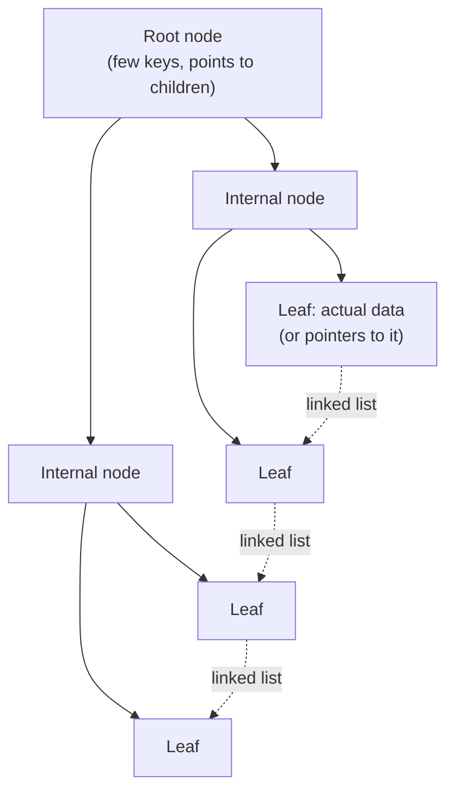

# B+Tree

> The default index structure behind almost every relational database. A
> balanced tree tuned for disk: shallow (few levels), wide nodes (fits many
> keys per disk page), and leaves linked for fast range scans.

## Choose a level

| Level | Guide | You are done when |
|---|---|---|
| Junior | [Why a tree beats scanning](junior.md) | You can explain why a B+Tree lookup is O(log n) instead of O(n). |
| Middle | [Node structure and linked leaves](middle.md) | You can explain why B+Trees are wide (high fan-out) and why leaves are linked. |
| Senior | [Write cost: page splits](senior.md) | You can explain why random-order inserts are more expensive than sequential ones. |
| Professional | [B+Tree vs. LSM-tree for pipelines](professional.md) | You can choose the right index structure for a write-heavy ingestion workload. |

## Practice rule

Next time you add an index, ask: "is this column's data inserted roughly in
order (like an auto-incrementing ID or a timestamp), or in random order?"
That answer predicts whether you'll pay `senior.md`'s page-split cost heavily
or barely at all.

## Related

- [Query Optimization](../../query-optimization/README.md)
- [LSM-Tree](../lsm-tree/README.md)
- [Skip List](../skip-list/README.md)
