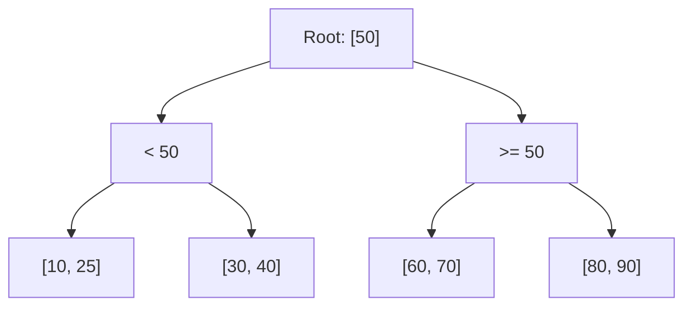
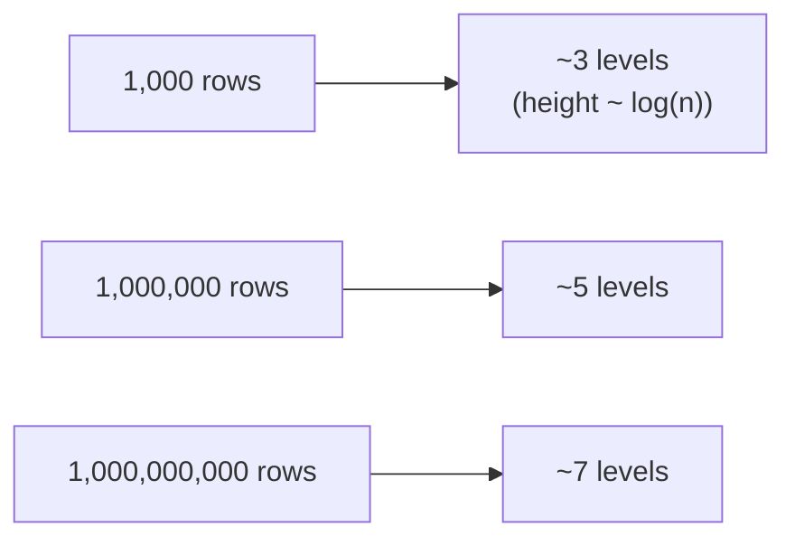

# B+Tree — Junior

<!-- level-focus -->
At junior level, focus on this question:

> Why does looking a value up in a B+Tree index take a handful of steps
> regardless of table size, instead of scaling with the number of rows?

---

## The problem: finding one row among millions

Without an index, finding `WHERE id = 42` means scanning every row until you
find it — O(n) in the worst case, as covered in
[Query Optimization — junior](../../query-optimization/junior.md). A
B+Tree index organizes keys into a **balanced, sorted tree** so a lookup
only needs to follow one path from root to leaf.

Looking up `id = 42`: start at root, `42 < 50` so go left; compare against
`[10, 25]` and `[30, 40]`, `42` is greater than both so descend to the
rightmost of that group; arrive at the leaf holding `42`. Three steps
total — and because the tree is **balanced**, every lookup takes
approximately the same, small number of steps, no matter how many total
rows exist.

## Logarithmic height is the key property

Because each node holds many keys and points to many children (high
**fan-out**, covered in `middle.md`), the tree's height grows extremely
slowly as the number of rows grows — doubling the number of rows barely
adds a level. This is why index lookups are described as O(log n): the
number of steps grows logarithmically with the data size, not linearly.

> 🎓 **Takeaway:** the entire value proposition of a B+Tree index is turning
> an O(n) linear search into an O(log n) tree traversal — for a table with a
> billion rows, that's the difference between potentially scanning a billion
> rows and following roughly 7 pointers.

## Test yourself

1. If a table has 1 million rows and a B+Tree index has a height of 5, how
   many comparisons does a lookup take, roughly?
2. Why does "balanced" matter — what would happen to lookup time if the tree
   were allowed to become lopsided (some paths much longer than others)?
3. Trace the lookup for `id = 15` through the diagram above.

Continue to [`middle.md`](middle.md).
