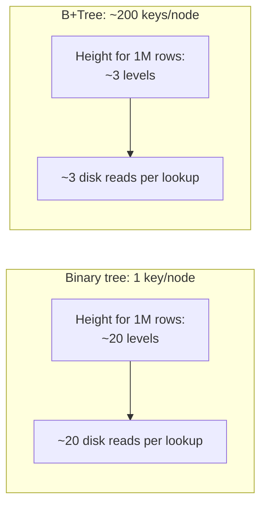

# B+Tree — Middle

<!-- level-focus -->
At middle level, focus on this question:

> Why are B+Tree nodes wide (holding many keys) instead of narrow like a
> binary tree, and why are the leaves linked together?

Prerequisite: [`junior.md`](junior.md).

---

## High fan-out is tuned for disk pages

A binary tree node holds one key and two children — a B+Tree node instead
holds **hundreds** of keys and pointers, sized to fill exactly one disk
page (typically 4-16 KB).



Every level of the tree potentially costs one disk read (or one cache miss,
if hot data is in memory). A binary tree's low fan-out means a deep tree and
many disk reads per lookup; a B+Tree's high fan-out (matched to disk page
size) means a shallow tree and far fewer disk reads — this is the actual
engineering reason B+Trees, not binary trees, are the standard database
index structure: **disk I/O, not comparison count, is the dominant cost.**

## Only leaves hold data; internal nodes are pure routing

```text
Internal node: [10, 25, 40]  -- keys only, used purely to route the search
                              -- down to the correct child
Leaf node: [10 -> row_ptr, 25 -> row_ptr, 40 -> row_ptr]  -- actual data
                                                            -- or pointers to it
```

Internal nodes exist purely to guide the search downward efficiently —
they don't store row data, which lets them pack more keys per page (more
fan-out) than if they also carried data payloads.

## Linked leaves enable fast range scans


```sql
SELECT * FROM orders WHERE order_date BETWEEN '2024-01-01' AND '2024-03-31';
```

For a range query, the tree traversal finds the **starting** leaf (following
the same root-to-leaf path from `junior.md`), then simply **walks the linked
list of leaves forward** until the range's upper bound is exceeded — no
re-traversal of the tree needed for each subsequent value. This is why
B+Trees (unlike a plain binary search tree or hash index) are excellent for
range queries: `col > X`, `col BETWEEN X AND Y`, `ORDER BY col LIMIT N`.

> 🎓 **Takeaway:** every structural choice in a B+Tree — wide nodes, data
> only in leaves, linked leaves — is optimized for the physical reality of
> disk-backed storage and the common query shapes (point lookup, range scan)
> a database actually needs to serve fast.

## Test yourself

1. Why does packing more keys per node reduce the number of disk reads a
   lookup requires, specifically?
2. Why can't a hash index (covered conceptually elsewhere) efficiently
   answer `WHERE col BETWEEN X AND Y` the way a B+Tree can?
3. If disk pages were 10x larger, would you expect B+Tree fan-out to
   increase or decrease, and what would that do to tree height for the same
   number of rows?

Continue to [`senior.md`](senior.md).
