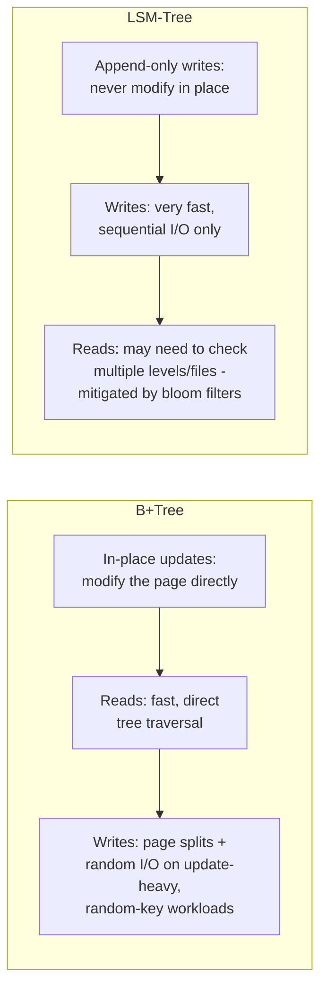

# B+Tree — Professional

<!-- level-focus -->
At professional level, focus on this question:

> Given a write-heavy ingestion pipeline, when should you choose a
> B+Tree-indexed store versus an LSM-tree-based one?

Prerequisite: [`senior.md`](senior.md).

---

## The fundamental trade-off, restated



A B+Tree optimizes for **read speed and in-place update simplicity**, at the
cost of write amplification from page splits on random-order writes
(`senior.md`). An LSM-tree (see [LSM-Tree](../lsm-tree/README.md)) inverts
this: writes are always sequential appends (cheap, regardless of key order),
and reads pay the cost of checking multiple sorted files, mitigated by
in-memory indexes and [Bloom filters](../bloom-filter/README.md).

## When a data pipeline should prefer each

| Workload | Prefer |
|---|---|
| OLTP source database, moderate write rate, read-heavy, keys often sequential (auto-increment, time-ordered) | B+Tree (Postgres/MySQL default) — reads stay fast, writes are cheap enough given key locality. |
| High-throughput event/metrics ingestion, extremely high write rate, keys effectively random or high-cardinality (event IDs, sensor IDs) | LSM-tree-based store (Cassandra, RocksDB, HBase, ScyllaDB) — sequential-write throughput dramatically outperforms a B+Tree under sustained random-key writes. |
| Read-heavy analytical serving layer built from pipeline output | B+Tree-indexed store, or a dedicated read-optimized structure — write pattern is a controlled batch load, not high-throughput random writes, so B+Tree's read advantage dominates. |
| Time-series ingestion (naturally near-sequential by timestamp) | Either can work well — time-ordering gives B+Trees good insert locality too (per `senior.md`), but many time-series databases still use LSM-tree-based engines for sheer write throughput at extreme ingest rates. |

## Design checklist

1. **Characterize your write pattern's key distribution before choosing a
   storage engine** — sequential/time-ordered keys favor B+Trees more than
   random keys do, per `senior.md`.
2. **Measure sustained write throughput requirements against each engine's
   known ceiling** — if ingestion rate genuinely exceeds what a B+Tree-backed
   store can sustain under your key distribution, an LSM-tree-based store is
   likely necessary, not just an optimization.
3. **Don't default to LSM-tree stores "for scale" without checking read
   latency requirements** — LSM-tree reads (especially point lookups on cold
   data) can be slower than a well-tuned B+Tree read, mitigated but not fully
   eliminated by bloom filters and caching.
4. **Consider time-ordered surrogate keys (UUIDv7, Snowflake IDs)** for any
   B+Tree-indexed table under meaningful write load, even if you don't
   switch storage engines — it's a low-cost way to capture much of
   `senior.md`'s insert-locality benefit.
5. **Reconsider the choice as the workload evolves** — a pipeline that
   started as moderate-throughput OLTP writes and grew into
   high-throughput event ingestion may have outgrown its original B+Tree-
   based store's write ceiling without anyone deciding that on purpose.

## Cheat Sheet

```text
+------------------------------------------------------------------+
|                            B+TREE                                   |
+------------------------------------------------------------------+
| Balanced tree, high fan-out (wide nodes matched to disk page size)   |
| Lookup: O(log n), ~few disk reads regardless of table size            |
| Only leaves hold data; leaves are LINKED -> fast range scans          |
+------------------------------------------------------------------+
| Write cost: page splits when a node is full - cascades upward         |
| Sequential/time-ordered keys -> cheap, localized splits                |
| Random keys (UUIDv4) -> scattered splits, low fill factor,             |
|   well-known B+Tree anti-pattern at scale                              |
+------------------------------------------------------------------+
| B+Tree vs LSM-tree for pipelines:                                     |
|   B+Tree: better reads, in-place updates, needs write locality         |
|   LSM-tree: sequential writes always cheap regardless of key order,    |
|     reads cost more (multi-level lookups, mitigated by bloom filters)  |
|   -> choose based on write throughput + key distribution + read needs |
+------------------------------------------------------------------+
```

## Test yourself

1. A metrics ingestion pipeline writes 500K events/sec with randomly
   distributed sensor IDs as the primary key. Would you recommend a
   B+Tree-backed or LSM-tree-backed store, and why?
2. Why does switching a high-write-volume table's primary key from UUIDv4 to
   UUIDv7 help a B+Tree-backed store without requiring a storage engine
   change at all?
3. A read-heavy analytical serving layer is built once per day from a batch
   pipeline. Does the B+Tree-vs-LSM-tree write-throughput trade-off matter
   much here? Why or why not?

## Further Reading

- Jim Gray & others — original B-Tree/B+Tree literature; PostgreSQL/MySQL
  documentation on B-Tree index internals.
- Use the Index, Luke! (Markus Winand) — practical B+Tree indexing guidance.
- See also: [LSM-Tree](../lsm-tree/README.md),
  [Bloom Filter](../bloom-filter/README.md),
  [Query Optimization — senior](../../15-query-optimization/senior.md).
