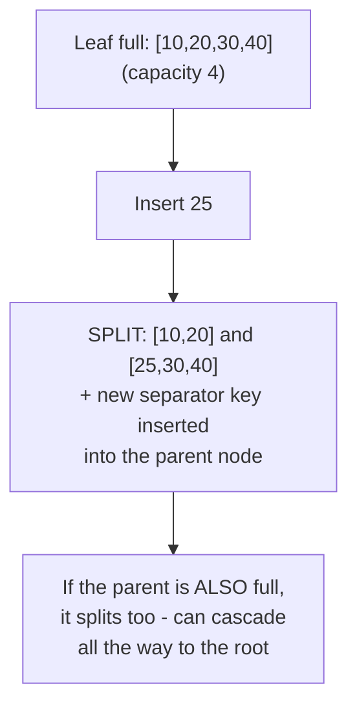
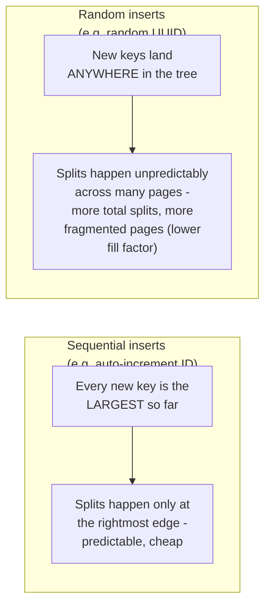

# B+Tree — Senior

<!-- level-focus -->
At senior level, focus on this question:

> Why do random-order inserts into a B+Tree cost more than sequential ones,
> and what is a "page split"?

Prerequisite: [`middle.md`](middle.md).

---

## Page splits: what happens when a node is full

Each B+Tree node (page) has a fixed capacity. Inserting a new key into an
already-full leaf requires **splitting** it into two half-full leaves and
propagating a new separator key up to the parent — which can itself be full,
cascading the split upward.

A page split isn't just "add a key" — it's a structural rewrite involving
allocating a new page, moving roughly half the entries into it, updating
sibling links, and writing a new entry into the parent. This is
meaningfully more expensive than an insert that lands in a leaf with free
space.

## Sequential vs. random insert order

An auto-incrementing primary key always inserts at the "end" of the key
space — the rightmost leaf fills up and splits in a predictable, localized
pattern. A **random** key (a UUID v4, a hash) inserts at an essentially
random position every time, causing splits scattered unpredictably across
the whole tree, and leaving many pages only partially full (lower **fill
factor**) because splits happen before pages are naturally full end-to-end.

This is why **UUID v4 primary keys are a well-known performance anti-pattern**
for B+Tree-indexed tables at scale, and why time-ordered ID schemes (UUIDv7,
Snowflake IDs, ULIDs) exist specifically to give you global uniqueness while
preserving the sequential-insert-friendly property of an auto-increment ID.

> 🎯 **Senior takeaway:** the choice of primary/index key isn't just about
> uniqueness — it's about **insert locality**. A monotonically increasing key
> (even a synthetic one like UUIDv7) keeps B+Tree writes cheap and pages
> well-packed; a randomly-distributed key spreads write cost and
> fragmentation across the entire index.

## Test yourself

1. Why does a cascading split (parent also full) become progressively rarer
   as you go up the tree, for a reasonably balanced workload?
2. Why does a UUID v4 primary key cause more total page splits over the
   table's lifetime than an auto-incrementing integer, for the same number
   of rows inserted?
3. What is UUIDv7 doing differently from UUIDv4 that preserves B+Tree
   insert-friendliness while still being globally unique?

Continue to [`professional.md`](professional.md) to compare B+Trees against
LSM-trees for write-heavy pipeline ingestion.
