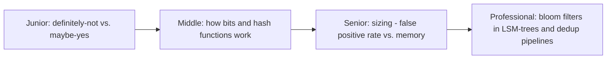
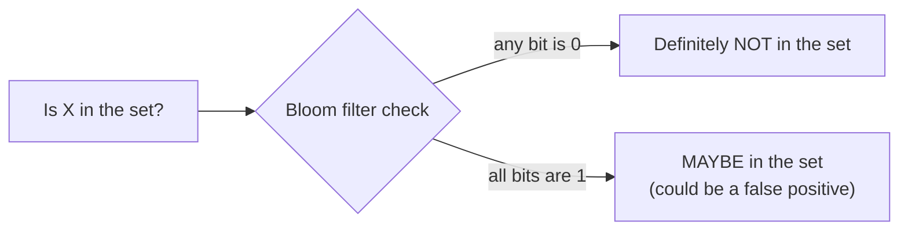

# Bloom Filter

> A probabilistic structure that answers "have I possibly seen this before?"
> using a fraction of the memory a real set would need — trading a tunable
> false-positive rate for massive space savings. The reason LSM-tree reads
> and deduplication pipelines don't grind to a halt at scale.

## Choose a level

| Level | Guide | You are done when |
|---|---|---|
| Junior | [Definitely-not vs. maybe-yes](junior.md) | You can explain why a bloom filter never has false negatives but can have false positives. |
| Middle | [Bits and hash functions](middle.md) | You can trace an insert and a lookup through a small bit array with 2-3 hash functions. |
| Senior | [Sizing the filter](senior.md) | You can compute the memory/false-positive-rate trade-off for a given expected set size. |
| Professional | [Bloom filters in LSM-trees and dedup](professional.md) | You can explain why an LSM-tree read checks a bloom filter before touching disk. |

## Practice rule

Before reaching for a bloom filter, ask: "can I tolerate an occasional false
positive (a 'maybe yes' that turns out to be no), and do I have zero
tolerance for false negatives (ever missing something that IS there)?" If
either answer is wrong for your use case, a bloom filter is the wrong tool.

## Related

- [LSM-Tree](../lsm-tree/README.md)
- [B+Tree](../b+tree/README.md)
