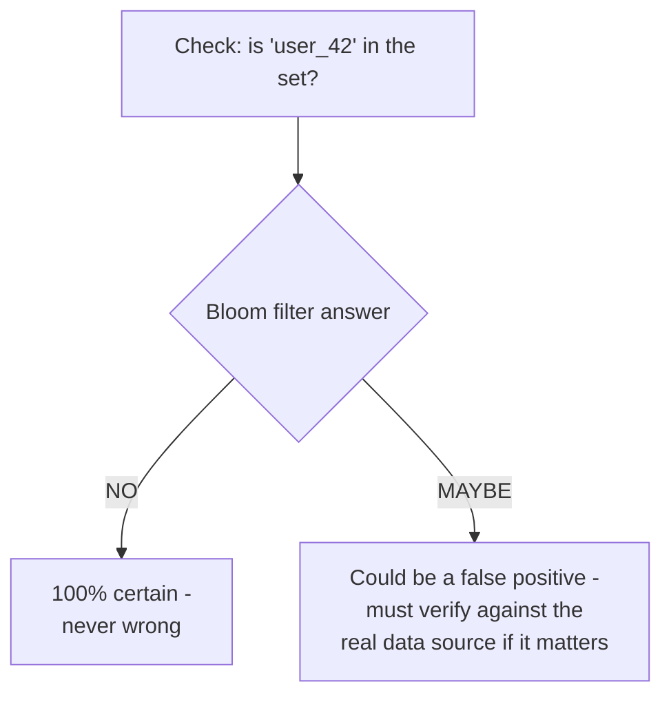

# Bloom Filter — Junior

<!-- level-focus -->
At junior level, focus on this question:

> Why can a bloom filter say "definitely not" with total confidence, but can
> only ever say "maybe" instead of "definitely yes"?

---

## The one-sided guarantee



A bloom filter is a compact structure that can answer membership queries
("is X in this set?") using far less memory than storing the actual set —
but it achieves that compactness by giving up perfect accuracy in one
specific, controlled direction: it can occasionally say "maybe yes" for
something that isn't actually there (a **false positive**), but it can
**never** say "no" for something that actually is there (**zero false
negatives**, guaranteed).

## Why this asymmetry is exactly what makes it useful

```python
# Typical usage pattern: bloom filter as a cheap pre-check
def has_seen_before(item):
    if not bloom_filter.might_contain(item):
        return False   # DEFINITELY not seen - skip the expensive check entirely
    return expensive_exact_check(item)   # "maybe" - verify against the real source
```

Because a "no" answer is 100% trustworthy, you can use a bloom filter to
**skip expensive work entirely** for the (often large) majority of queries
that are genuinely absent — only paying the cost of a real, exact check for
the smaller fraction that come back "maybe." This is the entire value
proposition: a cheap, memory-efficient filter that eliminates most
unnecessary expensive lookups.

> 🎓 **Takeaway:** a bloom filter trades perfect accuracy for massive space
> savings, but only in the "false positive" direction — it is designed to
> never produce a false negative, which is precisely what makes "definitely
> not" a safe, actionable answer to skip work on.

## Test yourself

1. Why would a bloom filter be a dangerous choice if it could produce false
   negatives instead of false positives?
2. In the code example, what happens to correctness (not performance) if the
   bloom filter has a 1% false positive rate?
3. Give one real scenario where "definitely not, skip the expensive check"
   is valuable even if "maybe yes" still requires a slower verification step.

Continue to [`middle.md`](middle.md).
