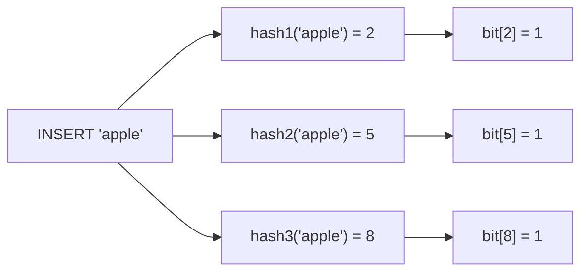
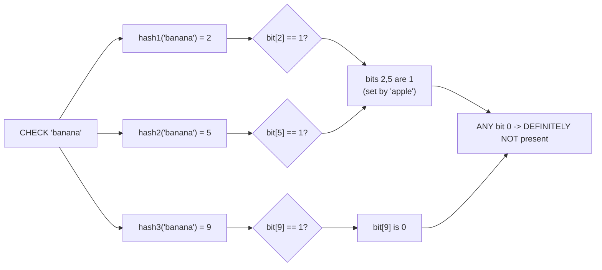

# Bloom Filter — Middle

<!-- level-focus -->
At middle level, focus on this question:

> How do the bit array and multiple hash functions actually work together to
> produce that one-sided guarantee?

Prerequisite: [`junior.md`](junior.md).

---

## The structure: a bit array plus K hash functions

A bloom filter is a fixed-size array of `m` bits (all initially 0) plus `k`
independent hash functions, each mapping any input to one position in the
array.

**Insert("apple")**: compute `k` hash values of "apple", set each
corresponding bit to 1.



**Check("banana")**: compute the same `k` hash functions on "banana", check
if **all** corresponding bits are 1.



## Why false positives happen (and false negatives can't)

If "banana" happens to hash to bits `{2, 5, 8}` — the exact same bits
"apple" set — the filter reports "maybe present" even though "banana" was
never inserted. This is a **collision**: multiple different keys' hash
functions landing on overlapping bit positions. Because bits are only ever
set to 1, never cleared, and a real member's bits are *always* set at
insert time, a **true member can never have any of its bits accidentally be
0** — this is exactly why false negatives are structurally impossible, while
false positives (someone else's insert happening to set all the bits a
non-member would also check) are possible.

## Minimal implementation

```python
import hashlib

class BloomFilter:
    def __init__(self, size, num_hashes):
        self.size = size
        self.num_hashes = num_hashes
        self.bits = [0] * size

    def _hashes(self, item):
        for i in range(self.num_hashes):
            h = hashlib.md5(f"{i}-{item}".encode()).hexdigest()
            yield int(h, 16) % self.size

    def add(self, item):
        for pos in self._hashes(item):
            self.bits[pos] = 1

    def might_contain(self, item):
        return all(self.bits[pos] == 1 for pos in self._hashes(item))
```

> 🎓 **Takeaway:** every hash function is a chance for a false positive
> collision, but also a chance to *distinguish* two different items. The
> balance between array size, number of hash functions, and expected number
> of inserted items determines the actual false-positive rate — `senior.md`
> makes this trade-off precise.

## Test yourself

1. Trace an insert of two keys and a lookup of a third key through a small
   (16-bit, 2-hash-function) bloom filter by hand, and identify a scenario
   producing a false positive.
2. Why can't you ever remove an item from a plain bloom filter (no
   "delete" operation)? What would go wrong if you tried to just flip its
   bits back to 0?
3. What happens to the false-positive rate as you insert more and more
   items into a fixed-size bit array, without ever growing it?

Continue to [`senior.md`](senior.md).
