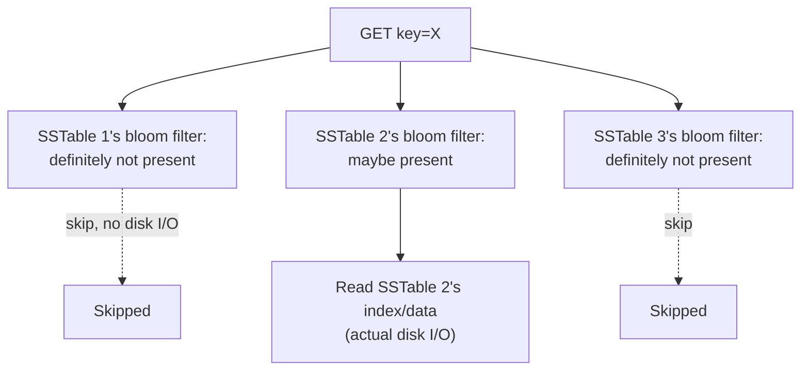
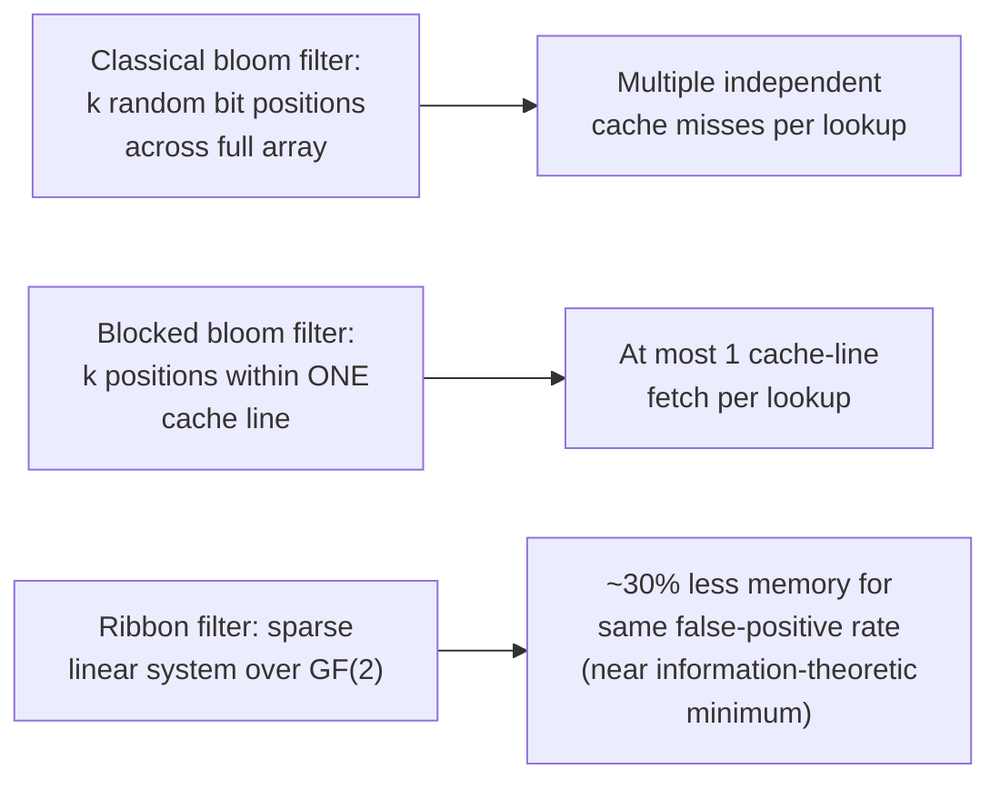

# Bloom Filter — Professional

<!-- level-focus -->
At professional level, focus on this question:

> How do RocksDB and Cassandra actually deploy bloom filters per SSTable
> internally, and what do modern refinements (Ribbon filters, blocked bloom
> filters) fix about the classical construction at scale?

Prerequisite: [`senior.md`](senior.md).

---

## Per-SSTable bloom filters: the mechanism that makes LSM-tree reads viable

An LSM-tree-based store (see the LSM-Tree deep dive) may have a key spread
across dozens of immutable SSTable files on disk after heavy write activity
and before compaction catches up. A naive point read (`GET key`) would need
to check every SSTable that could possibly contain the key — each check
potentially a disk seek. RocksDB and Cassandra both attach **one bloom
filter per SSTable** (built once, at file-write time, over exactly that
file's key set) and consult each SSTable's filter **before** touching its
actual disk blocks: a "definitely not present" from the filter (the
guaranteed-correct negative from `junior.md`) skips that SSTable's disk I/O
entirely, at the cost of a cheap in-memory bit-array check. In a well-tuned
system with filters kept resident in memory (RocksDB's block cache, or a
dedicated filter-block cache), this turns an O(number of SSTables) disk-seek
read into essentially O(1) disk seeks for the common case of a key that
exists in only one or zero SSTables.



## Why compaction and bloom filters are structurally linked

Every time compaction merges multiple SSTables into one, **all their bloom
filters must be rebuilt from scratch** for the new merged file, because a
bloom filter has no efficient "merge" operation that preserves its
false-positive guarantees across differently-sized original filters
(a naive OR of two same-sized filters *does* work correctly, but SSTables
of different sizes need differently-sized filters per the sizing formula in
`senior.md`, so a straightforward bitwise merge isn't generally available).
This makes bloom filter construction cost a **first-class, recurring
component of compaction cost**, not a one-time setup cost — at very high
write/compaction throughput, filter-rebuild CPU time is a real, measurable
line item in compaction's total resource budget, and is why RocksDB exposes
tunable filter policies (including the option to skip filters on the
largest, coldest levels where the disk-seek savings matter less relative to
the memory cost of keeping their filters resident).

## Modern refinements: Ribbon filters and blocked bloom filters

- **Blocked bloom filters** (used in RocksDB's default modern filter
  policy) restrict each key's `k` hash-derived bit positions to fall within
  a single cache line (typically 512 bits / 64 bytes) instead of scattering
  them across the entire array — trading a small increase in false-positive
  rate for a **massive reduction in CPU cache misses per lookup**, since a
  classical bloom filter's `k` random bit positions across a multi-megabyte
  array each risk being an independent cache miss, while a blocked filter
  guarantees at most one cache-line fetch per lookup.
- **Ribbon filters** (Facebook's RocksDB engineering, based on a 2021
  paper) replace the bit-array-plus-hash-functions construction entirely
  with a structure based on solving a **sparse linear system** over GF(2)
  (binary Galois field), achieving space usage much closer to the
  information-theoretic minimum for a given false-positive rate than
  classical bloom filters can — RocksDB's production benchmarks report
  roughly 30% memory reduction for the same false-positive rate compared to
  the classical construction, a meaningful line-item saving at the scale of
  a large multi-terabyte key-value store's aggregate filter memory.



## Production checklist (staff-level)

1. **Verify your storage engine's filter policy explicitly** (classical,
   blocked, or Ribbon) rather than assuming a default is optimal — the
   memory/CPU trade-off between these is significant at multi-terabyte
   scale and is usually a configurable policy, not a fixed engine behavior.
2. **Monitor filter memory usage as a distinct capacity-planning line item**
   from data size — filter memory scales with key count and target
   false-positive rate independently of value size, and can become a
   meaningful fraction of total memory budget for very large, small-value
   keyspaces.
3. **Account for filter-rebuild cost explicitly in compaction capacity
   planning** — a compaction strategy tuned purely for data-merge I/O
   without accounting for filter-rebuild CPU can be under-provisioned at
   high write throughput.
4. **Tune per-level filter policy** (e.g. skip filters on cold, rarely-read
   bottom compaction levels) if your engine supports it, trading a small
   number of extra disk seeks on rarely-accessed data for meaningfully
   reduced steady-state filter memory footprint.
5. **When evaluating a new key-value/LSM-based storage engine for
   production, ask specifically which filter construction it uses and its
   published false-positive-rate-vs-memory benchmarks** — this is a
   legitimate, material differentiator between engines at scale, not an
   implementation detail to ignore.

## Cheat Sheet

```text
+------------------------------------------------------------------+
|              BLOOM FILTER — INTERNALS & SCALE                       |
+------------------------------------------------------------------+
| LSM-tree engines (RocksDB, Cassandra): ONE bloom filter PER SSTABLE,  |
| checked before disk I/O - turns O(num SSTables) seeks into ~O(1) for  |
| the common "key not in this file" case                                |
+------------------------------------------------------------------+
| Compaction REBUILDS filters from scratch for every merged SSTable -   |
| filter construction is a recurring compaction cost, not one-time       |
+------------------------------------------------------------------+
| Blocked bloom filters: confine k hash positions to ONE cache line ->  |
|   fewer cache misses per lookup, slightly worse false-positive rate    |
| Ribbon filters (RocksDB/Facebook): sparse linear system over GF(2) -> |
|   ~30% less memory for the same false-positive rate vs. classical      |
+------------------------------------------------------------------+
```

## Test yourself

1. Explain why an LSM-tree point lookup would degrade toward
   O(number of SSTables) disk seeks without per-SSTable bloom filters, and
   precisely how the filter check avoids most of that cost.
2. Why must bloom filters be rebuilt on every compaction merge, rather than
   simply combined from the input SSTables' existing filters?
3. A team is choosing between classical and blocked bloom filters for a
   latency-sensitive point-lookup-heavy workload. Which would you recommend,
   and what specific hardware-level mechanism justifies the choice?

## Further Reading

- Bloom — "Space/Time Trade-offs in Hash Coding with Allowable Errors"
  (1970 — the original paper).
- Putze, Sanders, Singler — "Cache-, Hash-, and Space-Efficient Bloom
  Filters" (the blocked bloom filter construction).
- Dillinger & Manolios (and the RocksDB engineering blog) — "Ribbon filter:
  Practically smaller than Bloom and Xor" (the Ribbon filter design and
  RocksDB production benchmarks).
- See also: [LSM-Tree — professional](../lsm-tree/professional.md).
