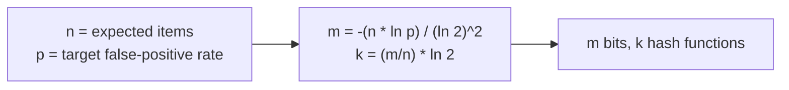
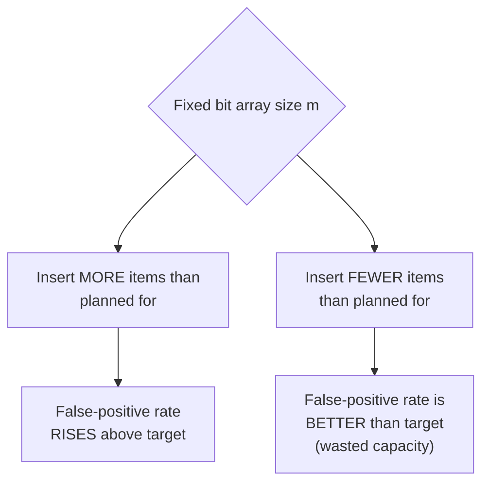

# Bloom Filter — Senior

<!-- level-focus -->
At senior level, focus on this question:

> How do you size a bloom filter — choosing the bit-array size and number of
> hash functions — for a target false-positive rate and expected item count?

Prerequisite: [`middle.md`](middle.md).

---

## The sizing formulas

Given `n` expected inserted items and a target false-positive rate `p`, the
optimal bit-array size `m` and number of hash functions `k` are:

```
m = -(n * ln(p)) / (ln(2)^2)
k = (m / n) * ln(2)
```



## Worked example

For `n = 1,000,000` items and `p = 0.01` (1% false-positive rate):

```
m = -(1,000,000 * ln(0.01)) / (ln(2)^2) ≈ 9,585,059 bits ≈ 1.14 MB
k = (9,585,059 / 1,000,000) * ln(2) ≈ 6.64, round to 7
```

Compare this to storing 1 million actual strings (assume average 20 bytes
each) in a real hash set: roughly 20 MB, plus per-entry overhead in most
language runtimes pushing it higher still. **The bloom filter uses roughly
1.1 MB to answer the same membership question with a 1% error rate** — an
order-of-magnitude-plus space savings, which is the entire economic argument
for using one.

## The size/accuracy/count trade-off, visualized



A bloom filter sized for `n` items and then filled with `10n` items doesn't
fail gracefully — its false-positive rate **degrades continuously and
predictably** as more bits get set to 1 (eventually approaching "everything
returns maybe" as the array saturates). This means **you must know (or
estimate) your expected item count in advance** — unlike a hash set, which
just grows. Systems using bloom filters at scale either size generously
upfront, monitor actual fill ratio and rebuild when it exceeds a threshold,
or use a **Scalable Bloom Filter** variant that chains additional filters
with progressively tighter false-positive rates as the original fills up.

## Test yourself

1. Using the formulas, would doubling `n` (expected items) while keeping `p`
   fixed roughly double, more than double, or less than double the required
   bit array size `m`? Compute it for `n=2,000,000, p=0.01` and compare.
2. Why does increasing the number of hash functions `k` past the formula's
   optimal value make the false-positive rate *worse*, not better (hint:
   think about how quickly the bit array fills up)?
3. A production bloom filter sized for 1 million items is silently filled
   with 5 million. What symptom would you expect to observe in production,
   and how would you detect it before it causes a real problem?

Continue to [`professional.md`](professional.md) to see how bloom filters
work under the hood inside LSM-tree storage engines at scale.
