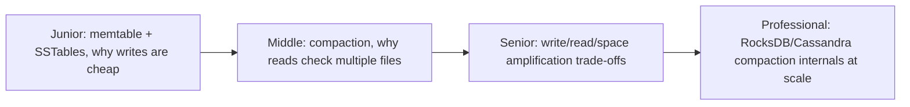
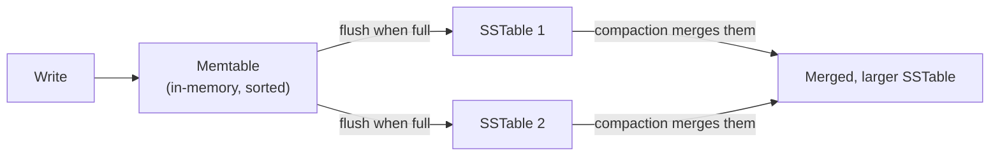

# LSM-Tree (Log-Structured Merge-Tree)

> Never modify data in place — always append. Writes become sequential and
> fast; reads pay the cost of checking multiple sorted files, mitigated by
> in-memory indexes and bloom filters. The storage engine behind Cassandra,
> RocksDB, HBase, and most high-write-throughput databases.

## Choose a level

| Level | Guide | You are done when |
|---|---|---|
| Junior | [Memtable and SSTables](junior.md) | You can explain why an LSM-tree write is always a fast, sequential append. |
| Middle | [Compaction](middle.md) | You can explain why a read might need to check several SSTables, and what compaction does about it. |
| Senior | [The RUM conjecture](senior.md) | You can explain the read/write/space amplification trade-off and why you can't optimize all three at once. |
| Professional | [Compaction internals at scale](professional.md) | You can compare leveled vs. tiered compaction strategies and their real production trade-offs. |

## Practice rule

For any LSM-tree-backed store you operate, ask: "is my workload write-heavy
or read-heavy, and does my compaction strategy match?" A mismatch here is
one of the most common, most fixable causes of unexpected performance
problems in these systems.

## Related

- [B+Tree](../b+tree/README.md)
- [Bloom Filter](../bloom-filter/README.md)
