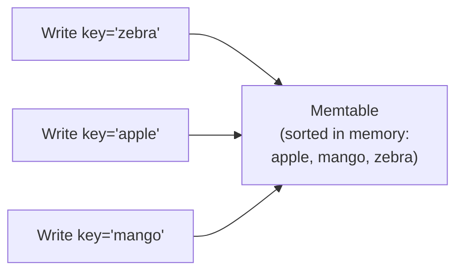
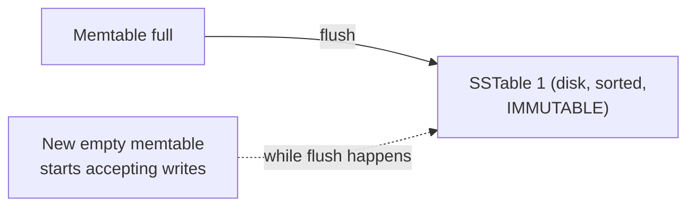

# LSM-Tree — Junior

<!-- level-focus -->
At junior level, focus on this question:

> Why is a write to an LSM-tree always fast, regardless of where in the
> keyspace the key falls?

---

## The memtable: writes go to memory first

Every write (insert, update, delete) is first added to an in-memory,
sorted data structure called the **memtable** — usually a skip list (see the
Skip List topic) or a balanced tree, chosen because it supports fast sorted
inserts.

Because this is a pure in-memory operation (no disk I/O per write at all,
beyond an append to a durability-providing write-ahead log for crash
recovery), a write completes in microseconds — and critically, **it costs
the same regardless of whether the key is "apple" or "zebra"**, unlike a
B+Tree, where a write's cost depends on where in the tree structure that
key falls and whether it triggers a page split (see the B+Tree topic).

## Flushing to disk: the memtable becomes an SSTable

Once the memtable reaches a size threshold, it's **flushed** to disk as an
**SSTable** (Sorted String Table) — an immutable file with keys stored in
sorted order. "Immutable" is the crucial word: once written, an SSTable is
**never modified** — not even to update a single key's value.

## Updates and deletes are also just appends

Updating a key doesn't modify any existing SSTable — it simply writes a
**new** memtable entry with the same key and a newer value. Deleting a key
writes a special marker called a **tombstone** — a memtable/SSTable entry
that says "this key is deleted" rather than physically removing anything.
Both operations are, mechanically, identical to an insert: an append to the
current memtable. This uniformity (every operation is an append) is exactly
what makes LSM-tree writes uniformly fast and sequential, unlike a B+Tree
where an update requires locating and modifying an existing page in place.

> 🎓 **Takeaway:** LSM-trees achieve fast writes by **never modifying
> anything in place** — every write, update, and delete is an append to an
> in-memory structure, later flushed to disk as an immutable, sorted file.
> This uniformity is the entire mechanism; everything else in this topic is
> about the consequences of never cleaning anything up immediately.

## Test yourself

1. Why does an LSM-tree write cost the same for a key at the "start" versus
   the "end" of the sorted keyspace, unlike a B+Tree insert?
2. What is a tombstone, and why is deleting a key implemented as an append
   rather than a physical removal?
3. If the memtable lives only in memory, what happens to unflushed writes if
   the process crashes? What mechanism (hinted at, not detailed here) would
   need to exist to prevent data loss?

Continue to [`middle.md`](middle.md).
