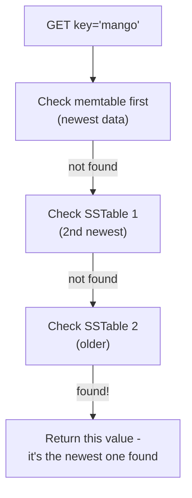
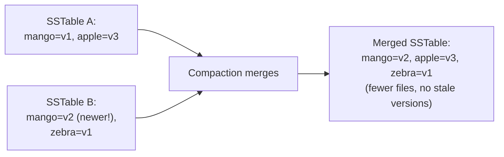

# LSM-Tree — Middle

<!-- level-focus -->
At middle level, focus on this question:

> Why might a single read need to check multiple SSTables, and what does
> compaction do to reduce that?

Prerequisite: [`junior.md`](junior.md).

---

## Reads must check every SSTable that might contain the key

Because updates are appends (`junior.md`), the same key can exist in
**multiple SSTables** simultaneously, each with a different value written
at a different time — the memtable (newest), plus every SSTable flushed
before it, potentially going back to when the key was first written.

A read checks structures **newest-to-oldest** and returns the first value
found — this correctly returns the most recent write, because older
SSTables' versions of the same key are simply stale copies that haven't
been cleaned up yet. Without any mitigation, this means a read's cost grows
with the **number of SSTables** that have accumulated, which grows
continuously as the memtable keeps flushing — an unbounded, ever-worsening
read cost if left unchecked.

## Compaction: merging SSTables to bound read cost

**Compaction** is a background process that merges multiple SSTables into
one, during which it: keeps only the newest version of each key (discarding
superseded older versions), and physically removes keys whose newest entry
is a tombstone (once safe to do so — see `senior.md`).

By periodically merging SSTables, compaction keeps the **total number of
files a read must check** bounded and manageable, rather than growing
forever — this is the direct mechanism that prevents reads from degrading
without limit as write volume accumulates over the database's lifetime.

## Bloom filters make "not in this file" cheap to check

Rather than reading each SSTable's actual data to check for a key, every
SSTable is typically paired with a **bloom filter** (see the Bloom Filter
topic) — a compact, in-memory structure that can say "definitely not in
this file" without touching disk at all, letting a read skip most SSTables
instantly and only actually read the (usually one or two) files that might
contain the key.

> 🎓 **Takeaway:** the "reads are more expensive" side of the LSM-tree
> trade-off (from the B+Tree professional page's comparison) is real, but
> two mechanisms working together — compaction bounding the file count, and
> bloom filters making "check this file" nearly free for the common
> not-present case — keep it manageable in practice.

## Test yourself

1. Why must a read check the memtable and SSTables from newest to oldest,
   rather than in any order?
2. If compaction never ran, what would happen to read latency over the
   lifetime of a heavily-written LSM-tree database?
3. How does a bloom filter change the *number of files actually read from
   disk*, versus the number of files *logically checked*, for a typical
   lookup?

Continue to [`senior.md`](senior.md).
