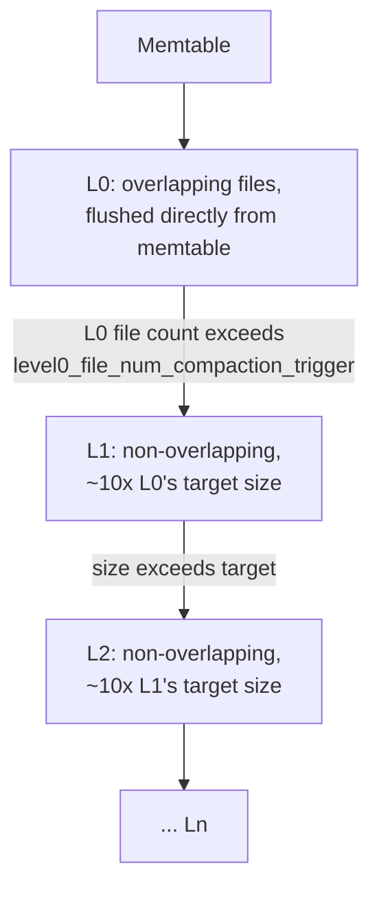
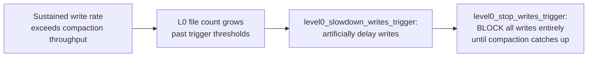

# LSM-Tree — Professional

<!-- level-focus -->
At professional level, focus on this question:

> How does RocksDB's leveled compaction actually schedule and execute merges
> internally, and what real production failure mode (compaction falling
> behind, "write stalls") results when the RUM trade-off is misconfigured?

Prerequisite: [`senior.md`](senior.md).

---

## RocksDB's leveled compaction: the actual level-size and trigger mechanics

RocksDB's default leveled compaction organizes SSTables into levels `L0`
through `Ln`, where each level's target size is (by default)
`max_bytes_for_level_multiplier` (default 10) times the previous level's —
this specific exponential growth factor is what bounds the total number of
levels to `O(log(total data size))`, and therefore bounds worst-case read
amplification to roughly one seek per level. `L0` is special: it's the
direct flush target from the memtable, and **unlike every other level, files
in L0 can overlap in key range** (because they're flushed independently,
not yet merged against each other) — a read may need to check *every* L0
file, not just one, which is why RocksDB triggers **L0→L1 compaction**
aggressively once L0 accumulates more than `level0_file_num_compaction_trigger`
files (default 4), specifically to bound this unmerged-overlap read cost
before it grows unbounded.



## Write stalls: the production failure mode when compaction can't keep up

If the write rate into L0 exceeds the rate at which background compaction
threads can merge L0 into L1 (and cascade down), RocksDB doesn't let L0
grow unboundedly (which would destroy read latency per the mechanism
above) — instead it **deliberately throttles or fully stops accepting new
writes** ("write stalls") once L0 file count crosses a second, higher
threshold (`level0_slowdown_writes_trigger`, then
`level0_stop_writes_trigger`). This is a direct, deliberate, and
**intentional** RUM-conjecture enforcement mechanism at the engine level:
rather than silently letting read amplification degrade without bound, the
engine sacrifices write availability to protect the read-latency guarantee —
a design decision every operator of a RocksDB-based system (this includes
CockroachDB, TiKV, and many other systems built on it) needs to understand
explicitly, because a "sudden write latency spike with no apparent cause"
incident is very often exactly this mechanism engaging under sustained write
pressure that compaction threads can't absorb.



## Cassandra's compaction strategy selection as a production-tuning surface

Cassandra exposes compaction strategy as an explicit, per-table
configuration (`compaction = {'class': 'LeveledCompactionStrategy', ...}`
or `SizeTieredCompactionStrategy`), and production operators routinely
**mix strategies within one cluster** based on per-table access patterns:
time-series/append-mostly tables (e.g. an event log with TTL-based
expiration) typically use STCS or the specialized
**TimeWindowCompactionStrategy (TWCS)** — which groups SSTables by time
window and largely avoids compacting across windows at all, since
TTL-expired data naturally ages out whole files without needing to be
merged with anything — while read-heavy, long-lived tables use LCS. Getting
this per-table decision wrong is a well-documented, recurring category of
Cassandra production incident: applying STCS defaults to a genuinely
read-heavy table causes read amplification to grow unboundedly over time
as un-compacted files accumulate, while applying LCS to a pure time-series
workload wastes enormous compaction I/O rewriting data that TWCS would have
simply let expire.

## Production checklist (staff-level)

1. **Monitor L0 file count (or your engine's equivalent unmerged-file
   metric) as a leading indicator of write-stall risk**, not just
   compaction pending-bytes — L0 file count is specifically what triggers
   the throttle/stop mechanism in RocksDB-family engines.
2. **Provision compaction thread count/I/O bandwidth against your actual
   sustained write rate**, not peak burst rate alone — a system that's
   fine at average load can still enter write-stall territory during
   sustained bursts if compaction throughput was sized only for the
   average.
3. **Choose compaction strategy per-table based on actual access pattern**
   (time-series/TTL-expiring → TWCS; write-heavy/rarely-reread → STCS;
   read-heavy → LCS), and treat a strategy mismatch as a real,
   diagnosable root cause during a performance investigation, not a last
   resort.
4. **Alert specifically on write-stall/write-stop events**
   (RocksDB exposes these as explicit stats/events) as a distinct
   incident class from generic "high write latency" — the remediation
   (more compaction throughput, reduce write rate, or re-tune thresholds)
   differs from a typical latency incident's playbook.
5. **In a capacity-planning review for a new LSM-tree-backed service,
   explicitly size compaction I/O bandwidth as a first-class resource
   budget**, alongside storage capacity and write throughput — it is not
   automatically "free" background work, and under-provisioning it is one
   of the most common root causes of LSM-tree-based production incidents.

## Cheat Sheet

```text
+------------------------------------------------------------------+
|                  LSM-TREE — INTERNALS & SCALE                       |
+------------------------------------------------------------------+
| RocksDB leveled compaction: L0 (overlapping, flush target) ->          |
| L1..Ln (non-overlapping, each ~10x the previous). L0 overlap means      |
| a read may check EVERY L0 file - this is why L0 compaction triggers    |
| aggressively at a low file-count threshold                            |
+------------------------------------------------------------------+
| WRITE STALLS: when L0 grows past level0_slowdown/stop_writes_trigger,  |
| the engine DELIBERATELY throttles/blocks writes to protect read        |
| latency - a sudden write-latency spike is often this mechanism         |
| engaging, not a mystery. Monitor L0 file count as a leading indicator |
+------------------------------------------------------------------+
| Cassandra: compaction strategy is a PER-TABLE production tuning        |
| surface. TWCS for TTL-expiring time-series (avoid cross-window         |
| merges), STCS for write-heavy rarely-reread, LCS for read-heavy.       |
| Wrong strategy per table is a common, diagnosable incident category    |
+------------------------------------------------------------------+
```

## Test yourself

1. Why does RocksDB treat L0 specially (allowing overlapping files) instead
   of enforcing the same non-overlap guarantee as every other level?
2. A production RocksDB-based system experiences a sudden write latency
   spike with no code or traffic-pattern change. What metric would you
   check first, and what mechanism might be engaging?
3. A Cassandra table storing 30-day-TTL event logs is configured with
   LeveledCompactionStrategy. What inefficiency would you expect, and what
   strategy would you recommend instead?

## Further Reading

- Athanassoulis et al. — "Designing Access Methods: The RUM Conjecture"
  (EDBT 2016 — the formal trade-off this page builds on).
- RocksDB Wiki — "Leveled Compaction" and "Write Stalls" (the specific
  trigger thresholds and mechanics referenced above).
- Apache Cassandra documentation — "Compaction strategies" (STCS, LCS, and
  TimeWindowCompactionStrategy selection guidance).
- See also: [Bloom Filter — professional](../bloom-filter/professional.md),
  [B+Tree — professional](../b+tree/professional.md).
