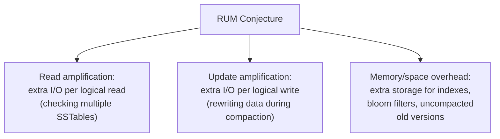
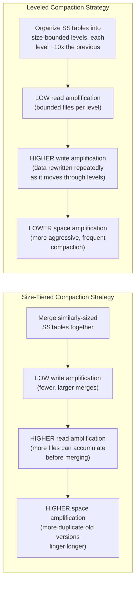

# LSM-Tree — Senior

<!-- level-focus -->
At senior level, focus on this question:

> Why can't a storage engine simultaneously minimize read cost, write cost,
> and space usage — and how does the RUM conjecture formalize this?

Prerequisite: [`middle.md`](middle.md).

---

## The RUM conjecture: pick two, trade off the third

The **RUM conjecture** (Athanassoulis et al., 2016) formalizes a trade-off
every storage engine designer faces: minimizing any two of **Read
amplification**, **Update (write) amplification**, and **Memory (space)
overhead** comes at the cost of the third.

| Amplification | What it means for an LSM-tree | Where it comes from |
|---|---|---|
| **Read amplification** | One logical `GET` may require reading several physical SSTables | Multiple versions of a key spread across un-compacted files (`middle.md`) |
| **Write (update) amplification** | One logical write ends up being rewritten multiple times as it's flushed, then re-merged repeatedly across compaction levels | Compaction physically rewrites data every time it merges files, even though the logical write happened once |
| **Space amplification** | The database uses more disk than the logical data size | Old, superseded versions and tombstones not yet compacted away still occupy disk space |

## Compaction strategy is choosing a point on this trade-off

`middle.md` presented compaction as a single mechanism; in practice, the
**strategy** you choose for it is precisely a RUM-conjecture trade-off
decision:

**Size-Tiered (STCS)** merges SSTables of similar size together
opportunistically — cheap in total rewrite I/O (write amplification is low)
but lets more files accumulate before merging (read and space amplification
rise). **Leveled (LCS)** organizes data into levels of exponentially
increasing size, guaranteeing any key exists in at most one SSTable per
level — bounding read amplification tightly, at the cost of significantly
higher write amplification (the same data is rewritten as it's promoted
through levels repeatedly over its lifetime).

> 🎯 **Senior takeaway:** there is no compaction strategy that minimizes
> all three amplification factors simultaneously — this isn't an
> implementation limitation, it's a proven structural trade-off. Choosing
> STCS vs. LCS (or a hybrid) is choosing which two factors matter more for
> your specific read/write ratio, not finding a strategy that's simply
> "better."

## Test yourself

1. Why does bounding read amplification (LCS's goal) necessarily require
   rewriting data more often (raising write amplification)?
2. For a write-heavy, rarely-read workload (e.g. an audit log), which
   compaction strategy would you expect to perform better, and why?
3. Why does the RUM conjecture apply to storage engine design in general,
   not just LSM-trees specifically — can you think of how a B+Tree makes a
   similar three-way trade-off?

Continue to [`professional.md`](professional.md) to see how RocksDB and
Cassandra implement these strategies at production scale.
