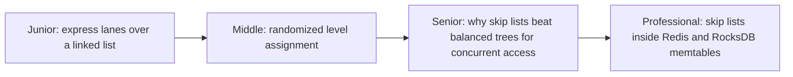
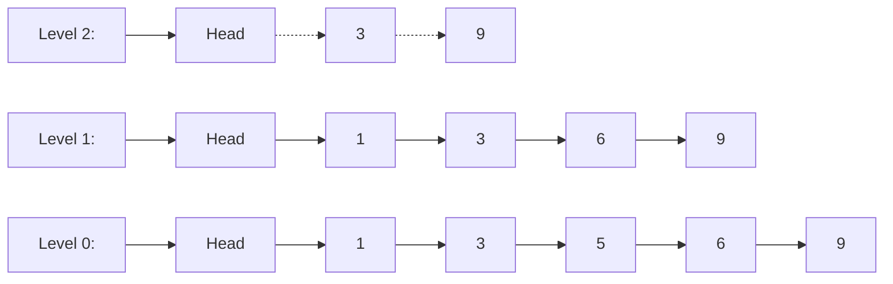

# Skip List

> A sorted linked list with extra "express lane" pointers layered on top,
> giving O(log n) search without the rebalancing complexity of a tree. The
> structure behind Redis's sorted sets and most LSM-tree memtables.

## Choose a level

| Level | Guide | You are done when |
|---|---|---|
| Junior | [Express lanes over a linked list](junior.md) | You can explain why extra levels of pointers let you skip past most nodes during a search. |
| Middle | [Randomized level assignment](middle.md) | You can explain how a coin-flip determines a node's height, and why that keeps the structure balanced on average. |
| Senior | [Concurrency advantage over trees](senior.md) | You can explain why skip lists support lock-free concurrent access more easily than balanced trees. |
| Professional | [Skip lists in production systems](professional.md) | You can explain why Redis and RocksDB chose skip lists over trees for their respective use cases. |

## Practice rule

Draw a plain sorted linked list of 16 elements and count how many hops a
search for the last element takes (15). Then draw the same list with one
extra "every 4th node" express lane and recount. That hop-count reduction
is the entire mechanism — everything else in this topic explains how to get
it without manually deciding where the express lanes go.

## Related

- [B+Tree](../b+tree/README.md)
- [LSM-Tree](../lsm-tree/README.md)
