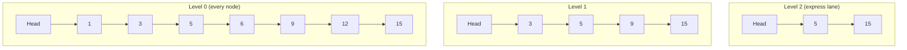

# Skip List — Junior

<!-- level-focus -->
At junior level, focus on this question:

> Why does adding "express lane" pointers on top of a sorted linked list
> make search dramatically faster?

---

## The problem: linked list search is O(n)

A plain sorted linked list supports fast sequential access but a slow
search — finding a specific value means walking node by node from the head
until you find it or pass it, an O(n) operation with no way to skip ahead.

Searching for `12` means visiting `1, 3, 5, 6, 9, 12` — six hops, even
though the list is sorted and you "know" `12` is somewhere near the end.

## Adding express lanes

A skip list adds extra layers of pointers, each layer skipping over more
nodes than the one below it — like an express lane on a highway that only
stops at major exits.

Searching for `12` now: start at the top level, hop to `5` (still less than
12), hop to `15` (overshot — 15 > 12), **drop down** a level and continue
from `5`, hop to `9` (still less than 12), drop down again, hop to `12` —
found it. Fewer total hops than the plain linked list, because the top
levels let you skip past large chunks of the list without visiting every
node.

> 🎓 **Takeaway:** a skip list's speed comes entirely from **layered
> pointers that skip over multiple nodes at once** — the bottom layer is a
> normal sorted linked list (so nothing is lost), but higher layers let a
> search "jump ahead" and only drop down to finer granularity once it's
> close to the target.

## Test yourself

1. In the search trace above, at which exact step did the search "overshoot"
   and need to drop to a lower level?
2. Why must the bottom level always contain every single node, even though
   higher levels skip most of them?
3. If you added a third, even sparser level above Level 2 (skipping even
   more nodes), what would you expect to happen to the number of hops for
   a search on a much larger list?

Continue to [`middle.md`](middle.md).
