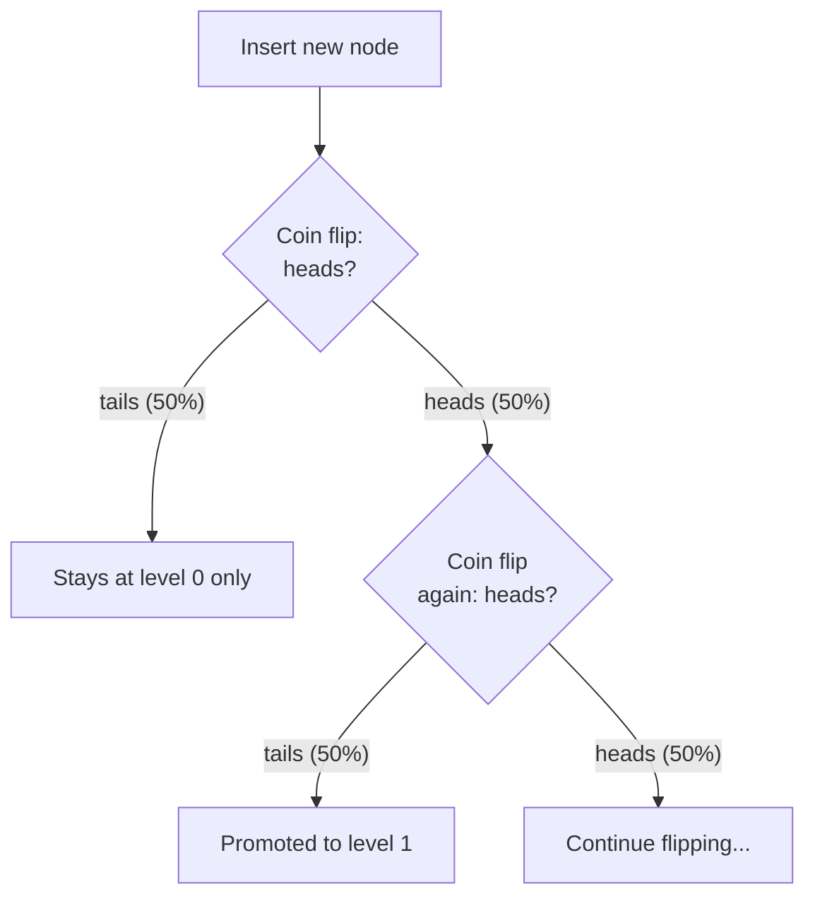
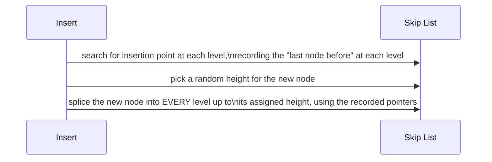

# Skip List — Middle

<!-- level-focus -->
At middle level, focus on this question:

> Who decides which nodes get promoted to higher express-lane levels, and
> how does that decision keep the structure balanced without explicit
> rebalancing?

Prerequisite: [`junior.md`](junior.md).

---

## Randomized level assignment via coin flips

Unlike a balanced tree (which requires explicit rotation/rebalancing logic
to maintain height guarantees after every insert), a skip list assigns each
new node's height using a **random coin flip**: start the new node at level
0; flip a coin, and while it comes up "heads" (typically with probability
`p = 0.5`), promote the node to the next level up.

```python
import random

def random_level(p=0.5, max_level=16):
    level = 0
    while random.random() < p and level < max_level:
        level += 1
    return level
```



This means roughly **half** of all nodes reach level 1, roughly a **quarter**
reach level 2, roughly an **eighth** reach level 3, and so on — a
geometrically decreasing distribution that, on average, produces exactly
the shape needed for O(log n) search: `O(log n)` levels total, with each
level having roughly half as many nodes as the one below it.

## Insertion: no rebalancing needed



Because the structure's balance comes from the **probability distribution**
of coin flips over many insertions, not from any invariant that must be
actively maintained, inserting a new node never requires restructuring
existing nodes — you simply splice it into the levels it randomly qualifies
for. This is the direct payoff of randomization: **balance emerges
statistically, with no rebalancing algorithm needed at all.**

> 🎓 **Takeaway:** a skip list trades a balanced tree's guaranteed,
> deterministic height bound for a **probabilistic** one — with high
> probability (not certainty) the structure stays close to optimally
> balanced, and the code required to maintain that is dramatically simpler
> than tree rotation logic, at the cost of a (rare, and bounded in
> expectation) chance of an unlucky run of coin flips producing a less
> balanced structure than typical.

## Test yourself

1. Given `p = 0.5`, roughly what fraction of nodes would you expect to
   reach level 3 or higher, in a list with many nodes?
2. Why doesn't inserting a new node ever require modifying the *height* of
   existing nodes, unlike a tree's rebalancing after an insert?
3. What would happen to the skip list's average search performance if you
   used `p = 0.9` instead of `p = 0.5` — would levels have more or fewer
   nodes, and how would that affect the total number of levels needed?

Continue to [`senior.md`](senior.md).
