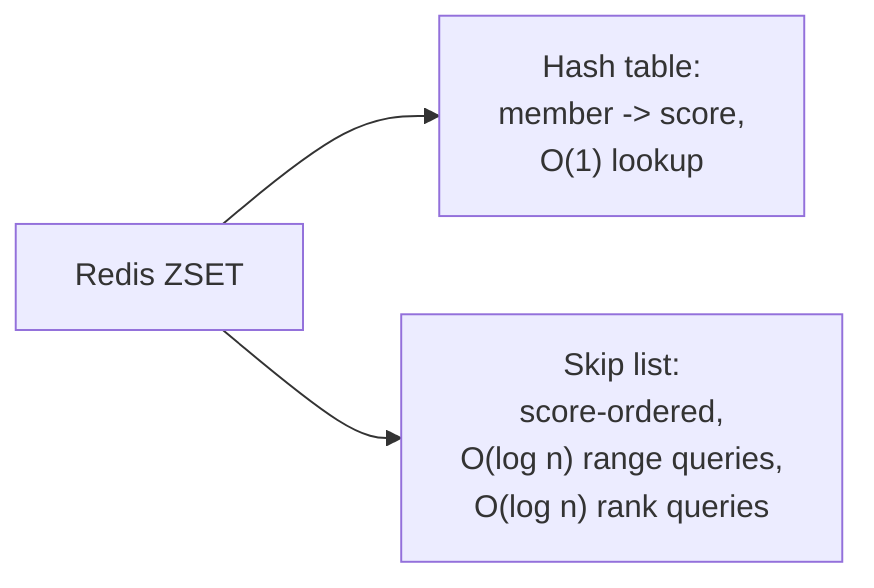

# Skip List — Professional

<!-- level-focus -->
At professional level, focus on this question:

> Why did Redis's own creator choose a skip list over a balanced tree for
> sorted sets, and why do RocksDB and LevelDB use skip lists specifically
> for the memtable role?

Prerequisite: [`senior.md`](senior.md).

---

## Redis sorted sets: antirez's own documented rationale

Redis's `ZSET` (sorted set) is implemented as a skip list combined with a
hash table (the hash table for O(1) member→score lookup, the skip list for
ordered operations like `ZRANGE`, `ZRANK`). Salvatore Sanfilippo (antirez),
Redis's creator, has publicly documented the specific reasoning: skip lists
give comparable expected performance to balanced trees for the required
operations (insert, delete, ordered range query) while being **dramatically
simpler to implement correctly** — critical for a codebase like Redis's,
which historically prioritized implementation simplicity and auditability
(fewer lines of tricky rebalancing logic means fewer subtle bugs in a
core data structure exercised by every sorted-set operation across every
Redis deployment worldwide) over squeezing out marginal constant-factor
performance gains a more complex balanced-tree variant might offer. This is
a **direct, documented instance** of a staff-level engineering trade-off:
choosing a data structure with a strong-but-probabilistic guarantee over one
with a stronger worst-case guarantee, specifically because the simpler
implementation reduces the surface area for production bugs in
security/correctness-critical shared infrastructure.



## Why LSM-tree memtables use skip lists specifically

RocksDB's and LevelDB's default memtable implementation is a skip list, for
a combination of reasons that compound the general advantages already
covered: the memtable must support **concurrent inserts from multiple
writer threads** while **simultaneously being iterated in sorted order**
by a background flush thread preparing to write it out as an SSTable — the
skip list's local-pointer-update property (`senior.md`) makes safe
concurrent insertion straightforward to implement correctly (RocksDB's
actual memtable uses a lock-free variant relying on atomic pointer writes
with specific memory-ordering guarantees), while its inherent sortedness
means the flush-to-SSTable operation is a simple, already-ordered traversal
requiring no separate sort step at flush time — directly enabling the fast,
sequential SSTable-write path that makes the whole LSM-tree write path fast
(see the LSM-Tree professional page).


## The professional-level generalization: simplicity as a first-class design criterion

Both case studies above share the same underlying staff-level lesson: skip
lists were chosen not because they're asymptotically superior to balanced
trees (they aren't, in the worst case) but because their **combination of
adequate expected performance, natural concurrency support, and
dramatically lower implementation complexity** made them the better
engineering choice for these specific, heavily-exercised, correctness-
critical subsystems. When reviewing a data-structure choice in a design
review, the professional-level question is rarely "which has the best
theoretical big-O" — it's "which structure's failure modes, implementation
complexity, and concurrency properties best match this specific system's
actual operational requirements."

## Production checklist (staff-level)

1. **Recognize skip lists as the standard choice for concurrent, ordered,
   in-memory structures** (memtables, sorted-set implementations) and
   understand *why* before reaching for a custom balanced-tree
   implementation in a similar role — you are very likely re-solving a
   problem with a worse complexity/benefit trade-off than the industry-
   standard choice.
2. **When evaluating a data structure for a new concurrent subsystem, weigh
   implementation/audit complexity explicitly against asymptotic
   worst-case guarantees** — for most production systems, a
   well-understood, simpler structure with strong expected-case performance
   is the safer engineering bet than a theoretically superior but harder-
   to-implement-correctly alternative.
3. **If using a lock-free skip list implementation (or building one), verify
   its memory-ordering/atomicity guarantees explicitly** for your target
   platform — this is exactly the kind of subtle, hard-to-test correctness
   surface where a well-audited existing implementation (Java's
   `ConcurrentSkipListMap`, RocksDB's memtable) should be strongly preferred
   over a homegrown one.
4. **In a design review proposing a custom balanced-tree-based concurrent
   structure, ask explicitly why a skip list-based approach was
   rejected** — given the well-documented industry precedent (Redis,
   RocksDB, LevelDB, Java's standard library), this should have a specific,
   articulable answer, not be an unconsidered default.

## Cheat Sheet

```text
+------------------------------------------------------------------+
|                  SKIP LIST — INTERNALS & SCALE                      |
+------------------------------------------------------------------+
| Redis ZSET: hash table (O(1) member->score) + skip list              |
| (O(log n) ordered range/rank queries). Chosen over a balanced tree    |
| specifically for IMPLEMENTATION SIMPLICITY - antirez's documented      |
| rationale: comparable performance, far less tricky rebalancing code   |
+------------------------------------------------------------------+
| RocksDB/LevelDB memtable: skip list chosen because it supports         |
| LOCK-FREE CONCURRENT INSERTS (local pointer updates, atomic CAS)       |
| while remaining always-sorted -> flush-to-SSTable is a simple          |
| ordered traversal, no separate sort step needed                       |
+------------------------------------------------------------------+
| Generalized lesson: skip lists are chosen for adequate EXPECTED         |
| performance + natural concurrency + LOW IMPLEMENTATION COMPLEXITY,     |
| not superior worst-case big-O. In a design review, weigh                |
| implementation/audit risk against theoretical guarantees explicitly    |
+------------------------------------------------------------------+
```

## Test yourself

1. Why does a Redis `ZSET`'s use of a skip list specifically benefit from
   the property that insertion doesn't require wide-scope rebalancing,
   given Redis's single-threaded execution model (no concurrent access
   within one instance)? What does simplicity buy you here even without a
   concurrency need?
2. Why is "already sorted after insert" specifically valuable for an
   LSM-tree memtable's role, beyond just fast lookups?
3. A teammate proposes implementing a custom lock-free balanced tree for a
   new concurrent subsystem "for better worst-case guarantees." What
   questions would you ask in the design review, based on this page's
   reasoning?

## Further Reading

- Pugh — "Skip Lists: A Probabilistic Alternative to Balanced Trees"
  (1990 — the original paper).
- Salvatore Sanfilippo (antirez) — Redis source code comments and blog
  posts explaining the ZSET skip-list-over-balanced-tree design rationale.
- RocksDB source/documentation — `SkipList` memtable implementation and its
  lock-free concurrent-insert design.
- See also: [LSM-Tree — professional](../lsm-tree/professional.md),
  [B+Tree — professional](../b+tree/professional.md).
