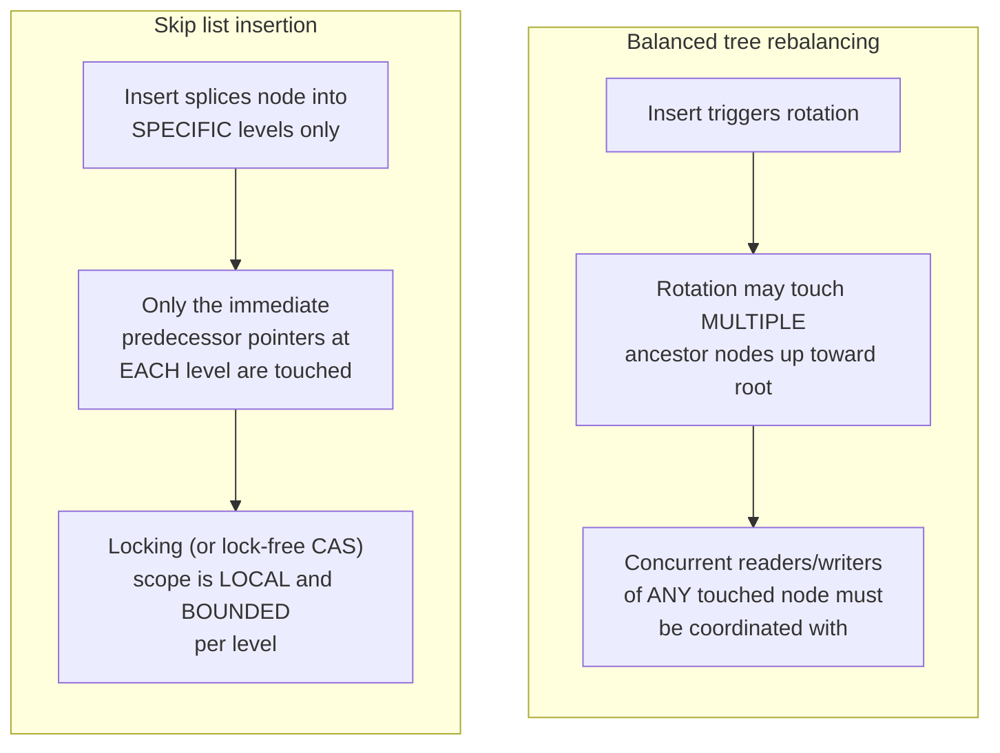

# Skip List — Senior

<!-- level-focus -->
At senior level, focus on this question:

> Why do skip lists support concurrent, lock-free (or lock-light) access
> more naturally than balanced trees do?

Prerequisite: [`middle.md`](middle.md).

---

## The core problem with concurrent trees: rebalancing touches many nodes at once

A balanced tree's rebalancing operation (a rotation after an insert/delete
that would otherwise violate the tree's balance invariant) can, in the
worst case, touch and restructure a **chain of ancestor nodes** up toward
the root. Under concurrent access, this means a thread performing a
rotation must coordinate (via locks) with any other thread that might be
reading or writing any node along that potentially-long chain — the
locking scope for a single rebalancing operation is not naturally
localized, which makes fine-grained concurrent tree implementations
genuinely difficult to get correct.

## Skip list insertion touches only local pointers

From `middle.md`: inserting a node means updating the "next" pointer of the
immediately preceding node **at each level the new node participates in** —
a small, fixed, local set of pointer updates, entirely independent of the
rest of the structure. This locality is exactly what makes **lock-free
skip lists** (using atomic compare-and-swap operations on individual
pointers, rather than a global or wide-scope lock) a well-established,
practical concurrent data structure — Java's `ConcurrentSkipListMap` is a
production, lock-free implementation built on exactly this property, while
a comparably lock-free balanced tree implementation is a substantially
harder engineering problem precisely because of the wide-scope rebalancing
issue above.

## The trade-off: probabilistic guarantees vs. deterministic ones

> 🎯 **Senior takeaway:** the concurrency-friendliness of skip lists is a
> direct consequence of the same design choice that made insertion simple
> in `middle.md` — no rebalancing invariant to maintain means no
> wide-scope, multi-node operation to coordinate under concurrency. The
> price paid for this is that skip lists provide **expected** O(log n)
> performance (true with overwhelming probability, given a good random
> number source), not the **worst-case guaranteed** O(log n) a balanced
> tree provides — a genuine trade-off between concurrency simplicity and
> a formal worst-case bound, not a strict improvement in every dimension.

## Test yourself

1. Why does a balanced tree's rebalancing operation resist localized,
   fine-grained locking in a way that a skip list's insertion does not?
2. What does "expected O(log n)" mean precisely, and under what
   circumstance (however rare) could a skip list's actual search performance
   degrade toward O(n)?
3. Why might a system requiring a hard, provable worst-case latency
   guarantee (e.g. a real-time system) still prefer a balanced tree over a
   skip list, despite the skip list's concurrency advantages?

Continue to [`professional.md`](professional.md) to see how Redis and
RocksDB actually use skip lists in production.
