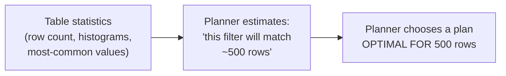
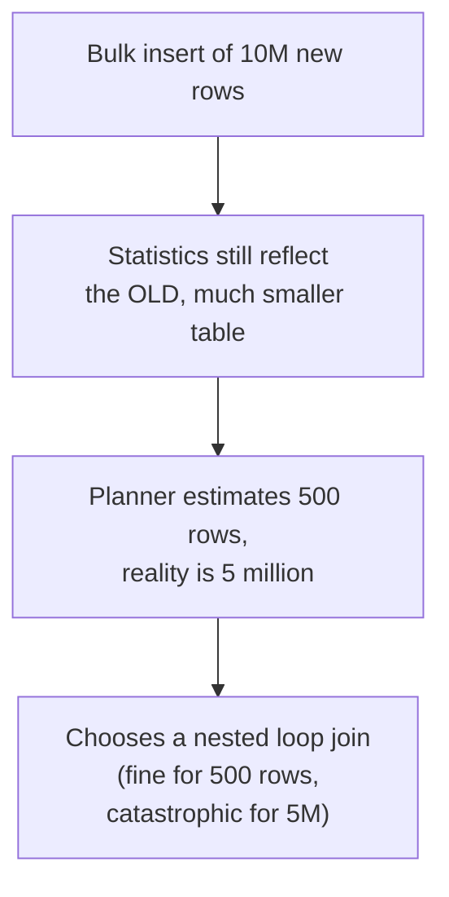

# Query Optimization — Senior

<!-- level-focus -->
At senior level, focus on this question:

> How does the planner estimate how many rows a filter or join will produce,
> and what happens when that estimate is wrong?

Prerequisite: [`middle.md`](middle.md).

---

## Cardinality estimation via statistics

The planner doesn't run your query to see how many rows match — it
**estimates** using statistics collected about each table's data
distribution: row counts, most-common values, histograms of value ranges,
and correlation between columns.

```sql
ANALYZE orders;  -- (re)collects statistics for the planner to use

SELECT * FROM pg_stats WHERE tablename = 'orders' AND attname = 'status';
-- shows: most_common_vals, most_common_freqs, histogram_bounds, n_distinct
```



## When statistics are stale or wrong



A large bulk load, a batch delete, or simply data that's changed shape since
the last `ANALYZE` can leave the planner working from **stale statistics** —
producing a plan that was optimal for data that no longer exists. This is one
of the most common causes of "the query was fast yesterday and is suddenly
terrible today with no code change" incidents, and it's exactly why
[Vacuum — Locking & Concurrency Control](../../transaction/mvcc/senior.md)-adjacent
maintenance (auto-vacuum/auto-analyze) matters operationally, not just for
space reclamation.

## Correlated columns break independence assumptions

Planners typically assume columns are **independent** unless told otherwise —
`WHERE city = 'New York' AND state = 'NY'` is estimated as if both
conditions independently filter the data, when in reality they're perfectly
correlated (New York implies NY), so the real match count is far higher than
the naive multiplication of two independent selectivities would suggest.
Modern Postgres supports **extended statistics**
(`CREATE STATISTICS ... (dependencies) ON city, state FROM addresses;`) to
explicitly capture this correlation.

## Diagnosing a misestimation

```sql
EXPLAIN ANALYZE SELECT ...;
```

```text
Nested Loop  (cost=0.43..1250.32 rows=500 width=97) (actual time=0.1..8500.2 rows=5000000 loops=1)
```

Compare the **estimated** `rows=500` against the **actual** `rows=5000000`
from `EXPLAIN ANALYZE` — a large gap between estimated and actual is the
direct signature of a cardinality misestimation, and the fix is almost
always `ANALYZE` (refresh statistics), extended statistics for correlated
columns, or in rare cases a planner hint/rewrite to force a better plan.

> 🎯 **Senior takeaway:** a "slow query" is very often not a bad query — it's
> a good query the planner mis-costed because its statistics were stale or
> its independence assumptions were wrong. Diagnose by comparing estimated
> vs. actual row counts in `EXPLAIN ANALYZE` before assuming you need to
> rewrite the SQL at all.

## Test yourself

1. Why would running `ANALYZE` immediately after a large bulk load likely
   fix a sudden performance regression, without changing the query at all?
2. Explain why `WHERE city = 'New York' AND state = 'NY'` gets a worse
   cardinality estimate than `WHERE city = 'New York' AND has_pool = true`,
   assuming the latter two are genuinely independent.
3. In an `EXPLAIN ANALYZE` output, what does a 10,000x gap between estimated
   and actual row count tell you, and what would you check first?

Continue to [`professional.md`](professional.md) to optimize queries at
warehouse scale.
