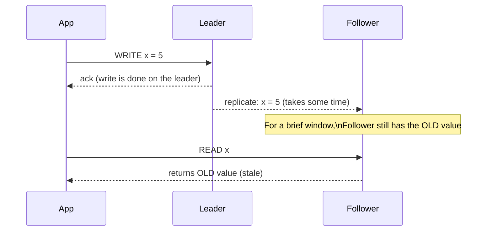

# Replication — Junior

<!-- level-focus -->
At junior level, focus on this question:

> Why can a follower answer a read with data that's technically wrong, even
> though nothing is "broken"?

---

## Leader-follower replication

One node (the **leader**/primary) accepts all writes. One or more
**followers**/replicas continuously receive a stream of the leader's
changes and apply them locally, staying (approximately) in sync.

The write **completes and is acknowledged by the leader** before the
follower necessarily has it — replication to followers happens
**afterward**, taking some amount of time (network latency, follower
processing speed). Any read reaching the follower during that window
returns a value that was correct a moment ago, but isn't anymore.

## Why replicate at all, given this cost?

- **Availability**: if the leader fails, a follower can be promoted and the
  system keeps running (see `senior.md` for the mechanics).
- **Read scaling**: read traffic can be spread across the leader and all
  followers, instead of concentrating every read on one node.
- **Geographic locality**: followers can be placed near users in different
  regions, serving reads with lower latency than always reaching back to a
  single leader.

> 🎓 **Takeaway:** replication lag is not a bug — it's the direct,
> unavoidable consequence of replicating asynchronously across a network
> that has non-zero latency. The engineering question is never "how do I
> eliminate lag" (you generally can't, without giving something else up) but
> "how much lag can this specific read tolerate, and how do I measure it?"

## Test yourself

1. Why can't the leader simply wait for every follower to confirm before
   acknowledging a write, in the simplest leader-follower design? (Think
   about what that would do to write latency and availability if one
   follower is slow or down.)
2. Give a real scenario where reading slightly stale data from a follower
   is perfectly acceptable, and one where it would cause a real problem.
3. If a follower falls behind by 10 seconds during a traffic spike, what
   happens to any read routed to it during that window?

Continue to [`middle.md`](middle.md).
