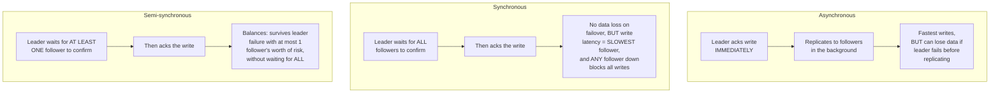

# Replication — Middle

<!-- level-focus -->
At middle level, focus on this question:

> What's the actual trade-off between synchronous, asynchronous, and
> semi-synchronous replication?

Prerequisite: [`junior.md`](junior.md).

---

## Three replication modes



| Mode | Durability on leader failure | Write latency cost | Availability risk |
|---|---|---|---|
| **Asynchronous** | Can lose the most recent writes (whatever hadn't replicated yet) | Lowest — leader doesn't wait for anyone | None from follower slowness |
| **Synchronous** | Zero data loss (every follower has every acked write) | Highest — bounded by the slowest follower | A single slow/down follower blocks all writes |
| **Semi-synchronous** | Bounded loss (at most what hasn't reached the one confirming follower) | Moderate — bounded by the fastest-to-respond follower | Only a total loss of all followers blocks writes |

## Choosing based on what you're protecting against

```sql
-- Postgres: synchronous_standby_names configures this directly
synchronous_standby_names = 'FIRST 1 (follower_a, follower_b)'
-- waits for the FIRST 1 of the named followers to confirm = semi-sync
```

A financial ledger typically wants semi-sync or full sync (data loss on
failover is unacceptable); a high-throughput analytics ingestion pipeline
where losing the last few seconds of events on a rare failover is
acceptable typically uses async replication to maximize write throughput.
This is the same durability-vs-throughput trade-off that appears throughout
this whole tree (see the write-behind caching topic) — replication is just
the version of it that applies to the database's own durability guarantee
across nodes.

> 🎓 **Takeaway:** there's no universally "correct" replication mode — it's
> a direct trade between write latency/availability and how much data you
> can afford to lose if the leader fails at the worst possible moment.

## Test yourself

1. Why does synchronous replication's write latency equal the *slowest*
   follower's response time, not the average?
2. In the Postgres example, what would `FIRST 2 (a, b, c)` change about the
   durability/latency trade-off compared to `FIRST 1`?
3. For an audit log where losing the last few seconds of events on a rare
   failover is genuinely acceptable, which mode would you choose, and why?

Continue to [`senior.md`](senior.md).
