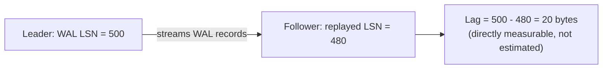
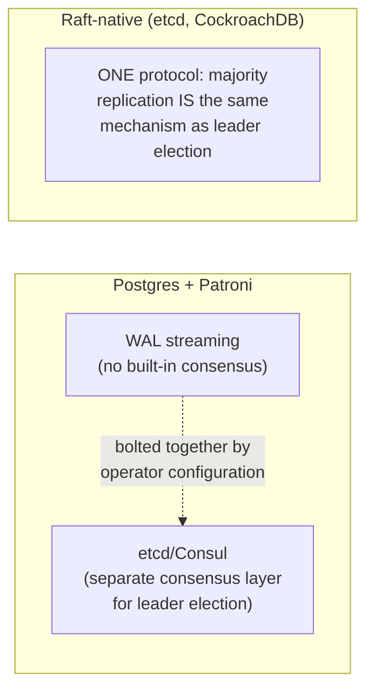

# Replication — Professional

<!-- level-focus -->
At professional level, focus on this question:

> How does Postgres's actual streaming replication protocol work at the
> byte/LSN level, and how does consensus-based replication (Raft) formally
> eliminate the split-brain risk that ad hoc failover managers only
> mitigate?

Prerequisite: [`senior.md`](senior.md).

---

## Postgres streaming replication: WAL shipping at the LSN level

Postgres replication is, mechanically, **continuous shipping of the WAL**
(see the Transactions & ACID professional page) from leader to follower: the
follower runs in continuous recovery mode, replaying WAL records as they
arrive, and each follower tracks its own **replay LSN** (Log Sequence
Number — a monotonic byte-offset identifier for a position in the WAL
stream). Replication lag is measurable *precisely* as
`leader's current WAL LSN - follower's replayed LSN`, exposed directly via
`pg_stat_replication` — this is why "replication lag" in Postgres is not an
estimate but an exact, byte-accurate measurement, unlike systems that must
infer lag from timestamps or heartbeats.



**Synchronous replication in Postgres** is implemented via
`synchronous_commit` and `synchronous_standby_names`: the leader's `COMMIT`
doesn't return to the client until the named synchronous standby's
**flush LSN** (not just receive LSN — the standby must have durably
`fsync`'d the WAL, not merely received it over the network) reaches the
commit's LSN — this precise flush-vs-receive distinction is what actually
delivers the "zero data loss on failover" guarantee from `middle.md`;
weaker settings (`remote_write` instead of `remote_apply`/`on`) trade a
sliver of that guarantee for lower latency by only requiring the standby to
have the data in its OS buffer, not durably on disk.

## Why ad hoc failover managers (Patroni, etc.) only mitigate split-brain, not eliminate it

Patroni (a common Postgres HA solution) uses a **distributed configuration
store** (etcd, Consul, or ZooKeeper) as its leader-election backend — this
means Postgres's split-brain protection is only as strong as the
[Leader Election](../../../distributed-system/consensus/leader-election/professional.md)
protocol underneath it, with all the same fencing-token and Raft-quorum
subtleties covered there. This is a real, important professional-level
distinction: **Postgres's own replication protocol has no built-in
consensus mechanism at all** — it's an operator-configured, external
leader-election layer bolted on top of simple WAL-shipping, meaning the
correctness of your entire failover story depends on correctly configuring
and fencing that external layer, not on any guarantee Postgres's
replication protocol itself provides.

## Raft-based replication: consensus and replication as one unified protocol

Systems built on Raft from the ground up (etcd, CockroachDB, TiKV) don't
have this two-layer structure — **replication and leader election are the
same protocol**: a write is only committed once it's replicated to a
majority of Raft peers via `AppendEntries` (see the Leader Election
professional page's Raft mechanics), and that same majority-based mechanism
is what elects the leader in the first place. This unification is what
gives Raft-based systems a formally proven guarantee that ad hoc
WAL-shipping-plus-external-failover-manager architectures can only
approximate through careful operational configuration: **it is
mathematically impossible for two Raft leaders to both commit conflicting
entries in the same term**, a guarantee that comes from the protocol's
proof, not from correctly configuring a separate coordination service
alongside it.



## Production checklist (staff-level)

1. **Know precisely which durability level your synchronous replication
   configuration provides** (`remote_write` vs. `remote_apply`/`on` in
   Postgres, or the equivalent in your engine) — the difference between
   "received" and "durably flushed" on the standby is exactly the gap
   between an apparent guarantee and a real one.
2. **Treat your failover manager's leader-election backend
   (etcd/Consul/ZooKeeper) as the actual source of your split-brain
   protection**, and audit it with the same rigor as the leader-election
   professional page recommends — a misconfigured coordination layer is a
   misconfigured split-brain defense, regardless of how correct your
   database's own replication protocol is.
3. **For new systems requiring the strongest possible split-brain
   guarantee, prefer a Raft-native database** (or a Raft-based
   coordination layer with proper fencing) over a WAL-shipping-plus-
   bolted-on-failover-manager architecture, when the operational
   complexity trade-off is acceptable for your team.
4. **Monitor replication lag as an exact metric where your engine supports
   it** (Postgres's LSN-based measurement) rather than an inferred
   heartbeat-based estimate — exact measurement changes what alerting
   thresholds and SLAs are honestly possible to commit to.
5. **In a DR/failover design review, explicitly diagram which layer
   provides consensus** (the database's own replication protocol, or an
   external coordination service) — this determines where your actual
   split-brain risk lives and what needs auditing.

## Cheat Sheet

```text
+------------------------------------------------------------------+
|                 REPLICATION — INTERNALS & SCALE                     |
+------------------------------------------------------------------+
| Postgres: WAL SHIPPING via LSN (exact, byte-accurate lag             |
| measurement: leader_LSN - follower_replayed_LSN, via                 |
| pg_stat_replication). Sync replication waits for FLUSH LSN            |
| (durably fsync'd), not just receive LSN - remote_write vs.            |
| remote_apply/on is the real durability line                          |
+------------------------------------------------------------------+
| Patroni/ad hoc failover: split-brain protection lives ENTIRELY in     |
| the external consensus layer (etcd/Consul/ZooKeeper) bolted on top    |
| of Postgres's own consensus-free WAL streaming - only as strong as    |
| that external layer's correctness, per the Leader Election page       |
+------------------------------------------------------------------+
| Raft-native systems (etcd, CockroachDB, TiKV): replication AND        |
| leader election are the SAME protocol (majority AppendEntries) -      |
| mathematically PROVEN no-two-leaders-per-term guarantee, not an        |
| operationally-approximated one                                        |
+------------------------------------------------------------------+
```

## Test yourself

1. Explain the precise difference between Postgres's `remote_write` and
   `remote_apply`/`on` synchronous replication settings, and which specific
   failure scenario each does or doesn't protect against.
2. Why is Patroni's split-brain protection only as strong as the etcd/
   Consul cluster underneath it, rather than something Postgres's
   replication protocol guarantees on its own?
3. Why can a Raft-native database make a stronger, provable claim about
   split-brain impossibility than a WAL-shipping database with a
   well-configured external failover manager?

## Further Reading

- PostgreSQL documentation — "Streaming Replication," "Synchronous
  Replication" (the exact `remote_write`/`remote_apply`/`on` semantics).
- Patroni documentation — architecture and its reliance on a DCS
  (distributed configuration store) for leader election.
- Ongaro & Ousterhout — "In Search of an Understandable Consensus
  Algorithm" (Raft, referenced for the unified replication/election
  design).
- See also: [Leader Election — professional](../../../distributed-system/consensus/leader-election/professional.md),
  [Transactions & ACID — professional](../../transaction/07-transactions-and-acid/professional.md).
