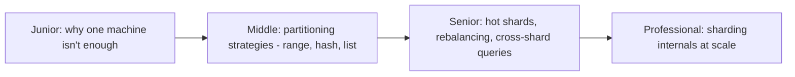
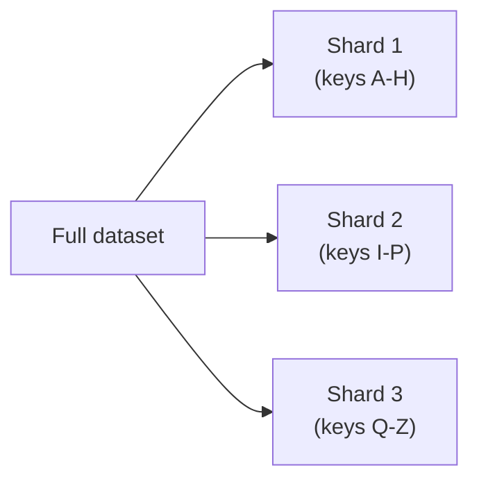

# Partitioning & Sharding

> Split one logical dataset across multiple physical nodes so no single
> machine has to store or serve all of it. The mechanism that lets a
> database scale past what one machine's disk and CPU can handle — and the
> source of most "why is this one query slow" mysteries in a sharded system.

## Choose a level

| Level | Guide | You are done when |
|---|---|---|
| Junior | [Why one machine isn't enough](junior.md) | You can explain the difference between partitioning and replication, and why you'd need both. |
| Middle | [Partitioning strategies](middle.md) | You can choose between range, hash, and list partitioning for a given access pattern. |
| Senior | [Hot shards and rebalancing](senior.md) | You can diagnose a hot-shard problem and explain the cost of rebalancing. |
| Professional | [Sharding internals at scale](professional.md) | You can explain how a real distributed database routes queries and rebalances shards without downtime. |

## Practice rule

Before choosing a shard key, write down your top 5 queries and ask: "does
this query know the shard key up front, or would it need to fan out to
every shard?" A shard key that doesn't match your dominant query pattern
turns every query into a scatter-gather across the whole cluster.

## Related

- [NoSQL Modeling](../../data-modeling/03-nosql-modeling/README.md)
- [Replication](../16-replication/README.md)
- [Scatter-Gather Aggregator](../../../distributed-system/distributed-transaction/03-scatter-gather-aggregator/README.md)
