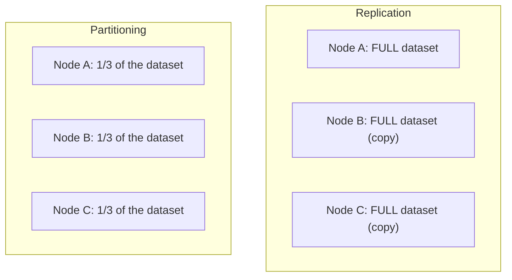
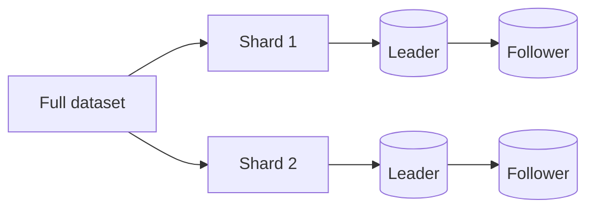

# Partitioning & Sharding — Junior

<!-- level-focus -->
At junior level, focus on this question:

> Why isn't replication alone enough to scale a database, and what problem
> does partitioning solve that replication doesn't?

---

## Replication copies everything; partitioning splits it

[Replication](../16-replication/README.md) puts a **full copy** of the
entire dataset on every node — great for read scaling and availability, but
it does nothing if the dataset itself is too large to fit on one machine's
disk, or if write throughput needs to exceed what a single leader can
handle (every write still has to go through one leader in a replicated
system).

**Partitioning** (also called **sharding**) splits the dataset itself into
disjoint pieces, each stored on a different node — no single node needs to
hold the whole dataset, and writes to different partitions can happen on
different nodes in parallel, removing the single-leader write bottleneck
that pure replication doesn't solve.

## Most real systems combine both

A production distributed database typically **partitions** the data across
shards, and **replicates** each individual shard for availability — the two
techniques solve different problems (partitioning: "the dataset is too big
for one node" and "writes need to parallelize"; replication: "a node can
fail and we still need to serve that data") and are used together, not as
alternatives.

> 🎓 **Takeaway:** partitioning is about **dividing the data**; replication
> is about **duplicating it**. A system with both partitions the dataset
> into shards, then replicates each shard independently.

## Test yourself

1. Why does a purely replicated (unpartitioned) system still have a single
   point of write-throughput limitation, no matter how many replicas you
   add?
2. Why would partitioning alone (no replication) be a risky design for a
   production system?
3. If a dataset is split into 4 shards, each replicated 3 times, how many
   total physical copies of the data exist across the cluster?

Continue to [`middle.md`](middle.md).
