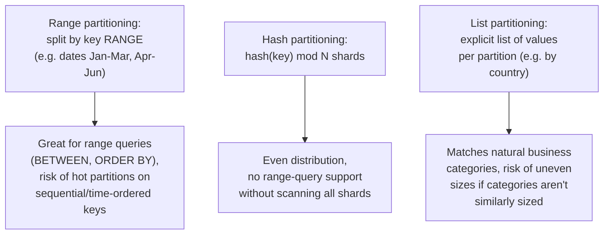

# Partitioning & Sharding — Middle

<!-- level-focus -->
At middle level, focus on this question:

> How do you decide which partitioning strategy — range, hash, or list — fits
> a given access pattern?

Prerequisite: [`junior.md`](junior.md).

---

## Three partitioning strategies



| Strategy | Distribution | Range queries | Risk |
|---|---|---|---|
| **Range** | Uneven if data isn't uniformly distributed across the key range | Excellent — a range query touches only the relevant partitions | New/recent data (if keyed by time) can concentrate on one "hot" partition while older ones go cold |
| **Hash** | Even, by design | Poor — a range query must scan every shard (the hash destroys ordering) | None of range's hot-spotting, but loses range-query locality entirely |
| **List** | Depends entirely on how evenly the listed categories are actually used | Good within a category | A single dominant category (e.g. one huge customer or region) can overload its partition |

## Worked example: choosing for a time-series table

```sql
-- Range partitioning by month - a very common real choice for time-series
CREATE TABLE events (
    event_id BIGINT,
    created_at TIMESTAMP,
    payload JSONB
) PARTITION BY RANGE (created_at);

CREATE TABLE events_2024_01 PARTITION OF events
    FOR VALUES FROM ('2024-01-01') TO ('2024-02-01');
CREATE TABLE events_2024_02 PARTITION OF events
    FOR VALUES FROM ('2024-02-01') TO ('2024-03-01');
```

Range partitioning by date is extremely common precisely because most
time-series query patterns filter by date range (`WHERE created_at BETWEEN
...`) — this lets the query planner **prune** entire partitions outside the
range instantly (the same partition-pruning mechanism from the Query
Optimization professional page). The trade-off `senior.md` covers: the
**current** month's partition receives 100% of new writes, while every
older partition is effectively write-cold — a deliberate, well-understood
hot-partition pattern that's usually acceptable for time-series specifically
because it's predictable and often even desirable (recent data being "hot"
matches most access patterns anyway).

> 🎓 **Takeaway:** the right strategy follows directly from your dominant
> query pattern — range partitioning if you filter/scan by range constantly,
> hash partitioning if you need even distribution and mostly do point
> lookups, list partitioning if your data naturally falls into known,
> roughly-balanced categories.

## Test yourself

1. Why does hash partitioning make `WHERE created_at BETWEEN X AND Y`
   inefficient, requiring a scan of every shard, while range partitioning by
   date handles it natively?
2. For a multi-tenant SaaS product partitioning by `tenant_id` using list
   partitioning, what real-world risk would you flag if one enterprise
   tenant is 1000x the size of a typical tenant?
3. Why is a "hot current partition" in date-range-partitioned time-series
   data often acceptable, when a hot shard in a general-purpose OLTP
   sharding scheme usually isn't?

Continue to [`senior.md`](senior.md).
