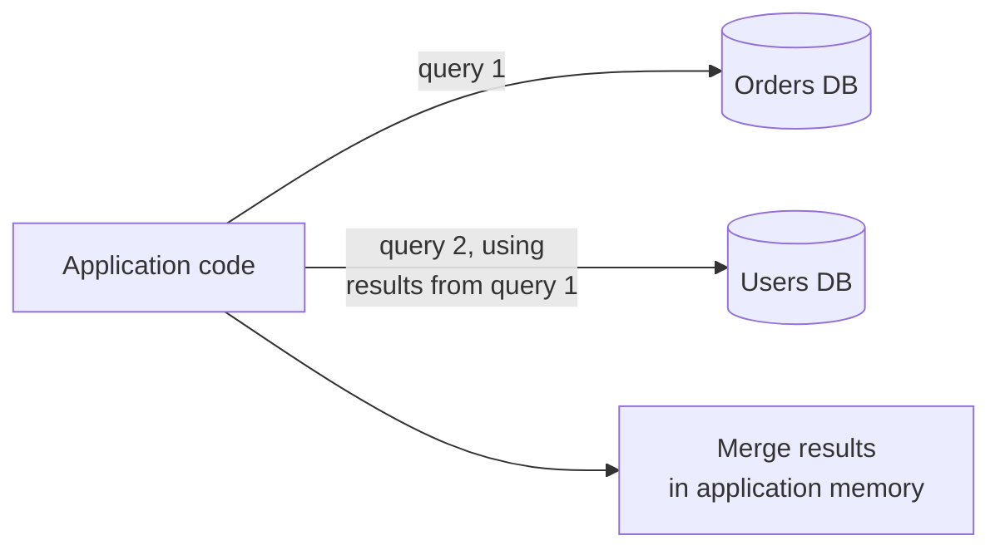

# Database Federation — Middle

<!-- level-focus -->
At middle level, focus on this question:

> What happens to a query that used to be a simple `JOIN` once the tables it
> joins live in different, federated databases?

Prerequisite: [`junior.md`](junior.md).

---

## The join that isn't a join anymore

```sql
-- Before federation: a simple, cheap database-level join
SELECT o.order_id, u.name, u.email
FROM orders o
JOIN users u ON o.user_id = u.user_id
WHERE o.status = 'pending';
```

Once `orders` and `users` live in separate, federated databases, this
`JOIN` **cannot execute at the database level at all** — there's no single
database that can see both tables. The join must be reimplemented as
**application-level orchestration**:

```python
def get_pending_orders_with_users():
    orders = orders_db.query("SELECT * FROM orders WHERE status = 'pending'")
    user_ids = [o.user_id for o in orders]
    users = users_db.query("SELECT * FROM users WHERE user_id IN (%s)", user_ids)
    users_by_id = {u.user_id: u for u in users}
    return [(o, users_by_id[o.user_id]) for o in orders]
```



## The costs this introduces

- **N+1 or batch-fetch complexity**: the application must now handle
  fetching related data in a second (or more) round trip, and must
  implement its own batching to avoid an N+1 query pattern (one query per
  order instead of one batched `IN (...)` query).
- **No database-level referential integrity across the boundary**: a
  `user_id` in the `orders` database can no longer be enforced via a
  foreign key against the `users` database — orphaned references become
  possible and must be handled by application logic or eventual
  reconciliation, not a `FOREIGN KEY` constraint.
- **No transactional consistency across the boundary**: you can no longer
  wrap a write to both databases in one `BEGIN`/`COMMIT` — this is
  `senior.md`'s subject.

> 🎓 **Takeaway:** federation doesn't eliminate the need to combine data
> from different domains — it just moves that work from the database (cheap,
> optimized, transactional) to the application (more code, more round
> trips, no automatic consistency guarantees). This is a real cost, not a
> free architectural improvement, and should be weighed against federation's
> benefits explicitly per query pattern that crosses the new boundary.

## Test yourself

1. Why can't a single SQL `JOIN` statement span two separate database
   instances, even if they're the same database engine (e.g. two separate
   Postgres instances)?
2. What specific bug class becomes possible once a foreign-key relationship
   crosses a federation boundary and is no longer enforced by the database?
3. If a query pattern joining `orders` and `users` runs thousands of times
   per second, what does federating those two tables do to your
   infrastructure's total query volume against each database?

Continue to [`senior.md`](senior.md).
