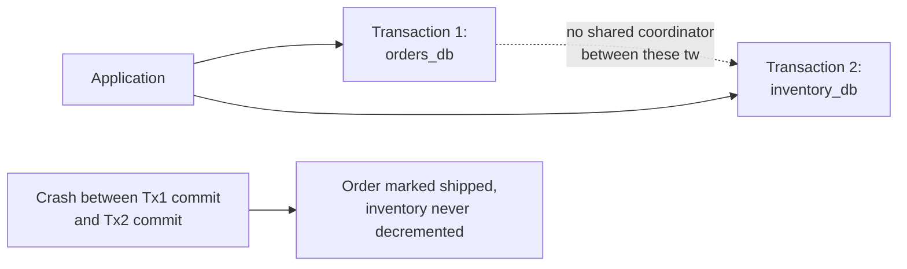
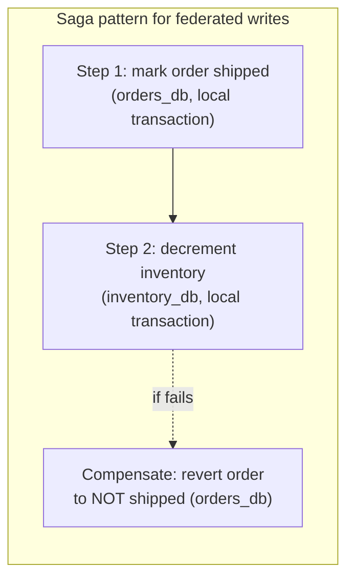

# Database Federation — Senior

<!-- level-focus -->
At senior level, focus on this question:

> Why can't you wrap a write to two federated databases in a normal
> transaction, and what are your actual options?

Prerequisite: [`middle.md`](middle.md).

---

## The problem: `BEGIN`/`COMMIT` doesn't span connections to different databases

```sql
-- This does NOT work across two separate database instances
BEGIN;
UPDATE orders_db.orders SET status = 'shipped' WHERE id = 42;
UPDATE inventory_db.inventory SET quantity = quantity - 1 WHERE sku = 'X';
COMMIT;  -- there is no single engine coordinating both halves
```

A transaction is a property of **one** database engine's write-ahead log
and lock manager (see the Transactions & ACID professional page) — it has
no mechanism to reach across a network boundary into a *different*
database engine's transaction manager. Once `orders` and `inventory` are
federated into separate databases, a "transaction" spanning both is no
longer a single-engine concept at all.



## Your actual options

| Option | How it works | Trade-off |
|---|---|---|
| **Two-phase commit (2PC)** | An external coordinator asks both databases to "prepare" (lock and stage the write), then "commit" only if both prepared successfully | Provides real atomicity, but is rigid, blocking (a coordinator crash mid-protocol can leave both databases holding locks indefinitely), and rarely used at scale — see [2PC/3PC Coordinator](../../../distributed-system/distributed-transaction/06-2pc-3pc-coordinator/README.md). |
| **Saga pattern** | A sequence of local transactions, each with a compensating action to undo it if a later step fails | No cross-database locking, scales well, but requires designing compensations for every step and accepting a window where the system is in an intermediate (not fully committed, not fully rolled back) state — see [Saga: Orchestration vs Choreography](../../../distributed-system/distributed-transaction/07-saga-orchestration-vs-choreography/README.md). |
| **Outbox pattern + eventual consistency** | Write locally to one database plus an "outbox" table in the same transaction; a separate process reads the outbox and propagates the change to the other database asynchronously | Avoids cross-database coordination entirely for the write path; accepts a lag window before the second database reflects the change. |



> 🎯 **Senior takeaway:** federation trades away the free, automatic
> transactional consistency a single database gives you for free — you must
> now explicitly choose and design one of these patterns for any write that
> needs to span the boundary. This is the same fundamental trade-off covered
> in [Transactions & ACID — senior](../../transaction/07-transactions-and-acid/senior.md)'s
> discussion of distributed transactions, just applied specifically to a
> federation architecture rather than a generic multi-database scenario.

## Test yourself

1. Why does a crash between committing to `orders_db` and committing to
   `inventory_db` leave the system in a state neither a rollback nor a
   commit would have produced?
2. Compare the outbox pattern to a saga — what's the key structural
   difference in how each handles the "second database hasn't been updated
   yet" window?
3. For the shipping/inventory example, design a saga with an explicit
   compensating action for the "decrement inventory" step failing after
   "mark order shipped" already succeeded.

Continue to [`professional.md`](professional.md) to see how federation is
handled at scale with query federation engines and data mesh architectures.
