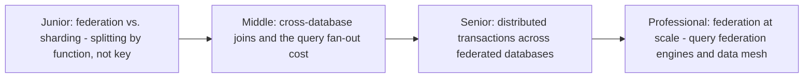
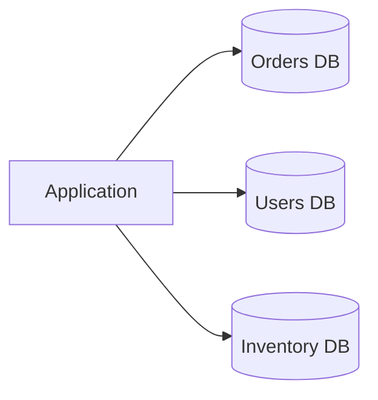

# Database Federation

> Split a database by function (orders, users, inventory) rather than by key
> range — each service gets its own database. Solves a different scaling
> problem than sharding, and creates a different set of cross-database
> query and consistency headaches.

## Choose a level

| Level | Guide | You are done when |
|---|---|---|
| Junior | [Federation vs. sharding](junior.md) | You can explain why splitting by function solves a different problem than splitting by key range. |
| Middle | [Cross-database joins](middle.md) | You can explain why a "join" across federated databases becomes application-level work. |
| Senior | [Distributed transactions](senior.md) | You can explain why a transaction spanning two federated databases can't use a normal `BEGIN`/`COMMIT`. |
| Professional | [Federation at scale](professional.md) | You can evaluate a query federation engine or data mesh architecture for a real multi-database system. |

## Practice rule

Before federating a database by function, ask: "which queries currently join
across the tables I'm about to split apart?" Every one of those queries
becomes cross-database application logic the moment you federate — know the
cost before you pay it.

## Related

- [Partitioning & Sharding](../partitioning-and-sharding/README.md)
- [Saga: Orchestration vs Choreography](../../../distributed-system/distributed-transaction/saga-orchestration-vs-choreography/README.md)
- [2PC/3PC Coordinator](../../../distributed-system/distributed-transaction/2pc-3pc-coordinator/README.md)
