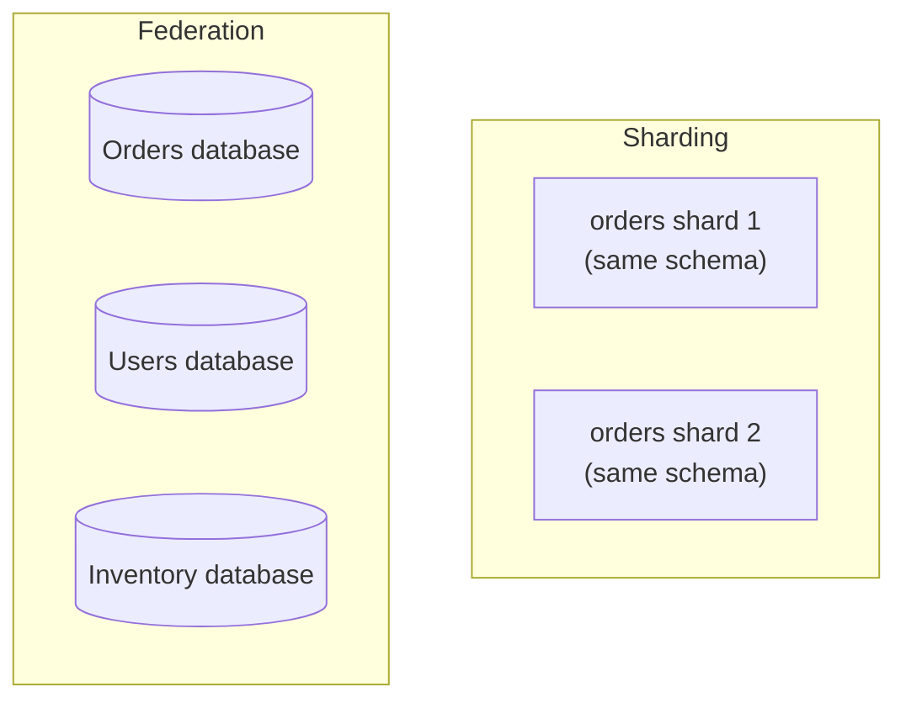

# Database Federation — Junior

<!-- level-focus -->
At junior level, focus on this question:

> How does splitting a database by function differ from splitting it by key
> range (sharding), and why would you choose one over the other?

---

## Federation splits by function, not by key

[Sharding](../partitioning-and-sharding/README.md) splits **the same
logical table** across multiple nodes by key (e.g. `orders` rows 1-1M on
shard 1, rows 1M-2M on shard 2). **Federation** instead gives **different
tables/domains** their own separate databases entirely.

A monolithic application with one large database can be **federated**
(split by function) as part of moving toward a microservices architecture —
the `orders` team gets their own database, the `users` team gets theirs,
and so on. This is a common, deliberate architectural decision when
different domains have different scaling needs, different teams owning
them, or different technology requirements (one domain might benefit from a
document store while another needs strict relational guarantees).

## Why federate at all?

- **Independent scaling**: the `orders` database can be scaled/tuned
  independently of the `users` database, without affecting each other's
  resource allocation.
- **Team autonomy**: each team owns their database's schema and can evolve
  it without coordinating a shared, monolithic schema migration.
- **Blast radius containment**: a problem in the `inventory` database
  (an overloaded query, a bad migration) doesn't automatically degrade the
  `orders` database's performance, because they're physically separate
  systems.

> 🎓 **Takeaway:** sharding answers "this one table is too big/busy for one
> node." Federation answers "these different parts of our system should be
> owned, scaled, and evolved independently." They solve different problems
> and are frequently used together (a federated `orders` database might
> itself be sharded internally once it grows large enough).

## Test yourself

1. Why wouldn't sharding alone solve the "different teams want to own their
   own schema independently" problem that federation solves?
2. Give an example where a federated `inventory` database's performance
   issue would NOT affect the `orders` database, assuming they're
   genuinely separate systems.
3. Could a single federated database (e.g. `orders`) also be sharded
   internally? What would that combination look like?

Continue to [`middle.md`](middle.md).
