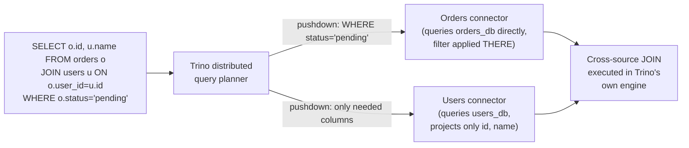
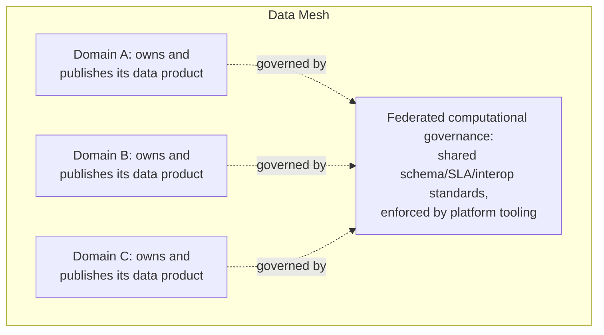

# Database Federation — Professional

<!-- level-focus -->
At professional level, focus on this question:

> How do query federation engines actually push down predicates across
> heterogeneous databases, and what does the "data mesh" architectural
> movement change about how organizations think about federation at scale?

Prerequisite: [`senior.md`](senior.md).

---

## Query federation engines: distributed query planning across heterogeneous sources

Rather than hand-writing the application-level join logic from `middle.md`
for every cross-database query, **query federation engines** (Presto/Trino,
Dremio, PostgreSQL's `postgres_fdw`/foreign data wrappers) let you write a
single SQL query spanning multiple, even heterogeneous, backend databases,
and the engine's own distributed query planner handles the execution
strategy. The key internal mechanism is **predicate and projection
pushdown across connector boundaries**: Trino's planner analyzes which
parts of a `WHERE` clause and which specific columns are needed from each
underlying source, and pushes those filters/projections down into each
connector's own query against its native database — minimizing the amount
of raw data actually pulled across the network into Trino's own execution
engine before the cross-source join happens there.



The professional-level nuance: **pushdown capability varies by connector
and by predicate complexity** — a simple equality filter pushes down
reliably to almost any backend; a complex expression, a window function, or
a predicate referencing a function the backend database doesn't support at
all cannot be pushed down and falls back to Trino pulling the full,
unfiltered dataset across the network before filtering locally — a
frequent, non-obvious source of federated-query performance problems that
requires inspecting the actual query plan (`EXPLAIN`) to diagnose, exactly
analogous to verifying pushdown-through-a-view in the Views professional
page, just across a network/connector boundary instead of within one
engine.

## Data mesh: federation as an organizational architecture, not just a technical one

The **data mesh** paradigm (Zhamak Dehghani's original formulation)
generalizes federation beyond "split the OLTP database by service" into a
full organizational model for analytical data: each domain team owns and
publishes its own **data products** (versioned, quality-guaranteed,
discoverable datasets) rather than centralizing all data into one team-owned
warehouse. The professional-level distinction from earlier federation
approaches: data mesh explicitly treats **federated computational
governance** as a first-class concern — global standards (schema
conventions, SLAs, interoperability requirements) are enforced
consistently across domains via automated tooling and platform-level
guardrails, specifically to prevent federation's `middle.md`/`senior.md`
costs (fragmented joins, inconsistent semantics, duplicated conflicting
logic) from compounding uncontrolled as the number of federated domains
grows across a large organization — a governance problem sharding and pure
technical federation don't need to solve, because they operate within one
team's boundary rather than across many independently-evolving ones.



## Production checklist (staff-level)

1. **Adopt a query federation engine (Trino, Dremio) rather than hand-
   rolling application-level cross-database joins** for any recurring,
   analytically-oriented cross-federated-database query pattern — it
   centralizes pushdown optimization instead of reimplementing ad hoc
   fetch-and-merge logic per query.
2. **Verify actual pushdown behavior via query plans for any
   performance-sensitive federated query** — don't assume a filter pushes
   down to the source database just because the SQL "looks simple"; connector
   and predicate-type limitations are real and non-obvious.
3. **For organization-wide federation across many domain teams, invest in
   federated computational governance tooling explicitly** (schema
   registries, SLA enforcement, data contracts) rather than relying on
   informal convention — this is the specific, documented failure mode data
   mesh's governance emphasis exists to prevent.
4. **Treat cross-domain data product ownership and quality SLAs as a
   platform requirement**, not an optional nice-to-have, once federation
   scales beyond a handful of teams — the coordination cost from
   `middle.md`/`senior.md` compounds non-linearly with domain count without
   it.
5. **In an architecture review for a proposed federation or data-mesh
   initiative, require an explicit answer for cross-domain transactional
   consistency (which pattern from `senior.md` applies) and cross-domain
   query patterns (which pushdown/federation tooling will be used)** before
   approving the domain split — these two costs are the most commonly
   underestimated parts of a federation decision.

## Cheat Sheet

```text
+------------------------------------------------------------------+
|             DATABASE FEDERATION — INTERNALS & SCALE                 |
+------------------------------------------------------------------+
| Query federation engines (Trino, Dremio, postgres_fdw): single SQL     |
| query spans heterogeneous backends via PREDICATE/PROJECTION           |
| PUSHDOWN per connector - filters/projections pushed into each          |
| source's own query, minimizing data pulled across the network          |
| before the cross-source JOIN executes in the federation engine itself  |
+------------------------------------------------------------------+
| Pushdown capability varies by connector AND predicate complexity -     |
| a non-pushdown-able predicate silently falls back to full data pull    |
| + local filtering - VERIFY via EXPLAIN, don't assume                  |
+------------------------------------------------------------------+
| Data mesh: federation as an ORGANIZATIONAL model - domain teams own    |
| "data products," with FEDERATED COMPUTATIONAL GOVERNANCE (enforced     |
| standards via platform tooling) as the explicit mechanism preventing   |
| federation's per-domain costs from compounding uncontrolled at         |
| org-wide scale - a governance problem simple technical federation      |
| doesn't need to solve within one team's boundary                       |
+------------------------------------------------------------------+
```

## Test yourself

1. Why can a query federation engine push down a simple `WHERE status =
   'pending'` filter to nearly any backend, but not a complex window
   function or an engine-specific function call?
2. What specific failure mode does data mesh's "federated computational
   governance" concept exist to prevent, that a two-database federation
   (from `junior.md`) doesn't need to worry about?
3. In an architecture review, a team proposes federating 15 domains without
   a shared schema/SLA governance plan. What would you flag, based on this
   page's reasoning?

## Further Reading

- Trino documentation — "Connectors" and query plan pushdown behavior per
  connector.
- Zhamak Dehghani — "How to Move Beyond a Monolithic Data Lake to a
  Distributed Data Mesh" (the original data mesh formulation) and
  *Data Mesh* (the book, on federated computational governance).
- See also: [2PC/3PC Coordinator](../../../distributed-system/distributed-transaction/2pc-3pc-coordinator/README.md),
  [Views — professional](../../operation/views/professional.md) (pushdown, same concept within one engine).
