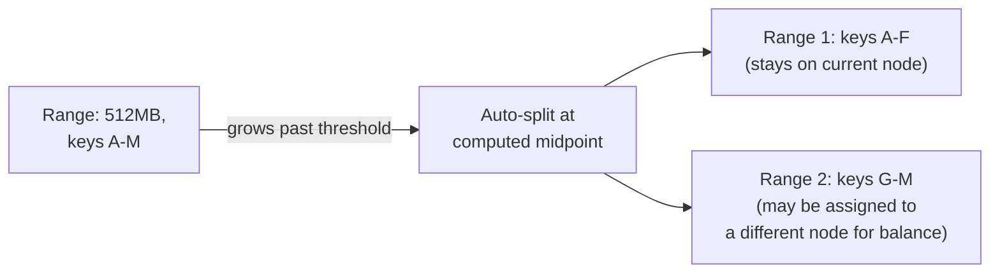
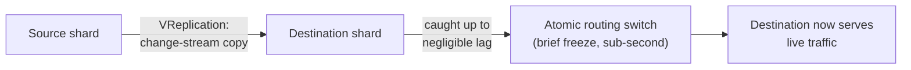

# Partitioning & Sharding — Professional

<!-- level-focus -->
At professional level, focus on this question:

> How do real distributed databases (CockroachDB, Vitess, MongoDB) implement
> automatic, live shard splitting and rebalancing without the manual
> migration risk described in `senior.md`?

Prerequisite: [`senior.md`](senior.md).

---

## Range-based auto-sharding: CockroachDB's actual mechanism

CockroachDB (and Google Spanner, which pioneered this design) doesn't use
a fixed shard count at all — data is organized into contiguous key **ranges**
(default target size historically ~64-512MB, tunable), each range
independently replicated via its own Raft consensus group. When a range
grows past its size threshold, it **automatically splits** into two ranges
at a computed split key, and the newly created range is independently
assigned to whichever node has capacity — this happens continuously and
automatically as data grows, with no operator-initiated "resharding
project" ever required, fundamentally changing the operational profile from
`senior.md`'s manual, project-scale rebalancing into routine, continuous,
automatic background work.



Crucially, because each range is its own Raft group, a range split is a
**local, per-range consensus operation** — it doesn't require coordinating
a cluster-wide stop-the-world event the way `senior.md`'s generic
description implies; only the specific range being split, and the small
number of nodes replicating it, are involved.

## Live migration without the dual-write correctness burden: Vitess's approach

Vitess (YouTube/Slack/GitHub's MySQL sharding layer, and the basis for
PlanetScale) implements shard splitting via **VReplication**: rather than
`senior.md`'s manual dual-write scheme, it runs a change-stream-based
replication process (structurally similar to CDC, per the Cache
Invalidation professional page's McSqueal pattern) from the source shard(s)
to the destination shard(s), continuously catching up, and only performs
the actual traffic cutover once the destination has verifiably caught up to
within a negligible lag — at which point traffic is atomically switched via
routing rule updates, with a very brief (sub-second, in practice) write
freeze only during the final cutover moment, not for the entire data-copy
duration. This is the professional-level generalization of `senior.md`'s
dual-write correctness concern: **replace manual dual-writing with a
proper, already-solved change-stream replication mechanism**, and the
correctness burden of "what if a write lands during migration" is handled
by the same well-understood machinery that handles ordinary replication
lag, rather than bespoke migration-specific logic.



## Consistent hashing as the alternative to explicit range management

Systems favoring hash-based distribution (Cassandra, DynamoDB — see the
NoSQL Modeling professional page) sidestep explicit range-splitting entirely
by using **consistent hashing with virtual nodes**: adding a node means it
claims ownership of some existing vnode ranges from other nodes, an
operation that's local to the specific vnodes being reassigned, not a
global rebalancing event — this is a structurally different but equally
valid answer to the same "how do we rebalance without a project-scale
migration" question CockroachDB's range-splitting and Vitess's VReplication
each answer differently.

## Production checklist (staff-level)

1. **Prefer a database with automatic, continuous rebalancing
   (range-based auto-splitting or consistent-hashing-based) over one
   requiring manual shard-migration projects**, for any new system expected
   to grow significantly — this converts a recurring, risky operational
   project into routine background behavior.
2. **If manually rebalancing a system without built-in support, use a
   change-stream/CDC-based migration approach (Vitess's VReplication model)
   instead of hand-rolled dual-writing** — it inherits well-understood
   replication-lag semantics instead of requiring bespoke correctness
   reasoning for the migration window.
3. **Understand your specific database's rebalancing granularity**
   (per-range independent Raft groups vs. per-vnode reassignment vs. a
   cluster-wide operation) before planning capacity growth — this
   determines whether scaling out is a routine, low-risk operation or a
   scheduled, higher-risk project.
4. **Monitor range/shard size distribution and split/merge activity as an
   operational metric**, even on systems with automatic rebalancing — an
   auto-splitting system that's splitting far more or less frequently than
   expected is signaling something about your actual write/key distribution
   worth investigating.
5. **In a database selection review for a system expected to scale
   significantly, ask specifically how the candidate handles growth and
   rebalancing** (automatic and continuous, vs. manual and project-scale)
   as a primary evaluation criterion, not an afterthought discovered after
   the first painful manual resharding.

## Cheat Sheet

```text
+------------------------------------------------------------------+
|          PARTITIONING & SHARDING — INTERNALS & SCALE                |
+------------------------------------------------------------------+
| CockroachDB/Spanner: no fixed shard count - data organized into       |
| RANGES, each its own independent Raft group. Ranges AUTO-SPLIT past a |
| size threshold, reassigned to nodes with capacity - continuous,        |
| automatic, LOCAL to the splitting range (not cluster-wide)             |
+------------------------------------------------------------------+
| Vitess VReplication: shard migration via CHANGE-STREAM replication     |
| (CDC-like) to the destination, atomic routing cutover only AFTER        |
| catch-up - replaces manual dual-writing with well-understood            |
| replication-lag semantics, eliminating senior.md's bespoke              |
| migration-window correctness burden                                    |
+------------------------------------------------------------------+
| Consistent hashing + vnodes (Cassandra/DynamoDB): rebalancing =         |
| local vnode reassignment, not a global operation - a third valid        |
| answer to the same "avoid project-scale resharding" problem             |
+------------------------------------------------------------------+
| Choose/evaluate a sharded database partly on ITS rebalancing model -    |
| automatic+continuous vs. manual+project-scale is a major operational   |
| cost difference, not a minor implementation detail                      |
+------------------------------------------------------------------+
```

## Test yourself

1. Why does a CockroachDB range split not require cluster-wide
   coordination, while `senior.md`'s generic description of rebalancing
   implies a much larger-scope operation?
2. Explain why Vitess's VReplication-based migration sidesteps the
   "write arrives during migration" correctness risk that manual
   dual-writing must handle bespoke, and what existing mechanism it
   reuses instead.
3. You're selecting a database for a system expected to grow 100x over 3
   years. What specific question about rebalancing would you ask every
   vendor/project, based on this page?

## Further Reading

- Corbett et al. — "Spanner: Google's Globally-Distributed Database"
  (the original range-based auto-sharding design).
- CockroachDB documentation — "Range Splits and Merges" and "Load-Based
  Splitting."
- Vitess documentation — "VReplication" and "Resharding" (the actual
  change-stream-based migration mechanism).
- See also: [Replication — professional](../replication/professional.md),
  [NoSQL Modeling — professional](../../data-modeling/nosql-modeling/professional.md).
