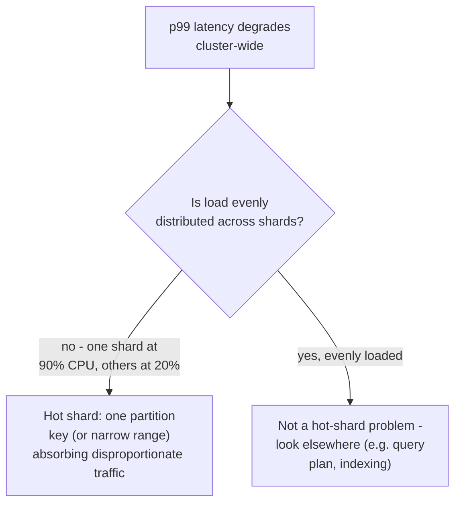
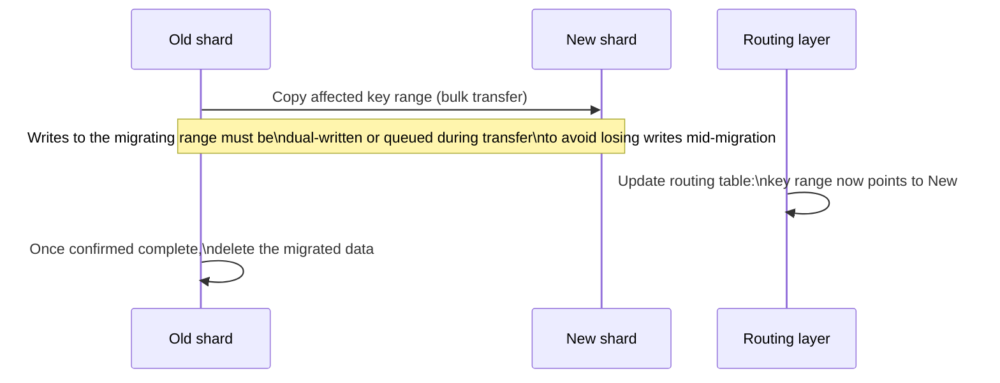
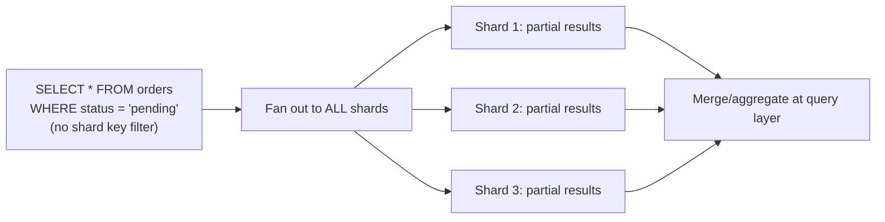

# Partitioning & Sharding — Senior

<!-- level-focus -->
At senior level, focus on this question:

> How do you detect and fix a hot shard, and what does rebalancing actually
> cost?

Prerequisite: [`middle.md`](middle.md).

---

## Diagnosing a hot shard

A hot shard's symptom (elevated **average** latency across the whole
system) often misdirects investigation toward cluster-wide causes — the
actual fix requires **per-shard** metrics (CPU, IOPS, request rate broken
down by shard), not cluster-aggregate ones. This is the direct sharding
analog of the per-node metric requirement covered for consistent hashing
in the NoSQL Modeling professional page.

## Rebalancing: moving data between shards is expensive

Fixing a hot shard (or accommodating cluster growth) means **moving data**
from one shard to another — physically transferring the affected rows/keys,
updating routing metadata, and doing so **without downtime or data loss**
for a live production system.

The real cost isn't just the data transfer — it's **maintaining
correctness for writes that arrive during the migration window**. Common
approaches: dual-writing to both old and new shards during migration (with
careful ordering to avoid lost updates), or a **stop-the-world** brief
freeze for the specific migrating key range only (acceptable if scoped
narrowly enough not to affect unrelated traffic). Getting this wrong — a
write landing on the old shard after the router has already switched to
the new one — is a classic source of silent data loss during a
"successful-looking" rebalance.

## Cross-shard queries: the cost sharding pushes onto you

Any query that can't be routed to a single shard (because it doesn't filter
on the shard key) must be executed as a **scatter-gather**: fan out to
every shard, collect partial results, and merge them at the application or
routing layer (see [Scatter-Gather Aggregator](../../../distributed-system/distributed-transaction/scatter-gather-aggregator/README.md)).

This is why the choice of shard key (`middle.md`) is so consequential:
picking one that doesn't match your dominant query pattern turns every one
of those queries into an expensive, latency-bound-by-the-slowest-shard
scatter-gather, instead of a cheap single-shard lookup.

> 🎯 **Senior takeaway:** a hot shard is a symptom requiring per-shard
> (not aggregate) metrics to diagnose; rebalancing is expensive primarily
> because of the correctness burden during the migration window, not just
> the data volume moved; and a mismatched shard key silently converts your
> common queries into expensive cluster-wide fan-outs.

## Test yourself

1. Why can average, cluster-wide latency metrics completely hide a hot
   shard problem, and what specific metric breakdown would reveal it?
2. Walk through exactly what can go wrong (data loss or duplication) if a
   write arrives for a migrating key range at the wrong moment during
   rebalancing, and how dual-writing is meant to prevent it.
3. A query filters on `customer_email` but the shard key is `customer_id`.
   What happens to this query's cost, and what would you propose to fix it?

Continue to [`professional.md`](professional.md) to see how real distributed
databases implement rebalancing without downtime at scale.
