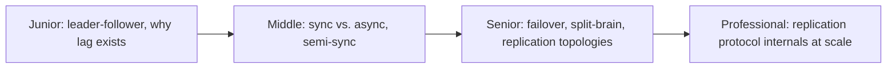
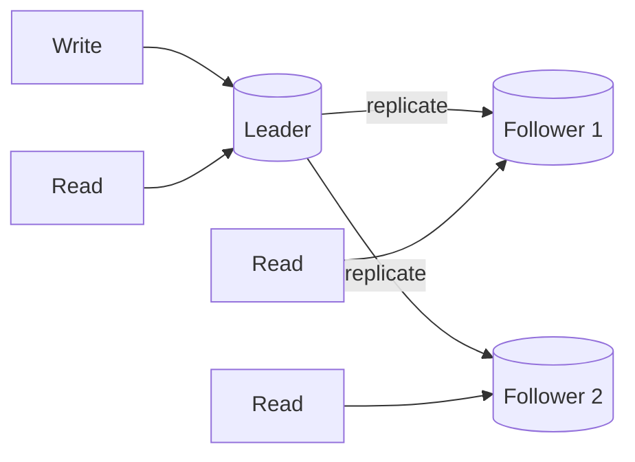

# Replication

> Keep copies of the same data on multiple nodes so the system survives a
> node failure and can serve more read traffic than one machine could alone.
> The mechanism (and its lag) underlies almost every other scaling and
> consistency topic in this whole tree.

## Choose a level

| Level | Guide | You are done when |
|---|---|---|
| Junior | [Leader-follower and lag](junior.md) | You can explain why a follower can return a stale value right after a write to the leader. |
| Middle | [Sync, async, and semi-sync](middle.md) | You can explain the durability/latency trade-off between the three modes. |
| Senior | [Failover and split-brain](senior.md) | You can explain what happens if a leader fails and two nodes both think they're the new leader. |
| Professional | [Replication protocol internals](professional.md) | You can explain how Raft/Paxos-based replication differs from simple leader-follower streaming at scale. |

## Practice rule

For any read against a replica, ask: "how stale could this data be right
now, and does this specific use case tolerate that?" If you don't know your
replication lag under real load, you don't actually know the answer.

## Related

- [Isolation Levels](../../transaction/isolation-levels/README.md)
- [Backup & Recovery](../../operation/backup-and-recovery/README.md)
- [BASE & Eventual Consistency](../../transaction/base-and-eventual-consistency/README.md)
