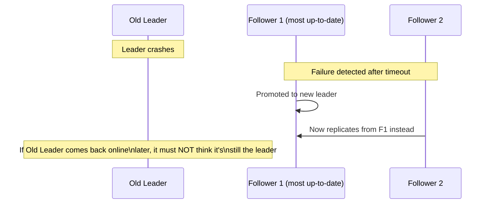
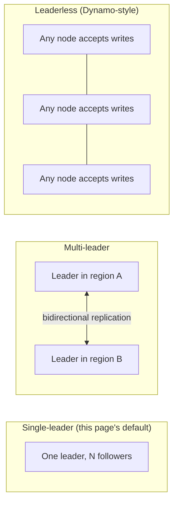

# Replication — Senior

<!-- level-focus -->
At senior level, focus on this question:

> What actually happens during failover, and how can it produce split-brain
> if not handled carefully?

Prerequisite: [`middle.md`](middle.md).

---

## Failover: promoting a follower to leader

When the leader fails (crash, network partition, planned maintenance), a
follower must be **promoted** to become the new leader. This requires:
detecting the failure (not instantaneous — some timeout must elapse to
distinguish "dead" from "slow"), choosing which follower to promote
(ideally the most up-to-date one), and redirecting all future writes to it.



## Split-brain: the exact same problem as leader election

This is the identical danger covered in
[Leader Election](../../../distributed-system/consensus/leader-election/README.md):
if the old leader recovers from a network partition (rather than a genuine
crash) and *still believes it's the leader*, while a new leader has already
been promoted, **two nodes now both accept writes** — and they diverge,
because each has writes the other doesn't. Reconciling two divergent leader
histories after the fact is often impossible without data loss (you must
pick one branch's writes to discard, or attempt an application-level merge
that may not be well-defined for arbitrary data).

```mermaid
flowchart LR
    OldLeader["Old leader (partitioned,\nbelieves it's still leader)"] --> W1["Accepts write A"]
    NewLeader["New leader (promoted)"] --> W2["Accepts write B"]
    W1 -.-.- W2
    Reconcile["Partition heals: TWO divergent\nhistories. Which write survives?"]
```

**The fix is the same fencing mechanism from leader election**: the new
leader's promotion should carry a fencing token/epoch number, and any write
from the old leader — should it ever resurface — must be rejected because
its epoch is stale. Most production replication systems (Postgres with a
proper failover manager like Patroni, MySQL Group Replication, MongoDB
replica sets) implement exactly this: a monotonically increasing
term/epoch tied to leadership, checked on every write.

## Replication topologies beyond single-leader



Multi-leader replication (each region has its own leader accepting local
writes, replicating bidirectionally) avoids single-leader's write-latency
cost for geographically distributed users, but **reintroduces conflict
resolution** as a first-class problem — two leaders can accept conflicting
concurrent writes to the same key, requiring the exact LWW/vector-clock/CRDT
machinery from [BASE & Eventual Consistency](../../transaction/base-and-eventual-consistency/README.md).
Leaderless (Dynamo-style) replication sidesteps having a single leader
entirely, at the cost of needing quorum reads/writes and anti-entropy
repair to maintain consistency (see the NoSQL Modeling professional page).

> 🎯 **Senior takeaway:** single-leader replication trades write scalability
> for a simple consistency story; multi-leader and leaderless topologies
> trade that simplicity for write availability/locality, reintroducing
> conflict resolution as a cost you must explicitly design for.

## Test yourself

1. Why is detecting "the leader is actually dead" (versus "the leader is
   just slow or partitioned") fundamentally difficult, and what trade-off
   does a shorter failure-detection timeout introduce?
2. Explain, using a fencing token, exactly how a recovering old leader's
   stale write gets rejected after a new leader has been promoted.
3. Why does multi-leader replication reintroduce the exact conflict-
   resolution problem covered in BASE & Eventual Consistency, when
   single-leader replication doesn't have this problem at all?

Continue to [`professional.md`](professional.md) to see how real replication
protocols implement these guarantees at the message level.
